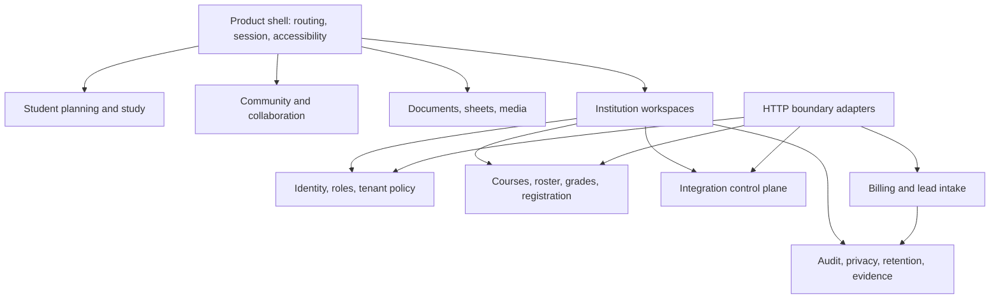

# Architecture plan

## Current state

Semester is a large Vite/React client backed by direct Supabase RLS/RPC access, 14 Edge Functions, one Vercel institution gateway, and PostgreSQL policies/functions. Security logic is strongest in SQL and shared Edge handlers, but orchestration is spread across very large screen/state modules. The institution gateway is a second server boundary with its own capabilities, journals, adapters and rate limits. Integrations use an inbox/outbox/control-plane design, but several adapters and operational activations remain intentionally off.

## Target bounded contexts

## Dependency rules

1. UI routes depend on domain services/types, never on service-role clients or raw tenant parameters.
2. Domain modules do not import screens, browser globals, deployment adapters, or other bounded contexts’ internals.
3. Every HTTP boundary validates shape, authenticates, derives tenant/subject, authorizes capability/ownership, consumes a shared limit, then invokes one domain operation.
4. Service-role operations are reachable only from named server boundaries and return typed, sanitized errors.
5. Integrations write through durable inbox/outbox/idempotency contracts; adapters cannot write tenant data directly.
6. Rendering accepts typed safe text/URL/SVG contracts; raw HTML production is centralized and adversarially tested.
7. SQL migrations are append-only changes with zero-build, upgrade, reapply and rollback/verification notes.

## Incremental migration

1. **Inventory gate (completed here):** regenerate `endpoint-manifest.json`; require coverage tests.
2. **Boundary hardening:** extract `productivity-sourcecheck` to a pure shared handler; add shared limits and egress pinning; map each service operation to an owner/test.
3. **Sheet slice:** extract import/export, formula engine, collaboration and view components from `Sheet.tsx` behind existing tests; do not change behavior in the extraction commits.
4. **Calendar/Today slice:** separate data selection, commands and presentation; centralize clock injection to remove impure render calls.
5. **Institution sandbox:** split adapter simulation, policy evaluation, fixture generation and orchestration; preserve gateway contract tests.
6. **Rendering contract:** make `SafeSvg`, `SafeUrl`, `SafeHtml` the only values accepted by dangerous sinks; add source checks preventing direct sink use.
7. **Operational activation:** deploy/verify database and functions per tenant only after approval, restore, alerting, DAST and data-rights gates are signed.

Each step should remain below ~300 changed lines per logical patch where possible, include characterization/adversarial tests, pass budgets, and be independently revertible.
