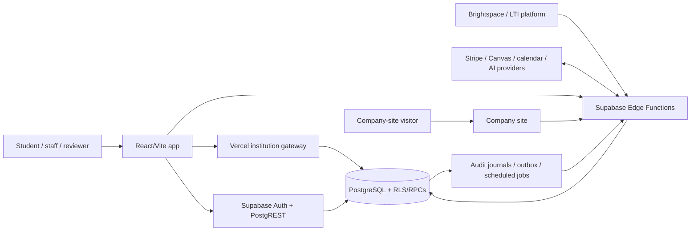

# Semester repository audit — 2026-10-02

## Executive summary

This audit found **no confirmed P0 vulnerability** in the reviewed snapshot (`3d87884c`). The strongest controls are unusually evidence-oriented: SQL grants are fail-closed against an explicit RPC allowlist, RLS behavior is exercised by adversarial SQL suites, workflows pin Actions by commit, service-role code stays on server boundaries, and the production build has enforced size budgets.

The repository is not institution-ready merely because those controls exist in source. The material residual risks are: an authenticated outbound-fetch endpoint with a DNS check/use gap; HawkScan not being a required branch check and scanning only the frontend; an intentionally non-blocking high/critical dependency audit; a queued community-media scanning design with no scanner function; a single-person review model; and operational gates that the repository itself still records as unmet. One confirmed internal-error disclosure in the push function was fixed during this audit, and the outbound source check now consumes a shared per-account limit before network work.

The audit produced a reproducible inventory of **15 HTTP entry points, 217 authenticated PostgREST RPC operations, and 81 explicitly granted service-role operations**. See `ENDPOINT-MANIFEST.md` and `endpoint-manifest.json`.

## Scope and limitations

Reviewed: application frontend, company site, Vercel route, 14 Edge Functions, 166 migrations, 107 SQL check suites, RPC grants, storage policies, workflows, dependency policy, secrets policy, accessibility tests, performance budgets, retention and incident documentation, and the highest-risk integration boundaries.

Verified locally: TypeScript, lint, university-server typecheck, production build, budgets, targeted security regressions, and a green baseline full Vitest suite. Post-change full-suite attempts were limited by five-second timeouts under worker concurrency; with four workers, 1,252/1,255 files passed and every residual failing test passed when replayed independently. No post-change assertion failure remained. The PostgreSQL 17 harness could not run because this host has no PostgreSQL 17 server. `npm audit` could not run because this host supplies Node but not npm. HawkScan could not run because the active environment exposes neither the HawkScan capability/runtime nor an API key. Deployment dashboards, live secrets, Supabase Auth settings, branch-ruleset application, backups, alerts, and institutional approvals were not accessible; repository files are evidence of intent, not proof of activation.

## Architecture map

Trust boundaries: browser-to-HTTP, bearer-link-to-HTTP, provider-webhook-to-HTTP, scheduler-to-HTTP, HTTP-to-service-role, PostgREST-to-RLS/RPC, outbound server fetches, and deployment/secret configuration.

## Findings

### P0

None confirmed.

### P1

#### AUD-P1-01 — Outbound source check lacks connection pinning; shared limiting fixed

- **Classification:** confirmed DNS check/use gap; DNS-rebinding exploitability is a hardening hypothesis. The confirmed missing abuse limit is fixed.
- **Evidence:** `supabase/functions/productivity-sourcecheck/index.ts:10-18` resolves a hostname and checks returned addresses, then `:39-44` later calls `fetch(url)`, which resolves again. The new call at `:33-38` consumes a fail-closed shared allowance before DNS or fetch work. `supabase/migrations/20261002100000_productivity_source_rate_limit.sql:8-34` derives the subject from `auth.uid()` and fixes the policy at ten calls per rolling minute.
- **Scenario:** a compromised or attacker-controlled eligible hostname could answer the pre-check with a public address and rebind before the fetch to target a private address. Repeated ordinary abuse is now bounded per account across Edge Function instances.
- **Impact:** possible SSRF if DNS rebinding succeeds; reduced but not eliminated cost/availability pressure.
- **Affected:** authenticated users, Edge Function capacity, internal network metadata/services.
- **Recommendation:** require an explicit institution host allowlist for activated tenants; connect to a validated/pinned address through a filtering egress layer; add redirect and rebinding adversarial tests. Consider a tenant-wide budget in addition to the shipped per-account limit when tenant identity is available at this boundary.
- **Owner / effort:** application security + platform; M–L.
- **Verification:** source regressions prove the limiter precedes DNS/fetch and emits bounded 429/503 responses; the SQL suite proves N+1 refusal and account isolation when run on PostgreSQL 17. Still required: refuse a host that changes from public to loopback/private, and table-test reserved IPv4/IPv6 plus redirects through a live filtered-egress integration.

#### AUD-P1-02 — HawkScan is not a required merge check and does not cover APIs

- **Classification:** confirmed governance/control gap.
- **Evidence:** `.github/rulesets/main.json:33-37` requires only `account-sync`, `build`, and `secrets`. `.github/workflows/hawkscan.yml:18-81` defines a separate job that starts only the Vite preview. `stackhawk.yml:8-12` explicitly says the separate Supabase API is not scanned.
- **Scenario:** an internal PR merges while HawkScan is failing, or an API regression is never exercised by DAST.
- **Impact:** dynamic web/API regressions can reach main without a required gate.
- **Affected:** all web users and API data.
- **Recommendation:** require the `hawkscan` status for internal branches; add authenticated API scan applications/environments for the Vercel and Edge surfaces; keep fork handling fail-closed through an internal-branch handoff.
- **Owner / effort:** repository admin + AppSec; M.
- **Verification:** a planted reflected/error disclosure fails a required PR check; API scan coverage reports each HTTP entry point.

#### AUD-P1-03 — Operational go-live evidence remains incomplete

- **Classification:** confirmed readiness gap, not a source-code vulnerability.
- **Evidence:** `docs/GO-NO-GO-CHECKLIST.md:23-36` distinguishes technical evidence from production activation and records unmet restore, journal backup, alerting, production headers/rate limits, accessibility audit, incident process, rollback, and secret-verification gates.
- **Scenario:** a technically green release is treated as institutionally operational without a proven restore, staffed incident path, or verified live controls.
- **Impact:** prolonged outage, incomplete incident response, or unverified tenant protection.
- **Affected:** every institutional persona and data class.
- **Recommendation:** do not label a tenant live until named owners attach dated production evidence for every gate.
- **Owner / effort:** SRE, security, privacy, institutional operations; L and ongoing.
- **Verification:** signed evidence packet, restore drill, alert receipt, rollback drill, live header/rate-limit probes, and approval register.

### P2

#### AUD-P2-01 — Push endpoint returned raw database errors (fixed)

- **Classification:** confirmed information disclosure, fixed.
- **Evidence:** prior code returned `error.message`; fixed at `supabase/functions/push/index.ts:116-124`. Negative regression at `app/src/lib/pushchain.test.ts:92-98` rejects any response built from `error.message`.
- **Scenario:** a caller holding the scheduler bearer receives relation, column, or policy details when the queue read fails.
- **Impact:** internal schema disclosure that improves follow-on attacks after credential compromise.
- **Affected:** push infrastructure; no student content was shown by the defect itself.
- **Recommendation:** shipped change: generic 500 and non-sensitive log. Apply the same boundary rule to future service-role handlers.
- **Owner / effort:** backend; S, completed.
- **Verification:** targeted 13-test push suite passes; full gates listed in `CHANGELOG-AUDIT.md`.

#### AUD-P2-02 — Source checker returned arbitrary runtime errors (fixed)

- **Classification:** confirmed information-disclosure boundary, fixed.
- **Evidence:** the prior catch returned `e.message` for every exception, including resolver, parser and fetch-runtime errors. `supabase/functions/productivity-sourcecheck/index.ts:5` now marks intentional public errors, and `:57-62` returns only those messages while logging only the unexpected error class.
- **Scenario:** a malformed or failing outbound request causes the runtime or network stack to include implementation details in its exception message, which is echoed to an authenticated caller.
- **Impact:** environmental or dependency detail disclosure that could improve SSRF probing.
- **Affected:** authenticated source-check users and the Edge Function runtime.
- **Recommendation:** shipped change: typed public errors and a generic fallback. Keep new validation failures inside this explicit contract.
- **Owner / effort:** backend/AppSec; S, completed.
- **Verification:** `app/src/lib/productivitysourcecheck.test.ts` rejects a catch-all `Error.message` response and holds the generic failure response.

#### AUD-P2-03 — High/critical dependency audit is advisory only

- **Classification:** confirmed supply-chain hardening gap.
- **Evidence:** `.github/workflows/ci.yml:97-118` states the tree was clean when written but sets `continue-on-error: true` for `npm audit --audit-level=high`.
- **Scenario:** a reachable high/critical advisory is printed but does not block a release.
- **Impact:** known vulnerable dependency may ship.
- **Affected:** app/runtime/build paths depending on reachability.
- **Recommendation:** create a dedicated required security check with a time-bounded, reviewed exception file rather than ignoring the exit code in the build job.
- **Owner / effort:** platform/AppSec; S–M.
- **Verification:** a lockfile with a known high advisory blocks; an approved exception includes reachability rationale, owner, and expiry.

#### AUD-P2-04 — Community-media scanner is designed but not implemented

- **Classification:** confirmed incomplete workflow; fail-closed behavior reduces severity.
- **Evidence:** `docs/COMMUNITY-MEDIA-SAFETY.md:187-205` instructs adding a `media-scan` function; no such function exists under `supabase/functions/` or `supabase/config.toml`. The migration queues scans and exposes media only after a safe verdict.
- **Scenario:** uploaded images remain pending forever, or operators are tempted to bypass the pending state to restore usability.
- **Impact:** broken community-image workflow; unsafe future workaround pressure.
- **Affected:** community users and moderators.
- **Recommendation:** implement a bounded magic-byte/decode/malware/image-safety worker, deletion worker, retries, dead-letter metrics, and lifecycle tests before enabling uploads.
- **Owner / effort:** trust & safety + backend/SRE; L.
- **Verification:** malicious/polyglot files never become readable, safe images progress, failed scans remain closed, and abandoned objects are deleted.

#### AUD-P2-05 — Single-person CODEOWNERS cannot provide independent review

- **Classification:** confirmed governance limitation.
- **Evidence:** `.github/CODEOWNERS:3-10` explicitly records one owner; security-sensitive paths at `:16-25` name the same account.
- **Scenario:** urgent security/database work either cannot satisfy independent approval or uses an owner bypass.
- **Impact:** review control is unavailable exactly where privilege is highest.
- **Affected:** migrations, Edge Functions, gateway, workflows, tenant contracts.
- **Recommendation:** add a second qualified reviewer or external security review group for privileged paths; monitor bypass use.
- **Owner / effort:** repository owner; organizational.
- **Verification:** a test PR by either owner requires and receives a different qualified approver; bypass events alert.

### P3

#### AUD-P3-01 — Large modules and React compiler warnings increase regression risk

- **Classification:** maintainability/performance issue.
- **Evidence:** `app/src/screens/Sheet.tsx` is 4,747 lines; `app/server/institution/sandbox.ts` 4,236; `app/src/lib/sheet.ts` 3,697; `App.tsx` 1,616. Lint passes with 24 React warnings including ref reads, synchronous effect state, impure `Date.now()` calls, and unpreserved memoization.
- **Scenario:** security/accessibility invariants become hard to review and render behavior changes under compiler optimization.
- **Impact:** higher defect probability and slower review, not a confirmed exploit.
- **Affected:** frontend users and maintainers.
- **Recommendation:** extract bounded domain modules behind characterization tests, starting with Sheet/Calendar/Today and sandbox orchestration; pay warnings down to zero before making them blocking.
- **Owner / effort:** frontend/platform; L incremental.
- **Verification:** behavior suites unchanged, per-route bundle budgets maintained, warnings trend to zero, files shrink without cross-domain imports.

#### AUD-P3-02 — Endpoint metadata existed as code/comments but not a generated inventory (fixed)

- **Classification:** maintainability/auditability issue, fixed.
- **Evidence:** 14 functions, one Vercel route, and hundreds of RPCs previously had no single manifest. `scripts/build_endpoint_manifest.mjs` now derives the RPC surfaces and emits `endpoint-manifest.json`; `app/src/lib/endpointmanifest.test.ts` fails when an Edge Function or authenticated RPC is omitted.
- **Impact:** reviewers previously had to rediscover the surface, increasing omission risk.
- **Owner / effort:** AppSec/platform; M, completed.
- **Verification:** generator reports 15 HTTP, 217 authenticated RPC, 81 explicit service operations; coverage tests pass.

## Human decision list

1. Decide whether the source checker is limited to explicit approved hosts or whether arbitrary `.edu` hosts are a product requirement worth an egress proxy.
2. Add a second independent privileged-path reviewer.
3. Decide and enforce the release policy for new high/critical advisories.
4. Fund and own the media-scanning service before enabling community uploads.
5. Complete and sign the production go/no-go evidence; do not infer it from repository tests.
