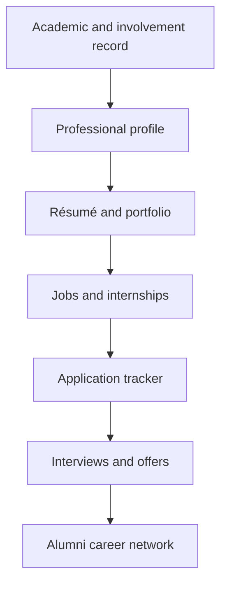

Semester should also include a complete **career, internship, alumni-networking, study-abroad, and professional-development system**. This would replace separate career-center portals, job boards, appointment systems, résumé builders, alumni directories, and study-abroad websites.

# Semester Career

Semester Career should support students from their first year through graduation and into their alumni careers.

## Career dashboard

Each student should see:

- Recommended jobs and internships
- Upcoming application deadlines
- Saved opportunities
- Application status
- Career-center appointments
- Career fairs
- Employer events
- Alumni connections
- Résumé progress
- Interview preparation
- Study-abroad opportunities
- Personalized career recommendations
- Required next steps

Recommendations should consider:

- Major and minor
- Skills
- Completed courses
- Career interests
- Preferred location
- Work authorization
- Graduation date
- Clubs and leadership
- Athletic participation
- Previous experience
- Saved opportunities

# Internships and jobs

Semester should contain a complete job and internship marketplace.

## Opportunity types

- Internships
- Part-time jobs
- Full-time jobs
- On-campus employment
- Research positions
- Fellowships
- Externships
- Apprenticeships
- Volunteer opportunities
- Summer programs
- Remote opportunities
- Work-study positions

## Search and filters

Students should be able to filter opportunities by:

- Industry
- Role
- Employer
- Location
- Remote, hybrid, or in-person
- Paid or unpaid
- Compensation
- Required major
- Required skills
- Experience level
- Application deadline
- Visa sponsorship
- Academic credit
- Hours per week
- Semester or season

## Opportunity pages

Each listing should show:

- Job description
- Responsibilities
- Qualifications
- Required skills
- Preferred skills
- Compensation
- Location
- Work format
- Deadline
- Employer information
- Alumni working at the organization
- Required application materials
- Interview process
- Application link or direct application
- Similar opportunities

## Application system

Students should be able to:

- Apply directly
- Upload a résumé
- Upload a cover letter
- Submit a portfolio
- Request recommendations
- Answer application questions
- Save drafts
- Track deadlines
- View submission confirmations
- Withdraw an application
- Schedule interviews
- Record outcomes

## Application tracker

Semester should display each opportunity under:

- Interested
- Saved
- Preparing
- Applied
- Interviewing
- Offer received
- Accepted
- Rejected
- Withdrawn

Students should be able to add notes, contacts, interview dates, follow-up reminders, and required tasks.

# Employer platform

Approved employers should receive a dedicated Semester portal.

Employers should be able to:

- Create company profiles
- Post opportunities
- Specify qualifications
- Review applications
- Search eligible candidates
- Schedule interviews
- Host information sessions
- Register for career fairs
- Communicate with applicants
- Make offers
- Track recruiting results

Universities should verify employers and review listings to reduce scams, misleading opportunities, and discriminatory postings.

# Career Center

Semester should replace separate career-center scheduling and resource systems.

## Appointments

Students should be able to schedule:

- General career advising
- Résumé reviews
- Cover-letter reviews
- Interview preparation
- Internship advising
- Job-search strategy
- Graduate-school advising
- Networking guidance
- Salary-negotiation coaching
- Career-exploration meetings

Appointments could be:

- In person
- Virtual through Semester Meetings
- Individual
- Group-based
- Drop-in

## Career resources

The Career Center should provide:

- Résumé templates
- Cover-letter templates
- Interview guides
- Networking guides
- Career-path information
- Industry research
- Salary information
- Internship preparation
- Graduate-school resources
- Recorded workshops
- Employer directories
- Alumni career stories

## Career events

Semester should manage:

- Career fairs
- Employer information sessions
- Networking events
- Recruiting presentations
- Résumé workshops
- Mock interviews
- Alumni panels
- Industry treks
- Graduate-school fairs

Students should be able to register, add events to their calendars, receive reminders, check in, and follow up with attendees.

# Résumé and cover-letter builder

Semester should include a full résumé-building system connected to the student’s verified academic and extracurricular record.

## Résumé builder

Students should be able to add:

- Education
- Work experience
- Internships
- Leadership
- Clubs
- Athletics
- Volunteer work
- Projects
- Research
- Awards
- Certifications
- Skills
- Languages
- Relevant coursework
- GPA when desired

## Résumé features

- Professional templates
- Drag-and-drop section ordering
- Automatic formatting
- One-page guidance
- Action-verb suggestions
- Bullet-point improvement
- Grammar checking
- Job-specific tailoring
- Keyword comparison
- Version history
- PDF and DOCX export
- Shareable résumé links
- Career-advisor comments
- Accessibility checks

Semester should let students maintain multiple versions, such as:

- Finance résumé
- Consulting résumé
- Government résumé
- Technology résumé
- Athletic résumé
- General internship résumé

## Cover-letter builder

Students should be able to:

- Select a job listing
- Import employer information
- Choose relevant experiences
- Generate a structured draft
- Edit every section
- Receive career-center feedback
- Save employer-specific versions
- Export or submit the letter

AI should assist with organization and language without inventing experience, skills, positions, or accomplishments.

# Professional profile and portfolio

Each student could maintain a professional Semester profile containing:

- Introduction
- Education
- Experience
- Skills
- Projects
- Clubs
- Athletics
- Leadership
- Research
- Awards
- Certifications
- Portfolio files
- Career interests
- Preferred industries

Students should control who can view each section.

Semester should support portfolios containing:

- Documents
- Presentations
- Designs
- Videos
- Spreadsheets
- Research
- Code links
- Writing samples
- Class projects

# Alumni networking

Semester Alumni should connect current students with verified graduates.

## Alumni directory

Students should be able to search alumni by:

- Employer
- Industry
- Role
- Major
- Graduation year
- Location
- Clubs
- Athletic team
- Study-abroad program
- Career interests
- Willingness to mentor

## Networking functions

Students should be able to:

- Follow alumni
- Send connection requests
- Request informational interviews
- Ask career questions
- Book mentoring sessions
- Join industry groups
- Attend alumni events
- Receive introductions from the Career Center
- Send thank-you messages
- Maintain networking notes

## Alumni controls

Alumni should choose whether they are available for:

- General questions
- Résumé reviews
- Informational interviews
- Mentoring
- Job referrals
- Internship advice
- Industry panels
- Campus events
- Student organization support

Semester should not assume that every alumnus is available for referrals or direct contact.

# Mentorship system

Semester should support structured mentorship programs.

Features should include:

- Mentor and mentee applications
- Interest matching
- Industry matching
- Goal setting
- Meeting scheduling
- Suggested discussion topics
- Progress check-ins
- Shared resources
- Program feedback
- Privacy and reporting controls

Students could be matched with:

- Alumni
- Older students
- Faculty
- Career advisors
- Industry professionals

# Study Abroad

Semester should replace separate study-abroad discovery, application, document, and planning systems.

## Program search

Students should be able to filter programs by:

- Country
- City
- Language
- Academic subject
- Semester
- Program length
- Cost
- Housing type
- University
- Course availability
- Internship availability
- GPA requirement
- Language requirement

## Program pages

Each program should show:

- Location
- Dates
- Courses
- Credits
- Credit-transfer rules
- Housing
- Estimated cost
- Scholarships
- Eligibility
- Visa requirements
- Health requirements
- Application deadline
- Student reviews
- Safety information
- Program contacts

## Study-abroad application

Students should be able to:

- Apply directly
- Upload documents
- Request recommendations
- Submit transcripts
- Write personal statements
- Track approvals
- Complete forms
- View missing requirements
- Schedule advisor meetings
- Accept a program offer

## Planning and preparation

Semester should manage:

- Passport requirements
- Visa documents
- Course approvals
- Credit equivalencies
- Housing
- Flights
- Insurance
- Health forms
- Emergency contacts
- Orientation
- Safety training
- Payment deadlines
- Scholarships
- Packing lists

## While abroad

Students should have access to:

- Local emergency contacts
- Program announcements
- Maps
- Class schedules
- Housing information
- Transportation guidance
- Currency tools
- Check-in requirements
- Advisor communication
- Incident reporting

## Returning from abroad

Semester should support:

- Transcript collection
- Credit transfer
- Program evaluation
- Expense reconciliation
- Alumni groups
- Résumé updates
- Study-abroad experience descriptions

# Career exploration

Students who do not know what career they want should receive structured exploration tools.

Semester could provide:

- Interest assessments
- Skills assessments
- Career-path comparisons
- Major-to-career mapping
- Day-in-the-life profiles
- Required-skills analysis
- Suggested courses
- Related clubs
- Relevant alumni
- Internship recommendations
- Career-development plans

Results should be treated as guidance, not as fixed decisions about a student’s future.

# Skills and credential tracking

Semester should maintain a skills profile based on verified and self-reported experiences.

Skills may come from:

- Courses
- Projects
- Employment
- Internships
- Clubs
- Athletics
- Volunteering
- Certifications
- Study abroad
- Research

Semester should distinguish between:

- Institution-verified skills
- Employer-verified skills
- Self-reported skills
- AI-inferred skills

Students should be able to earn and store:

- Certificates
- Training records
- Digital credentials
- Licenses
- Workshop completion
- Career-readiness milestones

# Connected career workflow

For example:

1. A student completes a class project.
2. The project is added to their Semester portfolio.
3. Relevant skills are identified and confirmed.
4. Semester recommends matching internships.
5. The student tailors a résumé to an opportunity.
6. A career advisor reviews it inside Semester.
7. The student contacts a relevant alumnus.
8. The application is submitted directly.
9. An interview is scheduled through Semester Meetings.
10. The result is recorded in the application tracker.

# Updated Campus and Career navigation

The **Campus** area should include:

- Athletics
- Clubs
- Events
- Recreation
- Dining
- Housing
- Transportation
- Student Services

The **Career** area should include:

- Jobs and Internships
- Application Tracker
- Career Center
- Résumé Builder
- Cover Letters
- Portfolio
- Alumni Network
- Mentorship
- Career Events
- Study Abroad
- Skills and Credentials

# Expanded final positioning

> **Semester is the complete operating system for education and student life. It replaces learning platforms, productivity software, communication tools, registration systems, advising portals, financial accounts, campus-service applications, athletic systems, club platforms, career portals, résumé builders, alumni networks, and study-abroad systems with one connected application.**