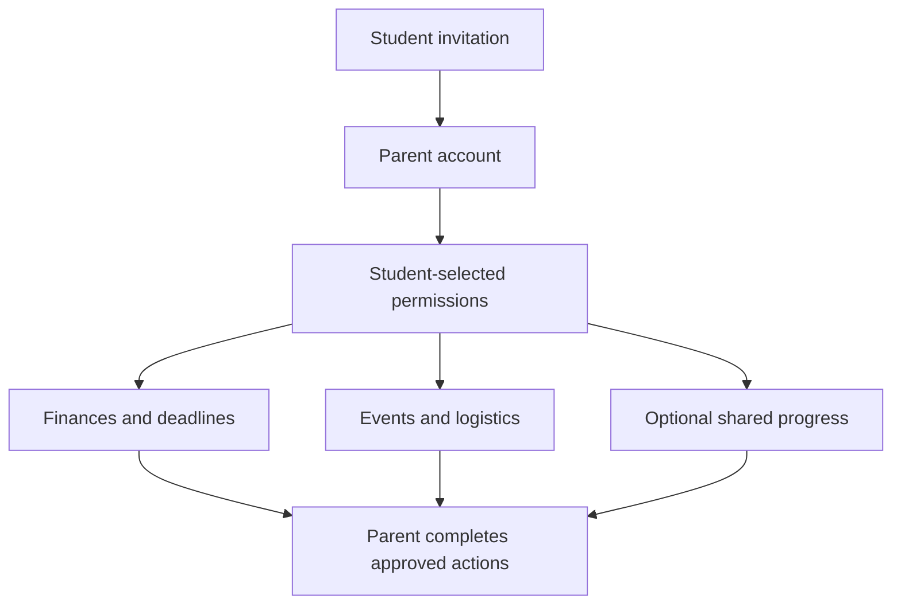

# Semester Parent and Family Portal

Semester should include an optional **Parent and Family Portal** that gives parents a legitimate reason to use the application while protecting student independence and privacy.

The parent experience should not be a surveillance dashboard. Its purpose should be to help families manage finances, deadlines, logistics, safety, and student support without giving parents automatic access to private academic information.

The central value proposition should be:

> **Semester helps parents support their student without having to manage the student’s life for them.**

# Why parents would use Semester

Parents currently receive important information through disconnected systems, emails, payment portals, orientation websites, housing pages, and messages from their student.

Semester would give them one place to:

- Pay tuition and university charges
- Monitor authorized financial information
- Manage payment plans
- Track financial-aid requirements
- View important family deadlines
- Access move-in and housing information
- Receive emergency campus alerts
- Help coordinate travel
- Access family events and university resources
- Support their student when assistance is requested
- Communicate with approved university departments

This creates value for parents while keeping the student in control.

# 1. Parent onboarding

A parent should not be able to search for a student and automatically access their account.

The process should be:

1. The student invites a parent or authorized family member.
2. The parent creates a separate Semester account.
3. The student selects which permissions to grant.
4. Semester explains what each permission allows.
5. The parent accepts the invitation.
6. The student can change or remove access at any time.

Institutions could separately authorize access to particular financial or administrative services.

# 2. Granular student-controlled permissions

Students should control each category independently.

| Permission | Possible parent access |
|---|---|
| Financial account | View bills, make payments, access receipts, and manage payment plans |
| Financial aid | View selected requirements, deadlines, and missing documents |
| Housing | View move-in dates, approved housing information, and family instructions |
| Calendar | View events the student chooses to share |
| Academic summary | View only information explicitly shared by the student |
| Emergency information | Receive official campus alerts and emergency instructions |
| Travel | View approved travel details and arrival information |
| Health | Access only explicitly authorized administrative information |
| Career | View selected career events or documents |
| Communication | Message the student and approved university departments |

Students should be able to choose:

- No access
- View-only access
- Payment-only access
- Selected information
- Temporary access
- Full access to a specific category

# 3. Parent home dashboard

A parent’s dashboard should be completely different from the student dashboard.

It could display:

- Upcoming tuition payments
- Current authorized balance
- Financial-aid requirements
- Move-in and move-out dates
- Family weekend
- University breaks
- Campus emergency alerts
- Travel information shared by the student
- Required parent forms
- University news
- Important family resources
- Messages from authorized departments

It should not automatically show:

- Individual grades
- Assignment submissions
- Private messages
- Search history
- Study activity
- Attendance
- Location
- Health records
- Advisor notes
- Club conversations

# 4. Tuition and payment management

Financial management would likely be the strongest reason for parents to adopt Semester.

Authorized parents should be able to:

- View tuition and fees
- Make payments
- Save payment methods
- Enroll in payment plans
- View upcoming installments
- Download statements
- Download receipts
- Review transaction history
- View housing and dining charges
- Track refunds
- Receive payment reminders
- Contact student financial services

The student and institution should control which financial details are visible.

# 5. Financial-aid support

With appropriate permission, parents could:

- View missing financial-aid documents
- See submission deadlines
- Complete parent-specific forms
- Upload required documentation
- Review estimated family contributions
- View scholarship deadlines
- Track aid-processing status
- Receive reminders
- Contact financial-aid staff

Semester should clearly separate:

- Student actions
- Parent actions
- University actions
- Completed requirements
- Outstanding requirements

# 6. College cost and budget planning

Semester could give families a complete picture of estimated education costs.

## Budget categories

- Tuition
- Fees
- Housing
- Dining
- Books
- Transportation
- Personal expenses
- Clubs
- Athletics
- Study abroad
- Health insurance
- Emergency expenses

## Planning tools

Parents and students could collaboratively:

- Build semester budgets
- Set monthly allowances
- Track approved categories
- Plan travel
- Estimate study-abroad costs
- Compare housing choices
- Track textbook spending
- Create emergency funds

The student should control whether personal spending details are shared.

# 7. Shared family calendar

Students should be able to share selected events such as:

- Move-in
- Move-out
- Academic breaks
- Family weekend
- Graduation
- Travel
- Athletic competitions
- Performances
- Club events
- Study-abroad departure and return
- Important financial deadlines

Parents should not automatically receive the student’s entire academic calendar.

# 8. Housing and move-in support

Parents often help with college logistics. Semester should provide:

- Move-in dates
- Arrival appointments
- Housing address
- Approved room information
- Packing checklist
- Prohibited items
- Parking instructions
- Shipping information
- Mail address
- Move-out requirements
- Storage options
- Family lodging information
- Housing-office contact details

Students could share a collaborative move-in checklist with family members.

# 9. Travel coordination

With student permission, parents could view:

- University break dates
- Travel itinerary
- Departure and arrival times
- Athletic travel
- Study-abroad travel
- Airport or transportation information
- Approved emergency contacts

Students should share travel information intentionally; Semester should not continuously track them.

# 10. Campus safety and emergency alerts

Parents should be able to receive public institutional information such as:

- Campus closures
- Severe weather
- Emergency alerts
- Evacuation instructions
- Public safety updates
- Emergency contact numbers
- Official status updates

Semester should avoid exposing private student locations or personal incident reports.

# 11. Student support requests

A student should be able to send a structured request to a parent, such as:

- Help with a payment
- Review my résumé
- Help plan travel
- Complete this financial-aid form
- Attend this family event
- Review my study-abroad budget
- Send a required document
- Schedule a check-in

The parent would receive the request with the relevant information and action button.

## Why it is useful

Students do not need to forward screenshots, explain complicated portal navigation, or share passwords.

# 12. Optional academic sharing

College students should control academic sharing.

A student could choose to share:

- Semester GPA
- Overall academic standing
- Progress toward graduation
- Completed credits
- General weekly workload
- Upcoming major exams
- Selected grades
- Academic achievements

The student should be able to:

- Share one item
- Share a summary
- Set an expiration date
- Stop sharing
- See when the parent viewed it

Parents should not automatically receive detailed grade or assignment access.

# 13. Well-being check-ins

Semester could support voluntary, student-controlled check-ins.

Examples:

- “I’m doing well.”
- “This week is busy.”
- “I would like to talk.”
- “I need help with something.”
- “I arrived safely.”

Students could schedule or send these without disclosing private health, location, or academic data.

## Why it is useful

It provides reassurance and encourages communication without continuous monitoring.

# 14. Parent-to-student communication

The Parent Portal could include a private family channel for:

- Check-ins
- Documents
- Payment discussions
- Travel plans
- Shared reminders
- Important dates

Students should be able to mute notifications, set boundaries, and control channel access.

# 15. University family resources

Universities could publish:

- Parent orientation
- Family guides
- Campus vocabulary
- Academic-calendar explanations
- Support-service information
- Financial guides
- Housing instructions
- Emergency procedures
- Student privacy explanations
- Advice for supporting college students
- Family newsletters

This helps parents understand where to direct concerns without contacting professors or intervening unnecessarily.

# 16. Family events

Parents should be able to:

- View Family Weekend
- Register for events
- Purchase tickets
- View schedules
- Make dining reservations
- Access maps
- Reserve parking
- Receive updates
- Add events to their calendars

They could also access public:

- Athletic events
- Performances
- Lectures
- Graduation events
- Alumni and family programs

# 17. Student-athlete family experience

With student and institutional permission, parents of student-athletes could access:

- Public competition schedules
- Tickets
- Venue information
- Travel guidance for spectators
- Team news
- Public results
- Livestreams
- Family events
- Approved travel information
- Athletic-department announcements

Parents should not automatically see:

- Medical information
- Private coach communication
- Performance evaluations
- Training data
- Eligibility details

# 18. Study-abroad family portal

For study abroad, authorized family members could access:

- Program dates
- General itinerary
- Emergency contact information
- Payment deadlines
- Required parent documents
- Public safety information
- Time-zone information
- Student-shared travel plans
- Arrival confirmation
- Program updates

The student should control access to personal schedules and location information.

# 19. Career-support features

Students could optionally invite parents to help with:

- Résumé review
- Career-event planning
- Interview preparation
- Internship travel
- Professional clothing budgets
- Relocation planning
- Offer comparison

The student decides what to share. Parents should not be able to submit applications or contact employers as the student.

# 20. Parent document center

Parents often need to provide or retain important documents.

The portal could organize:

- Tuition statements
- Payment receipts
- Tax documents
- Financial-aid forms
- Insurance documents
- Housing forms
- Study-abroad documents
- Authorized-payer agreements
- University correspondence

Documents should be securely separated from the student’s private academic files.

# 21. Parent AI assistant

The Parent Portal could have its own restricted AI assistant.

Parents could ask:

- “When is the next tuition payment due?”
- “What do I need to complete for financial aid?”
- “When is Family Weekend?”
- “Where can I find move-in instructions?”
- “Who should I contact about a billing question?”
- “What information has my student shared with me?”

The parent AI assistant must only use information the parent is authorized to access.

# 22. Multiple-family-member support

Students should be able to invite:

- Parents
- Guardians
- Stepparents
- Grandparents
- Sponsors
- Other authorized payers

Each person could receive different permissions.

For example:

- One parent can make payments.
- Another can view family events.
- A sponsor can view only a specific invoice.
- A guardian can access selected emergency information.

# 23. Divorced or separated family support

The platform should avoid assuming every family shares one household or financial structure.

Semester should support:

- Separate accounts
- Separate communication
- Independent payment permissions
- Different access levels
- Private billing arrangements
- No automatic disclosure among family members

# 24. Privacy and student independence

The Parent Portal succeeds only if students trust it.

Required safeguards include:

- Student-controlled access
- Separate parent credentials
- No password sharing
- Clear access logs
- Permission expiration
- One-click access removal
- No automatic location tracking
- No automatic grade surveillance
- No private-message access
- No hidden parental monitoring

The system should display:

> Your parent can view tuition statements and make payments. They cannot view your grades, assignments, messages, location, or study activity.

# 25. Parent value by student stage

| Stage | Main parent value |
|---|---|
| Applicant | Application, financial-aid, and decision deadlines |
| Admitted student | Deposit, orientation, housing, and preparation |
| First-year student | Move-in, payments, family resources, and emergency information |
| Continuing student | Tuition, travel, shared events, and optional support |
| Student-athlete | Public schedules, tickets, travel, and team-family information |
| Study abroad | Documents, payments, dates, and emergency resources |
| Graduating student | Graduation registration, tickets, travel, and final financial clearance |
| Alumni transition | Family events and continued university involvement |

# 26. Parent subscription or institutional value

The Parent Portal could create an additional business opportunity.

Possible models include:

- Included with institutional adoption
- Free basic parent account
- Optional premium family-planning tools
- University-sponsored family engagement
- Event, ticket, and travel services

Core financial access, emergency alerts, privacy controls, and required university information should not depend on a premium subscription.

# Connected parent workflow

# Updated user ecosystem

Semester would now serve:

- Students
- Faculty
- Advisors
- Administrators
- Student-athletes
- Coaches
- Clubs
- Employers
- Alumni
- Career-center staff
- Authorized parents and family members

# Final parent positioning

> **Semester Family gives parents one secure place to manage approved finances, deadlines, documents, travel, events, and support—while students retain control over their academic life and privacy.**

The reason for parents to use Semester is not to monitor everything their student does. It is to eliminate financial and logistical confusion, provide reliable university information, and make it easier to help when the student chooses to involve them.