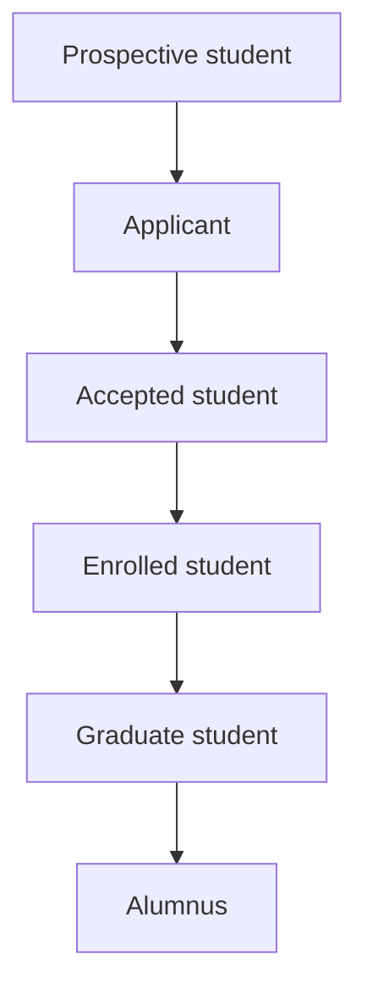

Semester should support the **entire education lifecycle**, beginning before admission and continuing through undergraduate study, graduate education, and alumni life.

A person should not create a completely new account at every stage. Their Semester identity should transition with them:

# Semester Apply: Prospective and applying students

Semester Apply should replace disconnected application portals and allow students to discover schools, prepare applications, submit materials, and monitor decisions in one place.

## 1. School and program discovery

Students should be able to search institutions by:

- Location
- Program
- Major
- Degree type
- Tuition
- Financial aid
- Campus size
- Admission requirements
- Application deadline
- Test requirements
- Housing
- Athletics
- Clubs
- Study-abroad opportunities
- Career outcomes
- Graduate programs

Each institution should have a verified profile containing:

- Programs and majors
- Admission requirements
- Deadlines
- Cost estimates
- Financial-aid information
- Campus tours
- Student organizations
- Athletics
- Housing
- Dining
- Career information
- Contact details

## 2. Application dashboard

Applicants should have one dashboard showing:

- Schools and programs
- Application status
- Deadlines
- Required documents
- Essays
- Recommendations
- Transcripts
- Test scores
- Financial-aid forms
- Interviews
- Missing information
- Decisions

## 3. Reusable student profile

Applicants should enter common information once:

- Personal information
- Contact details
- Education history
- Courses
- Grades
- Activities
- Athletics
- Employment
- Volunteer work
- Awards
- Skills
- Family information when required
- Residency information

They could then choose which information to submit to each institution.

## 4. Document center

Applicants should be able to manage:

- Official transcripts
- Unofficial transcripts
- Test scores
- Résumés
- Portfolios
- Writing samples
- Identification documents
- Residency documents
- Financial-aid forms
- Supplementary materials

Semester should show whether each document is:

- Not started
- Requested
- Uploaded
- Submitted
- Received
- Verified
- Rejected or incomplete

## 5. Essay workspace

Semester Documents should support application essays through:

- Prompt organization
- Brainstorming
- Outlining
- Drafting
- Version history
- Word-count limits
- Grammar and clarity feedback
- Counselor comments
- Final review
- Application-specific versions

AI should not invent experiences or write false personal stories.

## 6. Recommendation system

Applicants should be able to:

- Invite recommenders
- Assign letters to applications
- Track requests
- Send reminders
- View submission status
- Provide supporting information
- Waive access when required

Recommenders should have a separate secure portal for submitting letters directly.

## 7. Interview management

Applicants should be able to:

- Schedule interviews
- Join virtual interviews
- View interviewer details
- Receive preparation materials
- Practice common questions
- Add reminders
- Send follow-up messages
- Record personal notes

## 8. Application submission

Before submission, Semester should check for:

- Missing fields
- Missing documents
- Word-limit violations
- Unanswered questions
- Recommendation status
- Application fee
- Required signatures
- Program-specific requirements

Students should receive a permanent submission receipt.

## 9. Application-status tracking

Applications could be categorized as:

- Preparing
- Ready for review
- Submitted
- Incomplete
- Under review
- Interview requested
- Waitlisted
- Accepted
- Deferred
- Denied
- Withdrawn

## 10. Applicant financial planning

Applicants and authorized parents should be able to:

- Estimate total cost
- Compare institutions
- Track application fees
- Complete financial-aid requirements
- Upload parent documents
- Search scholarships
- Compare aid offers
- Estimate debt
- Calculate payment scenarios
- Review deposit deadlines

Financial comparisons should use consistent assumptions and distinguish estimates from official offers.

# Semester Welcome: Accepted students

Once accepted, the applicant dashboard should automatically transition into an accepted-student portal.

## 1. Decision center

Accepted students should see:

- Admission offer
- Program
- Financial-aid offer
- Scholarship information
- Estimated cost
- Deposit deadline
- Enrollment conditions
- Important documents
- Contact information

Students should be able to accept, decline, or request additional information.

## 2. Enrollment checklist

Semester should create a personalized checklist containing:

- Enrollment deposit
- Final transcript
- Housing application
- Meal-plan selection
- Health forms
- Insurance waiver
- Placement tests
- Student ID photo
- Orientation registration
- Emergency contacts
- Accessibility requests
- Advising questionnaires
- Course registration
- Required training
- Visa requirements
- Financial-aid documents

## 3. Accepted-student community

Universities could provide moderated spaces for:

- Incoming class announcements
- Academic programs
- Housing
- Student organizations
- Athletics
- International students
- Transfer students
- Graduate students
- Questions for current students

Direct messaging and student directories should include strong privacy controls.

## 4. Housing and roommate system

Accepted students should be able to:

- Complete housing applications
- Compare residence halls
- Select preferences
- Find compatible roommates
- Create roommate groups
- Select rooms when permitted
- Sign housing agreements
- View move-in details
- Submit accommodation requests

## 5. Orientation

Semester should manage:

- Orientation registration
- Required modules
- Orientation schedule
- Maps
- Group assignments
- Advisor meetings
- Placement testing
- Campus tours
- Required forms
- Completion tracking

## 6. Academic preparation

Before arrival, students should be able to:

- Review degree requirements
- Take placement tests
- Explore majors
- Meet advisors
- Build preliminary schedules
- Complete prerequisite modules
- Access summer readings
- Generate study materials
- Join academic-interest groups

## 7. Transfer-student support

Transfer students should have additional tools for:

- Previous college transcripts
- Transfer-credit evaluation
- Course-equivalency review
- Major progress
- Missing prerequisites
- Housing
- Transfer orientation
- Advisor appointments
- Expected graduation planning

## 8. International accepted students

Semester should include:

- Visa-document tracking
- Immigration forms
- Arrival information
- International orientation
- English-language requirements
- Travel guidance
- Health requirements
- Housing guidance
- International advisor contact
- Time-zone-aware deadlines

## 9. Parent and family preparation

Authorized family members could access:

- Deposit and billing
- Financial-aid requirements
- Housing deadlines
- Orientation information
- Move-in instructions
- Family events
- Travel planning
- Required parent forms

# Semester Graduate: Graduate and professional students

Graduate students require significantly different tools from undergraduates. Semester should offer specialized workspaces for master’s, doctoral, law, medical, business, and other professional programs.

## 1. Graduate application system

Applicants should be able to manage:

- Program-specific applications
- Statements of purpose
- Research statements
- Writing samples
- Résumés or CVs
- Recommendations
- Transcripts
- Test scores
- Faculty interests
- Assistantship applications
- Fellowship applications
- Interviews

Doctoral applicants should be able to identify potential faculty supervisors and research areas.

## 2. Graduate dashboard

Graduate students should see:

- Courses
- Research milestones
- Advisor meetings
- Assistantship duties
- Funding
- Teaching responsibilities
- Committee requirements
- Thesis or dissertation progress
- Conferences
- Publication deadlines
- Program requirements
- Professional-development opportunities

## 3. Graduate degree planning

Semester should track:

- Required courses
- Electives
- Research credits
- Qualifying examinations
- Comprehensive examinations
- Language requirements
- Residency requirements
- Internship or clinical requirements
- Thesis or dissertation milestones
- Expected completion date
- Time-to-degree limits

## 4. Research workspace

Graduate students should be able to:

- Create research projects
- Store literature
- Annotate articles
- Build bibliographies
- Organize research questions
- Record methods
- Store datasets
- Analyze data
- Track experiments
- Collaborate with research teams
- Maintain research logs
- Manage versions
- Prepare publications

## 5. Literature-review system

Semester should help graduate students:

- Search approved research databases
- Organize sources
- Tag themes
- Compare findings
- Track methodologies
- Identify disagreements
- Create evidence tables
- Build citation networks
- Detect research gaps
- Generate structured reading notes

AI-generated claims should always link back to the original research.

## 6. Advisor and committee management

Students should be able to:

- Identify advisors
- Form committees
- Request faculty participation
- Schedule committee meetings
- Share drafts
- Collect feedback
- Track approvals
- Record decisions
- Manage milestone deadlines

Faculty should be able to comment on documents without losing version history.

## 7. Thesis and dissertation management

Semester should support the complete process:

1. Topic exploration
2. Proposal
3. Committee approval
4. Literature review
5. Research plan
6. Ethics approval
7. Data collection
8. Analysis
9. Chapter drafting
10. Advisor review
11. Defense scheduling
12. Revisions
13. Final submission
14. Institutional deposit

## 8. Research ethics and compliance

Where applicable, Semester should manage:

- Ethics-review applications
- Human-subjects approval
- Animal-research approval
- Conflict-of-interest forms
- Safety training
- Data-management plans
- Consent documents
- Approval renewals
- Protocol modifications

Sensitive research information requires strict permissions.

## 9. Funding and assistantships

Graduate students should be able to view:

- Stipend
- Tuition coverage
- Assistantship terms
- Fellowship funding
- Grant support
- Payment schedule
- Funding expiration
- Required work
- Health-insurance support
- Travel funding
- Research expenses

## 10. Teaching-assistant workspace

Graduate teaching assistants should receive controlled faculty tools for:

- Section management
- Attendance
- Office hours
- Discussion sections
- Grading
- Rubrics
- Student questions
- Announcements
- Course files
- Assigned permissions

They should not automatically receive full instructor or student-record access.

## 11. Research-assistant workspace

Research assistants should be able to:

- View assigned tasks
- Access approved project files
- Record work
- Enter research data
- Attend lab meetings
- Complete training
- Submit reports
- Track hours
- Communicate with supervisors

## 12. Laboratory management

Research groups could use Semester to manage:

- Lab members
- Equipment reservations
- Safety documents
- Inventories
- Protocols
- Experiments
- Samples
- Data
- Meetings
- Publications
- Training records

## 13. Graduate studying

Semester Study should adapt to graduate-level learning through:

- Article analysis
- Literature reviews
- Oral-exam preparation
- Comprehensive-exam planning
- Advanced problem sets
- Research-method practice
- Theory comparisons
- Long-term reading plans
- Citation management
- Teach-Back Mode
- Discipline-specific AI tutoring

## 14. Publications

Semester should support:

- Manuscript drafting
- Coauthor collaboration
- Journal selection
- Citation formatting
- Figure management
- Submission deadlines
- Reviewer comments
- Revision tracking
- Publication status
- Institutional repositories

## 15. Conferences

Graduate students should be able to:

- Find conferences
- Track submission deadlines
- Submit abstracts
- Create posters
- Build presentations
- Request travel funding
- Arrange travel
- Store receipts
- Record networking contacts
- Add publications and presentations to their CV

## 16. Clinical and professional programs

Specialized programs may require:

- Clinical placements
- Rotations
- Patient-hour tracking
- Supervisor evaluations
- Skills checklists
- Professional examinations
- Licensure requirements
- Residency applications
- Case logs
- Compliance training

Permissions must protect sensitive information.

## 17. Graduate career center

Graduate career services should include:

- Academic CV builder
- Résumé builder
- Faculty-job searches
- Industry-job searches
- Postdoctoral opportunities
- Fellowship searches
- Research positions
- Teaching statements
- Research statements
- Job-talk preparation
- Interview preparation
- Alumni networking
- Salary negotiation

## 18. Graduate community

Semester should support:

- Research groups
- Graduate associations
- Department communities
- Writing groups
- Teaching-assistant groups
- International graduate students
- Professional organizations
- Conference groups
- Dissertation support groups

# Different dashboards for every stage

| User stage | Primary dashboard focus |
|---|---|
| Prospective student | School and program discovery |
| Applicant | Deadlines, materials, recommendations, and application status |
| Accepted student | Enrollment, financial aid, housing, and orientation |
| Undergraduate | Courses, studying, assignments, campus life, and careers |
| Master’s student | Courses, professional development, projects, and career |
| Doctoral student | Research, funding, teaching, committee, and dissertation |
| Professional student | Courses, clinical work, licensing, and placements |
| Alumnus | Careers, networking, mentoring, events, and credentials |
| Parent | Approved finances, logistics, deadlines, and family resources |

# Permanent Semester identity

A central advantage should be continuity. The user’s account should evolve without losing relevant work.

With proper permissions and retention controls, the account could preserve:

- Applications
- Admission documents
- Academic records
- Course materials
- Study guides
- Documents and projects
- Résumés and portfolios
- Certifications
- Research
- Publications
- Club involvement
- Athletic participation
- Career history
- Alumni connections

Users should control what remains visible, what is exported, and what is deleted.

# Updated complete positioning

> **Semester is a lifelong education operating system supporting prospective students, applicants, accepted students, undergraduates, graduate and professional students, parents, faculty, administrators, employers, and alumni—from the first college search through admission, learning, research, career development, graduation, and lifelong professional connection.**