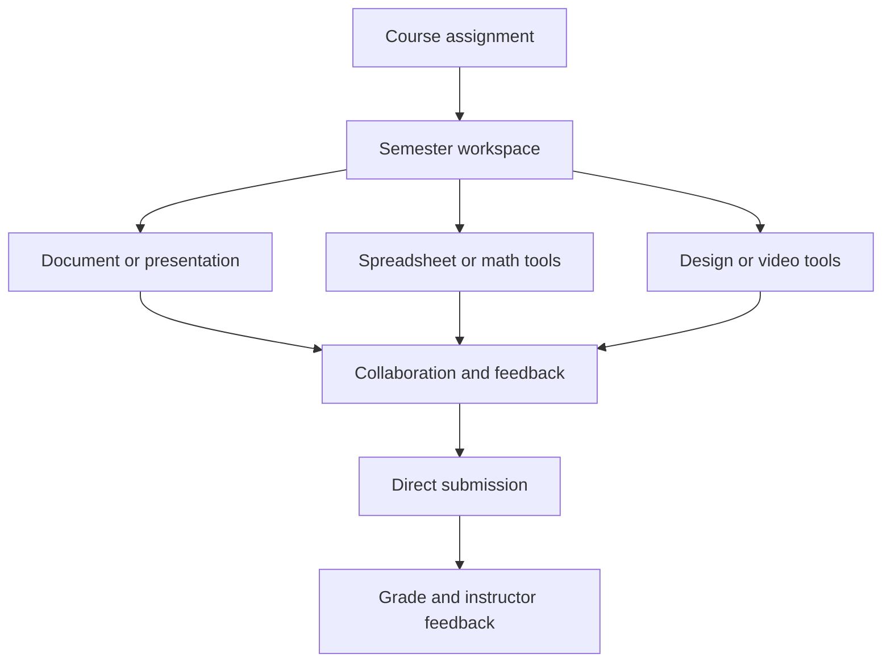

Semester should also replace the major productivity, communication, design, video, presentation, spreadsheet, form, and mathematics applications students use. This turns Semester from a school-management platform into a complete **education, productivity, and creation operating system**.

# Expanded Semester product vision

> **Semester is one unified application replacing school platforms and external productivity tools—including Canvas, Brightspace, Blackboard, Moodle, Google Docs, Gmail, Outlook, Zoom, Google Slides, Microsoft PowerPoint, Excel, Google Forms, Canva, CapCut, video platforms, and Desmos.**

Students should be able to complete nearly their entire academic workflow without leaving Semester:

- Receive an assignment
- Review instructions and course resources
- Research and take notes
- Write a paper
- Build a presentation
- Analyze data in a spreadsheet
- Create graphics
- Record and edit a video
- Solve and graph equations
- Collaborate with classmates
- Meet through video
- Submit the completed work
- Receive a grade and feedback

# Additional applications Semester replaces

| Application | Semester replacement |
|---|---|
| Google Docs | Collaborative document editor |
| Gmail | University email and inbox |
| Outlook | Email, calendar, contacts, and scheduling |
| Zoom | Video classes, meetings, recordings, and transcripts |
| Google Slides | Collaborative presentation builder |
| Microsoft PowerPoint | Advanced presentation design and delivery |
| Excel | Spreadsheets, formulas, analysis, tables, and charts |
| Google Forms | Forms, surveys, quizzes, and data collection |
| Canva | Graphic design, templates, posters, and social content |
| CapCut | Video recording, editing, captions, effects, and exporting |
| Desmos | Graphing, mathematical visualization, and classroom activities |

# 1. Semester Documents

Semester Documents should replace Google Docs and the academic functions of Microsoft Word.

## Core editing

Students and faculty should be able to:

- Create blank documents
- Use academic templates
- Format text
- Insert headings
- Create lists and tables
- Add images and diagrams
- Add equations
- Insert footnotes
- Add headers and page numbers
- Create citations and bibliographies
- Track word count
- Check spelling and grammar
- Search and replace text
- Export to PDF and DOCX
- Print documents
- Access documents offline

## Academic writing tools

Semester Documents should include:

- MLA, APA, Chicago, and other citation formats
- Automatic bibliography generation
- Footnotes and endnotes
- Title-page templates
- Research-paper formatting
- Citation verification
- Source organization
- Outline generation
- Table-of-contents generation
- Plagiarism checking
- Version history
- Instructor rubrics
- Writing feedback

## Collaboration

Users should be able to:

- Edit simultaneously
- See collaborator cursors
- Leave comments
- Suggest edits
- Mention classmates or professors
- Assign action items
- Compare document versions
- Accept or reject changes
- Control viewing and editing permissions

Documents should connect directly to courses and assignments. A student should be able to create a paper from an assignment page and submit it without downloading or reuploading it.

# 2. Semester Mail

Semester Mail should replace Gmail and Outlook for institutional communication.

## Core functions

- Inbox
- Sent mail
- Drafts
- Archive
- Trash
- Spam filtering
- Folders and labels
- Attachments
- Contact directory
- Search
- Signatures
- Scheduled sending
- Automatic replies
- Message forwarding
- Group distribution lists

## School-specific intelligence

Semester Mail should:

- Organize messages by course
- Recognize professors, advisors, and departments
- Extract dates and deadlines
- Add meetings to the calendar
- Convert emails into tasks
- Connect attachments to course files
- Flag urgent institutional messages
- Summarize long emails
- Draft professional responses
- Detect suspicious or phishing messages

Official announcements, direct messages, emergency alerts, and ordinary emails should be clearly distinguished.

# 3. Semester Meetings

Semester Meetings should replace Zoom and similar video-conferencing tools.

## Meeting capabilities

- One-to-one video calls
- Group meetings
- Virtual classes
- Office hours
- Advising appointments
- Screen sharing
- Presentation mode
- Breakout rooms
- Text chat
- Reactions
- Hand raising
- Polls
- Whiteboards
- Background effects
- Waiting rooms
- Host controls
- Attendance tracking

## Academic functions

Semester Meetings should support:

- Automatic class links
- Meetings displayed inside course pages
- Lecture recording
- Automatic transcription
- Captions
- Searchable transcripts
- Chapter markers
- Shared lecture notes
- Questions linked to timestamps
- Attendance records
- Instructor-controlled recordings
- Recorded-lecture study guides

A professor should be able to host a class directly through the course page. When the session ends, the recording, transcript, notes, and related files should automatically appear in the appropriate course module.

# 4. Semester Presentations

Semester Presentations should replace Google Slides and PowerPoint.

## Creation tools

Users should be able to:

- Create presentations from scratch
- Use academic and professional templates
- Add text, images, videos, tables, charts, and equations
- Build diagrams
- Apply themes
- Create slide layouts
- Add speaker notes
- Add transitions and animations
- Collaborate in real time
- Comment and suggest changes
- Present directly from Semester
- Export to PPTX and PDF

## AI capabilities

The presentation assistant should be able to:

- Turn an outline into slides
- Convert a paper into a presentation
- Suggest slide organization
- Summarize text
- Generate speaker notes
- Improve readability
- Recommend visuals
- Create charts from Semester spreadsheet data
- Check presentation length
- Practice timing
- Generate likely audience questions

## Presentation delivery

Semester should support:

- Presenter view
- Slide notes
- Timers
- Live audience questions
- Polls
- Remote presenting
- Collaborative presenting
- Recording with narration
- Automatic captions

Presentations should be attachable to assignments and deliverable through Semester Meetings.

# 5. Semester Sheets

Semester Sheets should replace Excel and Google Sheets.

## Spreadsheet functions

- Cells, rows, columns, and worksheets
- Formulas and functions
- Tables
- Sorting and filtering
- Conditional formatting
- Data validation
- Pivot tables
- Charts
- Statistical analysis
- Financial calculations
- Data importing
- CSV and XLSX support
- Real-time collaboration
- Comments
- Version history

## Academic functions

Semester Sheets should offer tools for:

- Statistics
- Economics
- Finance
- Accounting
- Business
- Laboratory data
- Survey analysis
- Research projects
- Grade calculations
- Budgeting

## Integrated capabilities

Spreadsheet data should connect to:

- Presentations
- Reports
- Forms
- Course assignments
- Research projects
- Financial planning
- Charts and dashboards

For example, responses from a Semester Form should automatically populate a Semester Sheet and generate charts.

# 6. Semester Forms

Semester Forms should replace Google Forms and Microsoft Forms.

## Form creation

Users should be able to create:

- Surveys
- Quizzes
- Applications
- Sign-up forms
- Feedback forms
- Attendance forms
- Research questionnaires
- Course evaluations
- Event registrations
- Appointment requests

## Question types

- Multiple choice
- Checkboxes
- Dropdown menus
- Short answer
- Paragraph response
- Rating scales
- Ranking
- Dates and times
- File uploads
- Images
- Video responses
- Mathematical responses
- Electronic signatures

## Form management

Semester should support:

- Conditional questions
- Required responses
- Anonymous responses
- Identity verification
- Response limits
- Opening and closing dates
- Automatic grading
- Response summaries
- Charts
- Spreadsheet exports
- Email confirmations
- Permission controls

Professors should be able to convert forms into quizzes, attendance checks, or course surveys.

# 7. Semester Design

Semester Design should replace Canva for academic and campus-related design work.

## Design products

Users should be able to create:

- Posters
- Flyers
- Infographics
- Reports
- Resume designs
- Social-media graphics
- Club announcements
- Event invitations
- Course graphics
- Certificates
- Diagrams
- Presentations

## Design tools

- Drag-and-drop editor
- Templates
- Text styles
- Shapes
- Icons
- Image uploads
- Background removal
- Layers
- Alignment tools
- Brand colors
- Charts
- Diagrams
- Image editing
- Collaboration
- Comments
- Resize tools
- PDF, PNG, JPG, and SVG exports

## Institutional templates

Schools should be able to provide approved templates containing:

- Official logos
- Colors
- Fonts
- Department branding
- Accessibility standards
- Event requirements

This would let students create polished materials while following institutional brand rules.

# 8. Semester Video

Semester Video should replace CapCut and other basic academic video-editing applications.

## Video creation

Users should be able to:

- Record using a camera
- Record the screen
- Record presentations
- Import media
- Record voiceovers
- Combine clips
- Trim and split footage
- Rearrange clips
- Add images and audio
- Adjust volume
- Control playback speed
- Add transitions
- Add text
- Add subtitles
- Add overlays
- Remove backgrounds
- Apply basic visual adjustments

## Academic video tools

Semester should support:

- Video essays
- Recorded presentations
- Group projects
- Demonstrations
- Interviews
- Laboratory reports
- Language assignments
- Course announcements
- Lecture recordings

## AI video capabilities

- Automatic captions
- Transcript generation
- Silence removal
- Background-noise reduction
- Speaker identification
- Chapter creation
- Transcript-based editing
- Clip suggestions
- Automatic summaries
- Translation and subtitles
- Accessibility checking

Completed videos should be directly attachable to assignments, course modules, presentations, or messages.

# 9. Semester Math

Semester Math should replace Desmos for graphing and classroom mathematical work.

## Calculator tools

- Scientific calculator
- Graphing calculator
- Geometry tools
- Statistics calculator
- Matrix operations
- Regression analysis
- Tables
- Unit conversions
- Probability tools
- Financial calculations

## Graphing functions

Students should be able to:

- Graph equations
- Graph inequalities
- Plot data
- Add sliders
- Find intersections
- Identify roots
- View maximum and minimum points
- Calculate derivatives
- Display integrals
- Create regression models
- Animate variables
- Adjust graph windows
- Export graphs

## Classroom functions

Professors should be able to create:

- Interactive math activities
- Guided lessons
- Graphing assignments
- Collaborative activities
- Mathematical assessments
- Live classroom demonstrations

Graphs and calculations should embed directly inside documents, presentations, assignments, quizzes, and study guides.

# 10. Semester Files

A central file system is necessary to connect every creation tool.

## File organization

Users should be able to organize files by:

- Course
- Assignment
- Semester
- Club
- Project
- Personal folder

## File capabilities

- Uploading
- Creating
- Renaming
- Moving
- Copying
- Sharing
- Downloading
- Searching
- Tagging
- Favoriting
- Archiving
- Restoring deleted files
- Version history
- Offline access

Semester should support common formats such as:

- PDF
- DOCX
- PPTX
- XLSX
- CSV
- JPG
- PNG
- SVG
- MP4
- MOV
- MP3
- WAV

# 11. Connected academic workflow

Semester’s biggest advantage should be that all tools work together.

Example workflow:

1. A professor creates a research assignment.
2. The deadline automatically appears on every student’s calendar.
3. Students create a shared Semester Document.
4. They collect survey responses through Semester Forms.
5. Results automatically populate Semester Sheets.
6. Students analyze the results and create charts.
7. Charts are inserted into a Semester Presentation.
8. Students meet through Semester Meetings.
9. They record and edit their final presentation in Semester Video.
10. They submit the entire project directly through the assignment.
11. The professor grades it with a rubric and provides feedback.
12. The grade automatically appears in the gradebook.

No downloading, reuploading, switching accounts, or opening outside applications should be required.

# 12. Updated primary navigation

The application should remain understandable despite its expanded capabilities.

## Main student navigation

1. **Home**
2. **Courses**
3. **Calendar**
4. **Assignments**
5. **Messages**
6. **Create**
7. **More**

## Create section

- Document
- Presentation
- Spreadsheet
- Form
- Design
- Video
- Math activity
- Study guide
- Notes

## More section

- Grades
- Study Center
- Meetings
- Registration
- Degree Planning
- Advising
- Finances
- Campus Services
- Files
- Settings

A universal search bar and AI assistant should remain available throughout the application.

# 13. Updated development roadmap

Attempting to build every replacement simultaneously would produce an unfocused and unreliable platform. The platform should be developed as connected product suites.

## Stage 1: Academic foundation

- Accounts and permissions
- Courses
- Assignments
- Calendar
- Syllabus upload
- Gradebook
- Notifications
- Study-guide generation
- File storage

## Stage 2: Productivity suite

- Documents
- Presentations
- Spreadsheets
- Forms
- Real-time collaboration
- File sharing
- Version history

## Stage 3: Communication suite

- Email
- Direct messaging
- Announcements
- Video meetings
- Recordings
- Transcriptions
- Contacts and scheduling

## Stage 4: Creative and technical tools

- Graphic design
- Video creation and editing
- Mathematical graphing
- Scientific calculations
- Interactive class activities

## Stage 5: University administration

- Registration
- Degree planning
- Advising
- Student records
- Financial accounts
- Institutional reporting

## Stage 6: Campus operations

- Student ID
- Dining
- Housing
- Mail
- Transportation
- Libraries
- Health services
- Career services
- Student organizations

## Stage 7: Complete institutional replacement

- Data-migration systems
- Administrative controls
- Enterprise security
- Institution-wide analytics
- Compliance management
- Support infrastructure
- Service guarantees
- Legacy-system retirement

# Updated final positioning

> **Semester is the complete operating system for education—one application replacing learning-management systems, email, calendars, video meetings, documents, presentations, spreadsheets, forms, design software, video editors, graphing calculators, registration portals, advising systems, financial accounts, and campus-service platforms.**

The goal is not simply to place everything on one dashboard. The goal is to let students, professors, advisors, and administrators **complete every major school activity inside one connected environment.**