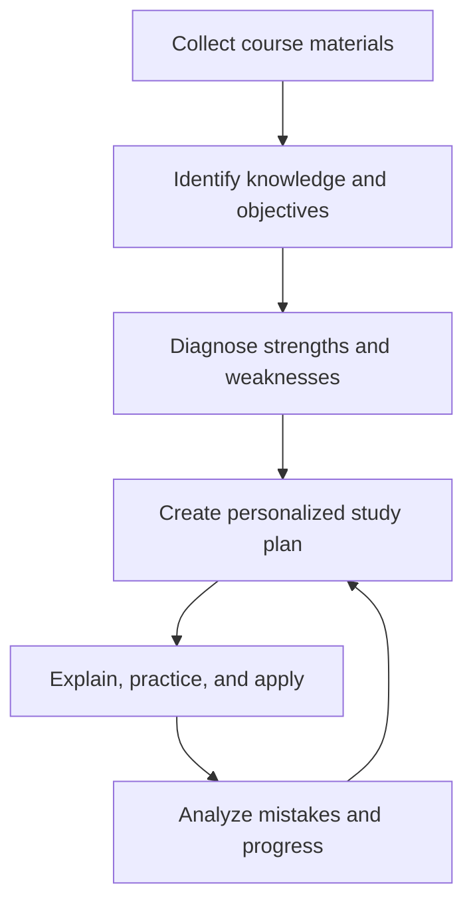

# Semester Study: Expanded Capabilities and Their Usefulness

The studying system should be the feature that makes Semester fundamentally different from traditional school platforms.

Canvas, Blackboard, Brightspace, and Moodle mainly distribute information. Semester Study should go further by helping students:

- Understand what they need to learn
- Organize course materials
- Decide what to study
- Learn concepts
- Practice recalling information
- Apply knowledge
- Identify weaknesses
- Prepare for assessments
- Measure improvement
- Retain knowledge over time

Semester Study should function as a personalized learning engine for every course.

# 1. Automatic course knowledge system

Semester should turn every course into a structured, searchable knowledge base.

## What it processes

- Syllabi
- Lecture slides
- Lecture recordings
- Transcripts
- Textbook chapters
- Assigned readings
- Class notes
- Handwritten notes
- Assignment instructions
- Rubrics
- Professor announcements
- Discussion posts
- Past quizzes
- Practice problems
- Study guides
- Relevant course emails
- Student-created materials

## What it identifies

- Topics
- Subtopics
- Definitions
- Formulas
- People
- Dates
- Events
- Theories
- Arguments
- Examples
- Evidence
- Processes
- Learning objectives
- Connections between concepts
- Exam coverage
- Professor emphasis

## Why it is useful

Students often have the information they need but cannot find or organize it. Semester should eliminate the need to search through folders, emails, modules, notes, and recordings separately.

A student could search:

- “Where did the professor explain fiscal policy?”
- “Find every example of opportunity cost.”
- “Which lecture covered this formula?”
- “Show all material related to Exam 2.”
- “What did the syllabus say about the final?”

# 2. Source hierarchy and conflict detection

Semester should understand that not all sources are equally authoritative.

A recommended hierarchy would be:

1. Official professor announcements
2. Updated assignment instructions
3. Current syllabus
4. Course modules
5. Professor-provided slides and notes
6. Required readings
7. Student notes
8. AI-generated materials

If two sources conflict, Semester should alert the student.

Example:

> The original syllabus lists the exam on October 12, but the professor’s September 30 announcement changes it to October 15.

## Why it is useful

This prevents students from studying for the wrong date, following outdated directions, or treating AI-generated content as official course policy.

# 3. Automatic syllabus-to-study transformation

After syllabus upload, Semester should automatically create:

- Course timeline
- Assignment schedule
- Exam schedule
- Reading schedule
- Weekly study recommendations
- Grade-weight overview
- Course workload forecast
- Initial flashcard categories
- Exam-preparation timelines
- Course knowledge structure

## Why it is useful

A syllabus stops being a static PDF and becomes the operating plan for the entire course.

# 4. Diagnostic assessment

Before creating a study plan, Semester should determine what the student already knows.

## Diagnostic options

- Short multiple-choice assessment
- Free-response questions
- Confidence ratings
- Problem-solving questions
- Vocabulary checks
- Self-assessment
- Review of previous quiz results
- Review of previous assignment feedback

Semester should identify:

- Strong topics
- Weak topics
- Unknown topics
- Misconceptions
- Knowledge gaps
- Topics the student understands but cannot apply
- Topics the student can recognize but not independently recall

## Why it is useful

Two students preparing for the same exam may need completely different study plans. Diagnostics prevent students from wasting time reviewing material they already understand.

# 5. Personalized study paths

Semester should generate a different learning path for each student based on:

- Diagnostic results
- Upcoming deadlines
- Course difficulty
- Grade weights
- Student goals
- Available time
- Preferred study methods
- Previous performance
- Professor expectations
- Accessibility needs

## Example personalized path

For a student struggling with statistics:

1. Review the difference between populations and samples.
2. Complete a short concept check.
3. Watch the relevant lecture segment.
4. Review the formula guide.
5. Complete three guided problems.
6. Complete five independent problems.
7. Explain the concept in Teach-Back Mode.
8. Take a timed quiz.
9. Review errors.
10. Schedule another review in three days.

## Why it is useful

The platform gives students a clear path instead of simply presenting a large library of study tools.

# 6. Multiple explanation styles

Students should be able to request explanations in different formats.

## Explanation options

- Plain language
- Course-level language
- Advanced explanation
- Step-by-step explanation
- Real-world example
- Analogy
- Visual explanation
- Mathematical explanation
- Historical context
- Compare-and-contrast
- Cause-and-effect
- One-sentence explanation
- Detailed explanation

## Why it is useful

Students do not all understand material in the same way. A technical textbook explanation may be accurate but still unhelpful to someone encountering the concept for the first time.

# 7. Layered explanations

Semester should reveal information gradually.

### Layer 1: Quick answer

A short definition or overview.

### Layer 2: Core explanation

The essential details required for class.

### Layer 3: Example

A practical demonstration.

### Layer 4: Deeper understanding

Nuances, exceptions, and related concepts.

### Layer 5: Application

Questions or problems requiring the concept.

## Why it is useful

Students can choose the amount of explanation they need without being overwhelmed by unnecessary detail.

# 8. Socratic tutoring

The AI tutor should not always provide the answer immediately.

It should be able to:

- Ask guiding questions
- Provide progressive hints
- Identify where reasoning went wrong
- Ask the student to explain a step
- Test assumptions
- Encourage the student to revise
- Reveal the answer only when appropriate

## Example

Instead of giving the answer to a calculus problem, Semester might ask:

> Which differentiation rule applies to the outer function?

If the student remains stuck:

> First rewrite the expression as a power. What exponent do you get?

## Why it is useful

Students learn the method rather than copying an answer.

# 9. Teach-Back Mode

Semester should ask students to explain a concept in their own words.

It should then identify:

- Correct information
- Missing information
- Incorrect claims
- Unclear reasoning
- Missing examples
- Weak connections

It should respond with targeted follow-up questions.

## Why it is useful

Students often believe they understand something because it looks familiar. Explaining it without notes provides stronger evidence of actual understanding.

# 10. Hint ladder

Problem-solving support should have several levels:

1. Restate the problem.
2. Identify the relevant concept.
3. Suggest the first step.
4. Provide a stronger hint.
5. Show part of the process.
6. Show a complete explanation.
7. Generate a similar problem.

## Why it is useful

Students can receive enough support to continue without immediately losing the opportunity to solve the problem independently.

# 11. Mistake analysis

Semester should analyze incorrect answers and identify the type of mistake.

Examples include:

- Conceptual misunderstanding
- Calculation error
- Incorrect formula
- Misread question
- Missing evidence
- Weak thesis
- Incomplete explanation
- Incorrect unit
- Sign error
- Confusion between similar concepts
- Failure to answer every part

## Why it is useful

Simply seeing that an answer is wrong does not tell a student how to improve. Semester should identify the cause of the error.

# 12. Personal mistake library

Semester should maintain a private history of recurring errors.

It could identify patterns such as:

- Frequently forgetting negative signs
- Confusing correlation with causation
- Failing to define key terms
- Using evidence without explaining it
- Misinterpreting graph axes
- Forgetting units
- Rushing through multi-part questions

## Why it is useful

The student can practice their specific weaknesses instead of receiving generic advice.

# 13. Similar-problem generation

After a student struggles with a problem, Semester should generate:

- An easier example
- A similar example
- A slightly harder example
- A mixed-topic example
- An exam-style example

Each generated problem should be clearly labeled and based on the approved course material.

## Why it is useful

Students can practice the underlying skill rather than memorizing one answer.

# 14. Question decomposition

Semester should help students break complicated prompts into manageable parts.

For an essay question, it could identify:

- Main command word
- Required concepts
- Time period
- Comparison dimensions
- Evidence requirements
- Number of tasks
- Suggested structure

For a math problem, it could identify:

- Given information
- Unknown variable
- Relevant formula
- Required conversions
- Necessary steps

## Why it is useful

Many students understand course material but lose points because they misunderstand what the question requires.

# 15. Eleven study-guide formats

Semester should maintain the 11 core formats:

1. Comprehensive study guide
2. Simplified study guide
3. Structured outline
4. Bullet-point notes
5. Flashcards
6. Practice quiz
7. Practice exam
8. Key-terms glossary
9. Concept map
10. Formula and problem-solving guide
11. Audio study guide

Each format should have customization controls.

## Customization options

- Length
- Depth
- Difficulty
- Selected topics
- Selected sources
- Exam focus
- Question quantity
- Question type
- Reading level
- Citation style
- Visual density
- Available study time

## Why it is useful

One set of course materials can become several complementary learning experiences instead of a single generic summary.

# 16. Smart flashcards

Flashcards should go beyond simple term-definition pairs.

## Card types

- Definition
- Question and answer
- Fill in the blank
- Image identification
- Diagram labeling
- Formula recall
- Example recognition
- Compare-and-contrast
- Audio identification
- Sequence ordering
- Application scenario

## Smart controls

Semester should:

- Track confidence
- Track accuracy
- Schedule reviews
- Detect memorization without understanding
- Generate application cards
- Separate mastered and developing cards
- Avoid repeatedly showing only easy cards
- Allow manual editing
- Link each card to its source

## Why it is useful

Students practice active recall while Semester decides which information needs to return and when.

# 17. Spaced repetition

Review intervals should adjust based on:

- Accuracy
- Confidence
- Response time
- Previous attempts
- Exam date
- Topic importance
- Forgetting history

## Why it is useful

Students review material close to the point when they might forget it, improving long-term retention and reducing last-minute cramming.

# 18. Practice quizzes

Quizzes should be configurable by:

- Topic
- Unit
- Difficulty
- Question type
- Number of questions
- Time limit
- Open-note or closed-note mode
- Immediate or delayed feedback

After each question, Semester could provide:

- Correct answer
- Explanation
- Source
- Why other options are incorrect
- Related concept
- Recommended review

## Why it is useful

Frequent low-stakes testing helps students discover weaknesses before the actual exam.

# 19. Adaptive quizzes

Question difficulty should change based on performance.

- Correct answers lead to harder or more applied questions.
- Incorrect answers lead to targeted review.
- Repeated mistakes trigger alternative explanations.
- Slow responses may trigger fluency practice.
- High confidence paired with an incorrect answer signals a misconception.

## Why it is useful

The quiz remains challenging without becoming impossible or repetitive.

# 20. Realistic practice exams

Semester should recreate the professor’s expected assessment style whenever sufficient information is available.

It could use:

- Syllabus descriptions
- Professor review materials
- Previous quizzes
- Course learning objectives
- Provided sample questions
- Student-selected settings

## Exam conditions

- Time limit
- Point values
- Question sections
- Limited hints
- No immediate feedback
- Full-screen mode
- Optional permitted resources

## Results

Semester should show:

- Overall score
- Topic scores
- Time used
- Questions skipped
- Confidence accuracy
- Recurring mistakes
- Readiness areas
- Recommended next steps

## Why it is useful

Students practice retrieving and applying information under conditions closer to the actual assessment.

# 21. Essay preparation

Semester should assist with:

- Understanding prompts
- Brainstorming
- Thesis development
- Outlining
- Evidence organization
- Counterarguments
- Paragraph structure
- Citation formatting
- Revision
- Rubric comparison

It should not fabricate sources, quotations, or student experiences.

## Why it is useful

Students receive help with the writing process while maintaining responsibility for their arguments and final work.

# 22. Oral-exam preparation

Semester should support spoken practice.

It could:

- Ask verbal questions
- Record student answers
- Transcribe responses
- Identify missing concepts
- Measure answer length
- Detect excessive filler words
- Ask follow-up questions
- Simulate a professor
- Provide speaking feedback

## Why it is useful

This prepares students for language examinations, presentations, interviews, defenses, and participation-heavy courses.

# 23. Presentation rehearsal

Students should be able to rehearse Semester Presentations and receive feedback on:

- Timing
- Pace
- Clarity
- Slide dependence
- Filler words
- Transitions
- Coverage of required material
- Audience accessibility
- Likely questions

## Why it is useful

The student practices both content knowledge and delivery.

# 24. Reading intelligence

Semester’s reading workspace should identify:

- Main argument
- Supporting claims
- Evidence
- Key terms
- Methodology
- Findings
- Counterarguments
- Limitations
- Connections to lectures
- Possible exam questions

Students should be able to:

- Highlight
- Annotate
- Define terms
- Ask questions
- Translate passages
- Create flashcards
- Generate notes
- Compare readings
- Extract citations

## Why it is useful

Long academic readings become easier to navigate without replacing the need to read and evaluate them.

# 25. Compare Sources Mode

Students should be able to select multiple sources and ask Semester to compare them.

It could identify:

- Shared arguments
- Disagreements
- Different methods
- Different definitions
- Conflicting evidence
- Chronological development
- Strengths and limitations

## Why it is useful

This is especially valuable for essays, literature reviews, political science, history, economics, and research assignments.

# 26. Citation and evidence manager

Semester should allow students to:

- Save sources
- Organize sources by project
- Generate citations
- Store quotations with page numbers
- Add annotations
- Tag evidence
- Build bibliographies
- Insert citations into Semester Documents
- Check whether a quotation matches its source

## Why it is useful

Students can keep research organized and reduce accidental citation errors.

# 27. Lecture intelligence

With permission, Semester should convert lectures into:

- Searchable transcripts
- Chapters
- Key-point summaries
- Definitions
- Professor emphasis
- Questions asked in class
- Example lists
- Flashcards
- Study guides
- Practice questions

Students should be able to click a transcript sentence and jump to that moment in the recording.

## Why it is useful

A student can revisit a specific explanation without replaying an entire lecture.

# 28. Synced lecture notes

Semester could synchronize:

- Lecture recording
- Transcript
- Professor slides
- Student notes

If a student writes a note at 10:17 a.m., the note could link to the corresponding lecture timestamp and slide.

## Why it is useful

Review becomes faster because every form of course content is connected.

# 29. Visual learning tools

Semester should generate or support:

- Concept maps
- Timelines
- Process diagrams
- Comparison tables
- Cause-and-effect maps
- Annotated graphs
- Labeled diagrams
- Geographic maps
- Formula relationships

## Why it is useful

Some relationships are difficult to understand through paragraphs alone.

# 30. Audio learning

Students should be able to:

- Generate audio study guides
- Listen to notes
- Create audio flashcards
- Practice pronunciation
- Pause for questions
- Adjust playback speed
- Download content
- Follow synchronized text

## Why it is useful

Students can review while walking, commuting, exercising, or completing other low-attention activities.

# 31. Language-learning mode

Semester should support:

- Vocabulary
- Pronunciation
- Listening comprehension
- Speaking practice
- Translation exercises
- Grammar corrections
- Conversation simulations
- Reading comprehension
- Writing feedback
- Spaced-repetition vocabulary

## Why it is useful

Language courses require listening and speaking practice that static notes cannot provide.

# 32. Mathematics and quantitative learning

Semester should combine AI tutoring, Semester Math, and Semester Sheets.

Students should be able to:

- Scan a handwritten problem
- Enter equations
- Graph functions
- Build tables
- Check individual steps
- Request hints
- Generate related problems
- Practice formulas
- Identify calculation errors
- Analyze datasets
- Visualize results

## Why it is useful

The student can move between conceptual explanation, calculation, graphing, data analysis, and practice without changing applications.

# 33. Coding study tools

Semester could support introductory programming education through:

- Code editor
- Syntax highlighting
- Execution sandbox
- Test cases
- Error explanations
- Step tracing
- Variable visualization
- Debugging hints
- Practice exercises
- Version history

## Why it is useful

Students learn why code fails instead of only receiving corrected code.

# 34. Lab and science preparation

Science courses could include:

- Pre-lab quizzes
- Procedure walkthroughs
- Safety checks
- Equipment diagrams
- Formula guides
- Data tables
- Observation records
- Error analysis
- Lab-report templates
- Results visualization

## Why it is useful

Students arrive prepared and can connect laboratory procedures with the underlying scientific concepts.

# 35. Study-session builder

Students should be able to choose:

- Available time
- Course
- Exam
- Energy level
- Preferred study format
- Current location
- Internet availability

Semester could then create a session such as:

### Thirty-minute session

- 5 minutes: Review weak flashcards
- 10 minutes: Revisit one concept
- 10 minutes: Complete practice questions
- 5 minutes: Record mistakes and schedule review

## Why it is useful

Students can begin studying without spending time deciding what to do.

# 36. Energy-aware study planning

The planner could allow students to identify:

- High-energy periods
- Low-energy periods
- Preferred study times
- Athletic practices
- Work shifts
- Travel
- Sleep goals
- Break requirements

Semester could schedule:

- Difficult problems during high-energy periods
- Flashcards during shorter periods
- Audio review while traveling
- Reading during quieter blocks

## Why it is useful

The plan becomes realistic instead of filling every available minute with equally demanding work.

# 37. Workload forecasting

Semester should look across every course and display:

- Heavy weeks
- Multiple exams
- Conflicting deadlines
- Large assignments
- Travel conflicts
- Insufficient study time
- Overdue work
- Estimated total workload

## Why it is useful

Students can prepare before a difficult week rather than discovering the problem when deadlines arrive.

# 38. Automatic rescheduling

When a student misses a study session, Semester should:

- Preserve the remaining goal
- Find a new available time
- Adjust session length
- Prioritize the most important material
- Warn the student if the original goal is no longer realistic

## Why it is useful

A missed day does not destroy the entire study plan.

# 39. Focus mode

A study session should offer:

- Focus timer
- Break timer
- Distraction blocking
- Selected study materials
- Session objective
- Progress tracking
- Quick note capture
- End-of-session reflection

## Why it is useful

The student enters a dedicated environment containing only what is needed for the current task.

# 40. Group study

Study groups should support:

- Shared calendars
- Semester Meetings
- Collaborative notes
- Shared whiteboards
- Group flashcards
- Live quizzes
- Topic assignments
- File sharing
- Attendance
- Session agendas

## Why it is useful

Groups can organize productive sessions instead of relying on scattered messages and separate applications.

# 41. Peer explanation exchange

Students could volunteer to explain topics they understand and request help with topics they find difficult.

The system should include:

- Course membership verification
- Scheduling
- Communication controls
- Reporting tools
- Privacy settings
- Instructor moderation options

## Why it is useful

Teaching a topic reinforces the helper’s understanding while giving classmates another explanation style.

# 42. Professor-created study experiences

Professors should be able to:

- Approve official study guides
- Create question banks
- Publish practice exams
- Select permitted AI modes
- Recommend materials
- Identify learning objectives
- View anonymous class-level difficulties
- Create review sessions
- Add explanations to common mistakes

## Why it is useful

Semester’s study tools remain aligned with the actual course rather than functioning as an unrelated AI application.

# 43. Advisor and tutoring-center connections

Students should be able to:

- Find tutoring
- Schedule academic-support appointments
- Share selected problem areas
- Attend virtual sessions
- Receive recommended resources
- Add follow-up tasks
- Track appointments

Students should control which study information is shared.

## Why it is useful

Semester can recognize when self-study may not be enough and connect students with human support.

# 44. Student-athlete study support

For student-athletes, Semester should:

- Plan around practice
- Account for travel
- Identify missed classes
- Schedule work before competitions
- Connect to athletic tutoring
- Generate travel study packs
- Provide offline materials
- notify professors through approved workflows

## Why it is useful

Athletes receive a study plan built around the reality of training and travel.

# 45. Offline study packs

Students should be able to download:

- Readings
- Notes
- Flashcards
- Study guides
- Practice questions
- Audio guides
- Course files

Progress should synchronize when the device reconnects.

## Why it is useful

Students can study during flights, travel, poor connectivity, or campus network outages.

# 46. Accessibility personalization

Students should be able to adjust:

- Text size
- Font
- Contrast
- Spacing
- Reading speed
- Audio speed
- Caption appearance
- Motion
- Content density
- Language complexity

Semester should provide:

- Screen-reader support
- Read-aloud tools
- Captions
- Transcripts
- Keyboard navigation
- Alternative text
- Simplified explanations

## Why it is useful

Students can interact with the same course material in a format suited to their needs.

# 47. Motivation without gamification

Because Semester should not include game mechanics, motivation should come from meaningful progress.

It can show:

- Topics completed
- Skills improving
- Exam readiness
- Study-plan progress
- Time remaining
- Clear next steps
- Personal improvement over time

It should avoid:

- Artificial points
- Leaderboards
- Competitive streaks
- Random rewards
- Pressure-based notifications

## Why it is useful

The system encourages progress without turning education into a distracting game or comparing students unnecessarily.

# 48. Study history and continuity

Semester should remember:

- What the student studied
- Which explanations helped
- Which problems were difficult
- Which topics were mastered
- Which study formats worked best
- What needs another review

## Why it is useful

Every study session builds on the last instead of starting from zero.

# 49. Long-term knowledge retention

After an exam, Semester could ask whether the student wants to retain certain knowledge for:

- Final examinations
- Advanced courses
- Professional certifications
- Graduate-school preparation
- Career use

It would then schedule occasional review.

## Why it is useful

Important information is not immediately forgotten after one test.

# 50. Study outcome reports

After a study period or exam, students should receive a report showing:

- Material covered
- Time studied
- Accuracy
- Confidence
- Weak areas
- Improvement
- Missed objectives
- Recommended next actions

Semester should not promise a particular grade. It should explain what evidence supports its readiness assessment.

# Essential Study screen

The Study homepage should immediately show:

- Next exam
- Current readiness
- Today’s study plan
- Weakest topics
- Materials needing review
- Recent progress
- Continue last session
- Generate study materials
- Ask the AI tutor
- Start a quick quiz

# Central study cycle

# Why Semester Study would be valuable

Traditional learning platforms tell students what has been assigned. Semester should help them determine how to complete it and how to learn the material.

Its value comes from combining:

- Official course information
- Personal scheduling
- Adaptive tutoring
- Active recall
- Spaced repetition
- Practice assessments
- Mistake analysis
- Source-grounded AI
- Human academic support
- Long-term progress tracking

The strongest final positioning is:

> **Semester does not only organize school. It transforms every course into a personalized learning system that helps students understand, practice, retain, and apply what they are learning.**