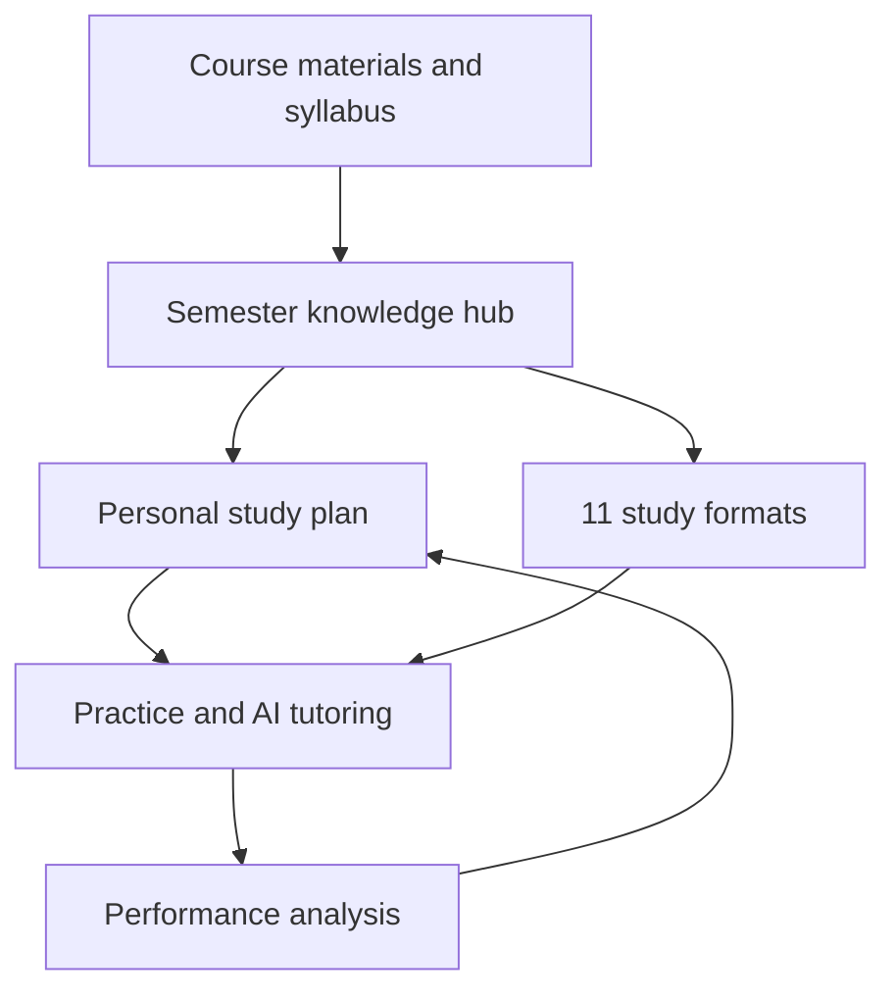

The **studying system must be one of Semester’s central pillars**, not a secondary feature. Semester should function as a complete academic learning environment that takes students from receiving course materials to understanding, practicing, reviewing, and mastering them.

# Semester Study: Core Product System

Semester Study should replace separate study applications for:

- Note-taking
- Flashcards
- Practice quizzes
- Study guides
- AI tutoring
- Exam preparation
- Reading summaries
- Lecture transcription
- Citation organization
- Focus timers
- Study scheduling
- Progress tracking

The central promise should be:

> **Upload or connect your course materials, and Semester turns them into a complete, personalized system for learning the course.**

# 1. Course Knowledge Hub

Every course should have a central knowledge hub containing:

- Syllabus
- Lecture slides
- Class notes
- Textbook chapters
- Readings
- Recorded lectures
- Lecture transcripts
- Assignment instructions
- Professor study guides
- Past quizzes
- Practice problems
- Student-created materials
- Important emails and announcements

Semester should organize materials automatically by:

- Course
- Unit
- Week
- Chapter
- Topic
- Exam
- Assignment
- Learning objective

The student should not need to upload the same material repeatedly. Once a file exists in a course, every authorized study tool should be able to use it.

# 2. Syllabus intelligence

The syllabus should act as the starting point for the entire study experience.

After a syllabus is uploaded, Semester should extract:

- Topics
- Units
- Weekly readings
- Assignment dates
- Quiz dates
- Exam dates
- Grade weights
- Learning objectives
- Required materials
- Professor expectations
- Attendance rules
- Late-work policies

It should then automatically:

- Build the course calendar
- Create assignment reminders
- Organize course units
- Recommend study sessions
- Prepare an exam timeline
- Connect readings to the appropriate week
- Identify periods of high workload
- Generate an initial course study plan

Semester should ask students to confirm information when dates or instructions are unclear.

# 3. Universal material upload

Students should be able to upload:

- PDF
- DOCX
- PPTX
- XLSX
- CSV
- TXT
- Images
- Scanned pages
- Handwritten notes
- Audio
- Video
- Web links
- Lecture recordings

Semester should process uploaded content using:

- Text extraction
- Optical character recognition
- Handwriting recognition
- Audio transcription
- Video transcription
- Table extraction
- Formula recognition
- Diagram identification
- Slide organization
- Source labeling

The original source should always remain available beside the processed version.

# 4. Eleven study-guide formats

Semester should keep all 11 study formats and allow students to generate several formats from the same materials.

## 1. Comprehensive study guide

A complete guide containing:

- Detailed explanations
- Key concepts
- Theories
- Definitions
- People
- Dates
- Formulas
- Examples
- Evidence
- Connections between topics
- Likely areas of assessment

## 2. Simplified study guide

A shorter guide containing:

- Plain-language explanations
- Essential ideas
- Simple examples
- Minimal technical terminology
- Quick-review sections

## 3. Structured outline

Content organized into:

- Main topics
- Subtopics
- Supporting points
- Definitions
- Evidence
- Examples
- Conclusions

## 4. Bullet-point notes

Concise and organized notes designed for efficient review.

Students should be able to select:

- Basic
- Detailed
- Comprehensive
- Exam-focused
- Lecture-by-lecture

## 5. Flashcards

Flashcards should support:

- Terms and definitions
- Questions and answers
- Images
- Diagrams
- Formulas
- Examples
- Audio pronunciation
- Fill-in-the-blank cards
- Spaced repetition
- Confidence ratings
- Mastered and unmastered categories

## 6. Practice quiz

Semester should generate:

- Multiple-choice questions
- True-or-false questions
- Matching
- Fill-in-the-blank questions
- Short-answer questions
- Numerical questions
- Diagram labeling

Each question should provide:

- Correct answer
- Explanation
- Source citation
- Difficulty level
- Topic
- Recommended material to review

## 7. Practice exam

Students should be able to create an exam based on:

- Professor’s exam format
- Specific topics
- Selected materials
- Difficulty
- Number of questions
- Point values
- Time limit

After completion, Semester should provide:

- Score
- Topic-by-topic performance
- Incorrect-answer explanations
- Time-per-question analysis
- Weak-area identification
- Recommended review plan

## 8. Key-terms glossary

A searchable list of:

- Vocabulary
- Definitions
- People
- Events
- Theories
- Dates
- Formulas
- Cases
- Examples

Terms should link back to the source material.

## 9. Concept map

Visual maps should show:

- Relationships
- Causes and effects
- Sequences
- Comparisons
- Hierarchies
- Arguments
- Processes
- Historical timelines

Students should be able to edit the maps and add personal connections.

## 10. Formula and problem-solving guide

For mathematics, statistics, economics, finance, science, and accounting, Semester should provide:

- Formulas
- Variable definitions
- Conditions for using each formula
- Step-by-step examples
- Worked problems
- Common mistakes
- Practice problems
- Full solutions
- Graphs and diagrams

This should connect directly to Semester Math and Semester Sheets.

## 11. Audio study guide

Students should be able to generate spoken study materials with:

- Adjustable playback speed
- Chapters
- Downloadable audio
- Text synchronization
- Topic selection
- Pause-and-answer questions
- Different lengths
- Automatic transcripts

# 5. Personalized AI tutor

The AI tutor should understand the student’s authorized course materials.

Students should be able to ask:

- “Explain this in simpler language.”
- “Give me an example.”
- “Walk me through this problem.”
- “Quiz me on Chapter 4.”
- “What am I misunderstanding?”
- “Compare these two theories.”
- “Show where the professor discussed this.”
- “Explain why my answer is incorrect.”
- “Ask me increasingly difficult questions.”
- “Do not reveal the answer—give me a hint.”

## Tutoring modes

### Explain Mode

Provides explanations at different levels:

- Beginner
- Course-level
- Advanced
- Exam-focused

### Socratic Mode

Guides students using questions and hints rather than immediately providing answers.

### Problem-Solving Mode

Walks through a problem one step at a time and checks the student’s work.

### Quiz Mode

Tests the student without showing answers until they respond.

### Review Mode

Revisits concepts the student previously struggled with.

### Teach-Back Mode

Asks the student to explain a topic, then identifies missing or incorrect parts.

The tutor should cite the exact course materials used in every answer.

# 6. Adaptive learning system

Semester should personalize studying based on performance.

It should track:

- Correct and incorrect answers
- Confidence levels
- Time spent
- Number of attempts
- Topics reviewed
- Flashcard performance
- Quiz performance
- Practice-exam performance
- Missed assignments
- Upcoming examinations

It should identify:

- Mastered topics
- Developing topics
- Weak topics
- Forgotten topics
- Topics never reviewed
- High-priority exam material

It should then adjust:

- Question difficulty
- Review frequency
- Study recommendations
- Flashcard scheduling
- Practice-exam content
- Study-session length
- Topic priority

# 7. Study planner

The study planner should build a realistic plan using:

- Exam dates
- Assignment deadlines
- Course difficulty
- Grade weights
- Student availability
- Estimated study time
- Existing calendar events
- Current mastery
- Personal study preferences

## Planning options

Students should be able to choose:

- Short daily sessions
- Longer concentrated sessions
- Weekday-only planning
- Weekend review
- Morning or evening study
- Specific days off
- Preferred break intervals
- Priority courses

If a student misses a session, Semester should automatically adjust the remaining plan without treating the entire plan as failed.

# 8. Exam preparation mode

When an exam approaches, Semester should create a dedicated exam workspace.

It should display:

- Exam date and time
- Location
- Covered units
- Exam format
- Allowed materials
- Grade weight
- Days remaining
- Study progress
- Weak topics
- Recommended next activity

## Exam preparation sequence

Semester could recommend:

1. Complete a diagnostic quiz.
2. Review weak concepts.
3. Study the comprehensive guide.
4. Practice with flashcards.
5. Complete topic-specific problems.
6. Take a timed practice exam.
7. Review incorrect answers.
8. Complete a final short review.

The plan should adjust based on the student’s performance.

# 9. Active-recall tools

Semester should emphasize active studying instead of only rereading and summarizing.

Tools should include:

- Flashcards
- Closed-note quizzes
- Teach-back exercises
- Fill-in-the-blank notes
- Free-recall prompts
- Practice problems
- Timed tests
- Diagram recreation
- Oral-response questions
- Confidence ratings

Students should be asked to attempt answers before seeing explanations.

# 10. Spaced repetition

Semester should schedule reviews shortly before information is likely to be forgotten.

The system should:

- Record flashcard performance
- Schedule the next review
- Increase intervals for mastered material
- Shorten intervals for weak material
- Bring back previously mastered information
- Prioritize material before exams
- Continue long-term review after an exam when relevant

# 11. Notes and lecture tools

## Notes

Students should be able to:

- Type notes
- Handwrite notes
- Draw diagrams
- Add equations
- Highlight text
- Attach files
- Link notes to lecture timestamps
- Organize notes by topic
- Search handwritten and typed notes
- Collaborate with classmates

## Lecture recording

With appropriate classroom permission, Semester should support:

- Audio recording
- Video recording
- Live transcription
- Speaker identification
- Automatic chapters
- Searchable transcripts
- Timestamped notes
- Key-point extraction
- Question identification
- Study-guide generation

The recording, transcript, professor slides, and student notes should be synchronized.

# 12. Reading workspace

Students should be able to open readings inside Semester and:

- Highlight
- Annotate
- Add comments
- Define words
- Translate sections
- Ask questions
- Create citations
- Generate summaries
- Identify arguments
- Extract key evidence
- Convert highlights into flashcards
- Connect passages to assignments

Summary options should include:

- One paragraph
- Key points
- Detailed notes
- Chapter outline
- Argument and evidence
- Exam-focused review

# 13. Mathematics and problem-solving workspace

Semester Study should connect directly to Semester Math.

Students should be able to:

- Enter equations
- Scan handwritten problems
- Graph functions
- Create tables
- View mathematical steps
- Check their work
- Request hints
- Generate similar problems
- Practice by difficulty
- Identify recurring mistakes

The system should distinguish between:

- Providing a hint
- Teaching the method
- Checking a student’s work
- Showing a complete solution

For graded work, institutional rules should determine which assistance modes are available.

# 14. Group studying

Semester should support study groups within each course.

Students should be able to:

- Find classmates interested in studying
- Create private groups
- Schedule sessions
- Meet through Semester Meetings
- Share study guides
- Collaborate on notes
- Create group flashcard sets
- Run group quizzes
- Use shared whiteboards
- Assign topics to members
- Review progress together

Privacy controls should prevent automatic disclosure of grades or personal academic information.

# 15. Study analytics

Students should receive useful information such as:

- Time studied by course
- Topics completed
- Topics mastered
- Quiz accuracy
- Flashcard retention
- Practice-exam scores
- Progress toward exam readiness
- Study-plan completion
- Most productive study times
- Areas needing attention

The system should avoid unhealthy comparisons and excessive productivity pressure.

## Exam readiness indicator

Instead of claiming that a student is guaranteed a grade, Semester could show:

- Limited preparation
- Developing
- Nearly prepared
- Strong preparation

The indicator should explain what evidence was used and what still needs review.

# 16. Source accuracy and trust

Every AI-generated study resource must show:

- Source document
- Page, slide, or timestamp
- Course
- Date uploaded
- Confidence level when appropriate

Students should be able to:

- Open the source
- Report an error
- Edit generated content
- Exclude a source
- Regenerate a section
- Compare generated notes with the original material

Semester should never invent course policies, quotations, citations, formulas, or professor instructions.

# 17. Academic-integrity controls

Semester should support learning without becoming an uncontrolled answer generator.

Institutions and professors should be able to define:

- Whether AI is allowed
- Which assistance modes are allowed
- Whether full solutions may be shown
- Whether collaboration is permitted
- Whether sources must be cited
- Whether assessments are restricted

Semester should clearly identify:

- Tutoring assistance
- AI-generated content
- Student-written content
- Collaborative edits
- Direct source quotations

# 18. Accessibility

Study materials should be available in multiple accessible formats:

- Adjustable text
- Screen-reader-compatible notes
- High contrast
- Reduced motion
- Captions
- Transcripts
- Read-aloud mode
- Dyslexia-friendly display options
- Keyboard navigation
- Audio descriptions
- Simplified-language versions
- Extra-time support

The 11 study formats allow students to choose how they learn most effectively.

# 19. Connections with the rest of Semester

The Study system should connect to every major product area.

| Semester area | Study connection |
|---|---|
| Courses | Uses modules, lectures, readings, and assignments |
| Syllabus | Builds the course plan and exam schedule |
| Calendar | Schedules personalized study sessions |
| Assignments | Recommends supporting material |
| Grades | Identifies areas that may require improvement |
| Documents | Turns notes into organized study resources |
| Meetings | Converts lectures into recordings and transcripts |
| Math | Generates graphs and practice problems |
| Sheets | Supports statistics, finance, and data analysis |
| Career | Helps prepare for interviews and certifications |
| Athletics | Builds study plans around practice and travel |
| Study Abroad | Supports translation and course preparation |

# 20. Correct primary navigation

Because studying is a core feature, **Study must be a top-level navigation item**, not hidden inside “More.”

Recommended navigation:

1. **Home**
2. **Courses**
3. **Study**
4. **Calendar**
5. **Assignments**
6. **Messages**
7. **Campus**
8. **Career**
9. **Create**

The Study section should contain:

- Study Dashboard
- AI Tutor
- Study Guides
- Flashcards
- Practice Quizzes
- Practice Exams
- Notes
- Readings
- Study Planner
- Study Groups
- Progress

# Core Semester workflow

# Updated final positioning

> **Semester is a complete education operating system built around learning. It replaces disconnected school platforms, productivity applications, study tools, communication systems, campus services, and career portals with one intelligent environment that helps students organize their education, understand course material, practice effectively, and prepare confidently.**

The studying system should be one of the first major parts built and perfected because it provides Semester’s strongest direct value to students. Other platforms organize school information; **Semester should organize the information and actively help students learn it.**