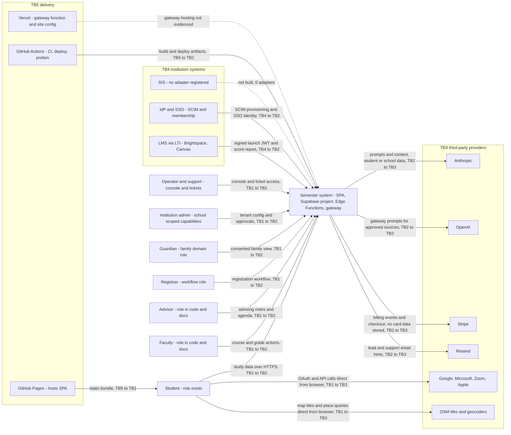
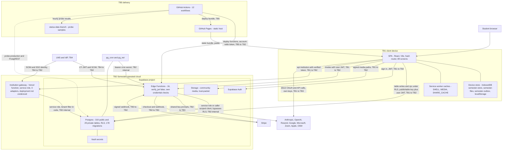

# C4 views: current system (levels 1 and 2)

| | |
| --- | --- |
| Purpose | Show who and what the system touches today, and the containers inside it, with the data and trust boundary on every edge. |
| Scope | The as-built system per `docs/program/ARCHITECTURE_CURRENT_STATE.md`. "People" are roles that exist in code or documents; that a role is used in production is not evidenced. Diagrams are flowcharts (not the `C4Context` grammar) so they render with plain Mermaid. |
| Method | Edges taken from the Edge Function table (`docs/architecture/security/privileged-surface-map.md` section 4), the CSP `connect-src`/`img-src` lists in `app/vercel.json`, `supabase/functions/*/index.ts`, `.github/workflows/*.yml` and `docs/architecture/tenancy/tenant-boundary-map.md`. No diagram was rendered by a Mermaid tool in this session; syntax was kept to flowchart basics and reviewed by eye. |
| Date | 2026-10-04 |
| Status | Phase 0 baseline — evidence-cited, not a readiness claim |

## Trust-boundary legend

| ID | Boundary | Meaning |
| --- | --- | --- |
| TB1 | Client device | Browser and device storage; the client is assumed hostile (`docs/architecture/0002-rls-is-the-authorization-boundary.md`); it holds only the publishable key |
| TB2 | Semester-operated cloud | Supabase project (Postgres, Auth, Storage, Edge Functions), Vercel gateway function, static hosts |
| TB3 | Third-party processor or provider | Anthropic, OpenAI, Stripe, Resend, Google, Microsoft, Zoom, Apple, OpenStreetMap services |
| TB4 | Institution systems | LMS, SIS, identity provider; reached through LTI, SCIM or adapters |
| TB5 | Delivery | GitHub repository and Actions, GitHub Pages, Vercel |

## Level 1: system context

Evidence: roles and capabilities `supabase/migrations/20260921223000_role_grants.sql`, `20260922012000_capabilities.sql`; matrix domains D1-D14 in `docs/program/CAPABILITY_TRACEABILITY_MATRIX.md` section 6; providers and hosts `app/vercel.json` (CSP `connect-src`: `api.anthropic.com`, `api.openai.com`, `login.microsoftonline.com`, `graph.microsoft.com`, `accounts.google.com`, `*.googleapis.com`, `zoom.us`, `appleid.apple.com`, `nominatim.openstreetmap.org`, `photon.komoot.io`; `img-src` `https://*.tile.openstreetmap.org`); AI paths `docs/architecture/ai/ai-policy-enforcement-map.md` section 2; Stripe `supabase/functions/_shared/stripe.ts`; Resend `supabase/functions/lead-intake/index.ts`, `support-reply-notify/index.ts`; LTI `supabase/functions/lti/index.ts:192-218,650`; SCIM `app/server/institution/postgres-scim.ts`, `20260928200000_scim_gateway.sql`; SIS "adapters = []" `app/server/institution/adapters.ts:32`; hosting `.github/workflows/pages.yml`, `docs/infrastructure/README.md`. Whether any of the people or provider edges carries production traffic is not evidenced in the repository.

Edge labels summarise the data class, not a verified flow. Where the student's own Anthropic or OpenAI key is used the call goes browser to provider (`app/src/lib/claude.ts:886`, `openai.ts:182`) and never touches TB2; the Semester-keyed route is the `claude` Edge Function.

## Level 2: containers

Evidence: SPA, screens, device stores `app/src/screens.tsx`, `app/src/state/persist/db.ts`, `app/src/lib/files.ts`, `app/src/lib/sync/outbox.ts`, `app/public/sw.js`; Postgres counts `database/TENANT_ISOLATION_MATRIX.md`, `ls supabase/migrations | wc -l` (178); Edge Functions `supabase/config.toml` (16 `[functions.*]` blocks, all `verify_jwt = false`) and `docs/architecture/security/privileged-surface-map.md` section 4; service role in 13 of 16 `grep -c SERVICE_ROLE supabase/functions/*/index.ts`; gateway `app/api/institution/[...path].ts`, `app/server/institution/context.ts`, `app/vercel.json`; storage buckets `20260928032000_community.sql`, `20260928100000_trust_room.sql`; Vault and cron `supabase/scheduler.sql`, `20260928101000_integration_tick_auth.sql`; workflows `.github/workflows/{ci,pages,functions,production-smoke}.yml`; `status-data` `.github/workflows/production-smoke.yml:9,94-95`. The publishable-key-only client is stated in `app/.env.production` and `docs/ARCHITECTURE.md` invariant 1.

Deployment state of the gateway, the company-site host and `scheduler.sql` is not in the repository; the dotted lines mark that.

## Open questions / not verified

1. Whether the gateway is deployed and which hosts carry `company-site/`.
2. Whether any listed person role has a real user: the repository holds no production usage evidence (`docs/program/BASELINE_AUDIT.md` section 4).
3. Google, Microsoft, Zoom, Apple and OSM edges are drawn from CSP entries and file names (`app/src/lib/connect.ts`, `oauthscopes.ts`); the code was not read in Phase 0.
4. Realtime, Web Push delivery services and SMTP/DNS dependencies are not drawn; `push` (`supabase/functions/push/index.ts`) uses Web Push with a VAPID key and the browser vendors' push endpoints sit outside this view.
5. Mermaid rendering was not executed in this session.
