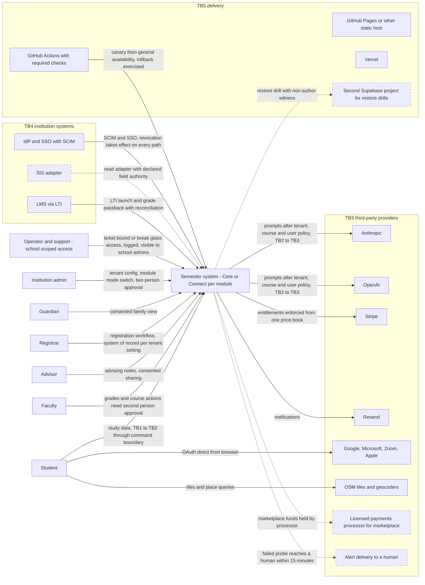
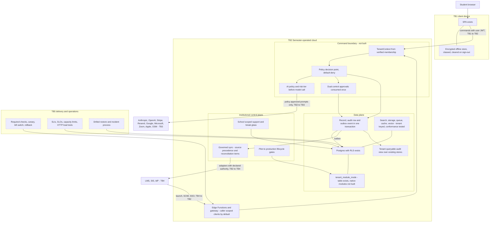

# C4 views: target system (levels 1 and 2)

| | |
| --- | --- |
| Purpose | Show the system the proposed ADRs imply, with the same actors and external systems as `docs/architecture/c4/current-system-context.md`, and mark which elements are not built. |
| Scope | Target, not built, unless an element is labelled "exists". Every ADR is Proposed and unratified (`docs/decisions/proposed/ADR-0001..0025`); this is a reading of them, not a decision. See `docs/program/ARCHITECTURE_TARGET_STATE.md` for the gap and ADR per element. |
| Method | Edges from the `Decision` sections of the ADRs; elements that already exist are copied from the current-state view. Dashed boxes use the class `nb` (not built). Flowcharts rather than `C4Context`; rendering was not executed in this session. |
| Date | 2026-10-04 |
| Status | Phase 0 baseline — evidence-cited, not a readiness claim |

## Trust-boundary legend

| ID | Boundary | Target change |
| --- | --- | --- |
| TB1 | Client device | Encrypted, revocable local store; caches cleared on sign-out (ADR-0009, ADR-0023) |
| TB2 | Semester-operated cloud | Command boundary with tenant context, policy decision and audit; no default RLS bypass (ADR-0002, 0003, 0004, 0007) |
| TB3 | Third-party provider | AI calls only after tenant policy; provider terms and disclosure per counsel (ADR-0005, 0014) |
| TB4 | Institution systems | Adapters with declared source authority and drilled degraded mode (ADR-0011) |
| TB5 | Delivery | Required checks, staged rollout, exercised rollback (ADR-0012) |

## Level 1: system context

Elements marked `nb` (dashed) are not built: SIS adapter (`app/server/institution/adapters.ts:32` registers none), marketplace processor (ADR-0024; `docs/decisions/D-1236.md` holds the marketplace), alert delivery (ADR-0012 item 6, ADR-0018; `.github/workflows/production-smoke.yml` has no notify step), second project for restore (ADR-0012 item 5, ADR-0018; `supabase/restore-drill.sh` never run). The remaining target behaviours on edges (second-person approval, ticket-bound support, tenant policy before model call, one price book, reconciliation) are also not built; only the actors, providers and the container shells exist today.

Evidence: ADR decisions `docs/decisions/proposed/ADR-0003`, `ADR-0005`, `ADR-0006`, `ADR-0010`, `ADR-0011`, `ADR-0012`, `ADR-0016`, `ADR-0018`, `ADR-0019`, `ADR-0020`, `ADR-0024`; current counterparts in `docs/architecture/c4/current-system-context.md`; gap table `docs/program/ARCHITECTURE_TARGET_STATE.md` sections 3 and 4.

## Level 2: containers

Dashed elements are `target, not built`. Solid elements exist today: `spa`, `pg` (178 migrations, RLS), `ef` (16 Edge Functions and the gateway function, but today they use service-role clients and derive tenant in two different ways), and the table `tenant_module_mode` (`supabase/migrations/20260930010000_module_mode.sql:71-84`).

Evidence per dashed element:

| Element | Not-built evidence | ADR |
| --- | --- | --- |
| `tctx` | `app.tenant_id` appears 0 times in `supabase/migrations`; two derivations in `docs/architecture/tenancy/tenant-boundary-map.md` section 2 | ADR-0002 |
| `pdp` | `decide(` has 1 non-test call, `app/server/productivity/service.ts:380` | ADR-0003 |
| `aipol` | tenant policy binds only gateway `respond` (`app/server/institution/intelligence.ts:124-234`); `app/src/lib/claude.ts:886` ignores it | ADR-0005, ADR-0014 |
| `dual` | approval and break-glass exist (`20260929110000_console_approvals_and_break_glass.sql`) but executing definers do not require them; one person holds every seat (`OWNER-AND-ACCOUNTABILITY-MATRIX.md`) | ADR-0010 |
| `rec`, `audv` | one outbox producer (`20261004123000_productivity_commands.sql:351`); four audit stores | ADR-0007 |
| `tstores` | no tenant-bearing search, queue or vector service; storage keys carry no tenant prefix | ADR-0021 |
| `sync` | `adapters = []`; no precedence engine (`app/src/lib/integration/catalog.ts` `SOURCE_OF_TRUTH` is display text) | ADR-0011 |
| `sup` | support capability checked at platform scope (`supabase/functions/support-reply-notify/index.ts:mayAnswer`) | ADR-0020 |
| `life` | described in `docs/operating-model/PILOT-TO-PRODUCTION.md`, not enforced in code | ADR-0015 |
| `vault` | `packages/offline-sync` vault unmounted; browser data plaintext | ADR-0009, ADR-0023 |
| `gha` | live ruleset count 0; CI red 48 of 100 latest `main` pushes (platform audit readback) | ADR-0012 |
| `slo` | `supabase/load/edge/edge.mjs` manual; no SLO set | ADR-0025 |
| `rest` | `supabase/restore-drill.sh` never run; `RESTORE.md` result tables empty | ADR-0018 |

## Open questions / not verified

1. Every ADR is Proposed; edges and boxes change if the owner decides otherwise (for example the pilot path in ADR-0002 item 3, direct RLS or gateway).
2. Placement of "Core or Connect per module" at level 1 is shown as a property of the Semester system; where a native Core module's domain code lives is undecided (`docs/target-architecture/04-DOMAIN-BOUNDARIES-AND-OWNERSHIP.md` is a proposal).
3. A licensed payments processor for the marketplace and a paging provider are placeholders for ADR-0024 and ADR-0012/0018 needs; no vendor choice exists in the repository.
4. Rendering of the Mermaid blocks was not executed.
