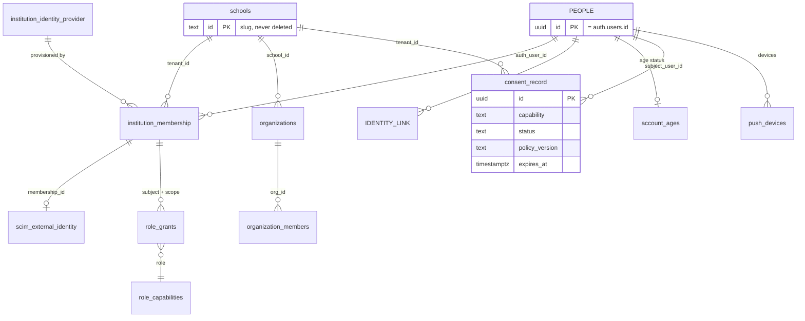
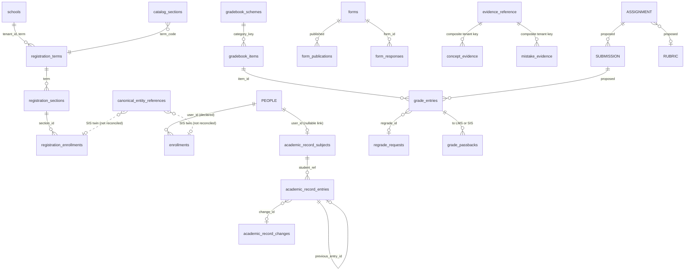
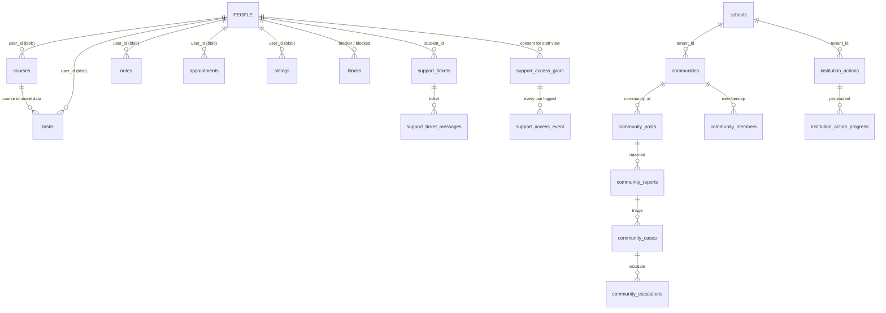
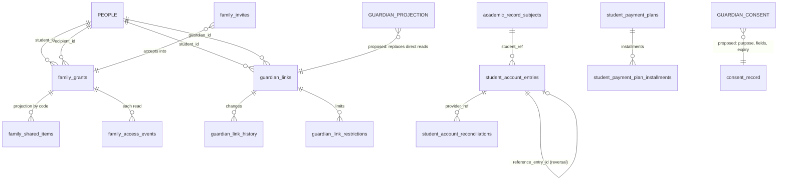
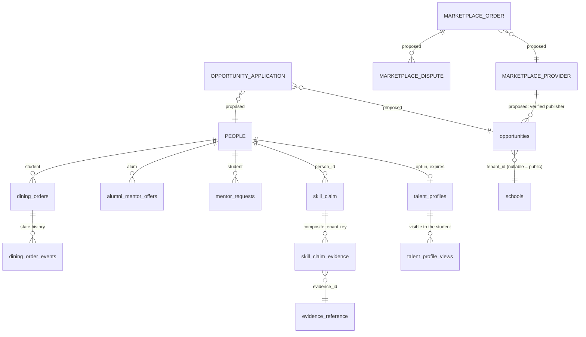
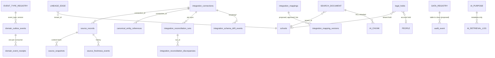

# 1 · Canonical entity model

The model is **a contract over what exists, not a rewrite of it.** [`unified-education-graph.md`](../unified-education-graph.md)
already says the target names "are logical contracts, not a direction to rename 171 migrations in one release".
This document keeps that stance and adds three things it lacked: every table is assigned to exactly one domain
(with a control that fails if one is not), each canonical entity names the tables that realise it today and
whether the realisation is whole, partial or absent, and the relationships are drawn.

Legend. **Status**: `●` realised, `◐` partial or split across several tables, `○` absent. Entity names in
UPPER CASE in the diagrams are proposed; lower-case are tables that exist today.

## 1.1 Identifier strategy

| Kind | Rule | Why |
| --- | --- | --- |
| Tenant | `tenant_id text`, slug `^[a-z0-9][a-z0-9-]{1,39}$` (`schools.id`). **Keep text.** | 177 tables carry it. Changing the type is a rewrite for no integrity gain; a foreign key to `schools` gives the integrity. |
| Person | The existing `auth.users.id` **is** the person id. A later `PEOPLE` table is keyed identically (`id = auth.users.id`) and adds `IDENTITY_LINK (provider, subject → person)`. | 206 tables already reference `auth.users`. Splitting person from login by *adding* a table needs no data migration and no new foreign key; it is the compatibility-layer route `unified-education-graph.md` prescribes. Never link on email alone. |
| Record | `uuid` primary key (228 of 348 tables already). | |
| Institutional student | `student_ref` (pseudonymous, per tenant), mapped to an account in `academic_record_subjects`. | Already used by both ledger-chained ledgers. It lets an academic record outlive an account without the chain depending on a person column. **Adopt for every institution-owned record about a student.** |
| Source object | `(tenant_id, connection_id, source_system, source_record_id, canonical_entity_type)` in `canonical_entity_references`. | Exists, unique-keyed, carries `source_of_truth`, `classification`, `freshness_status`, `mapping_version`, `external_deleted_at`. |
| Cross-tenant safety | New tables that hang off a tenant-scoped parent carry `tenant_id` in a **composite foreign key** `(parent_id, tenant_id)`. | Already the pattern in `capture_artifact`, `concept_evidence`, `mistake_evidence`, `skill_claim_evidence`. A cross-tenant reference becomes impossible in the database, not merely unlikely. |

## 1.2 Domains, entities and what realises them

Counts are tables per domain from the generated map ([`appendix/conformance.csv`](appendix/conformance.csv));
`private` tables are included. Total 348.

### Identity and tenancy (28 tables)

| Canonical entity | Key | Realised by | |
| --- | --- | --- | --- |
| Tenant / institution | `tenant_id` | `schools` (edition `higher_ed`/`k12`), `tenant_*` policy tables | ● |
| Organisation / sub-unit | `organizations.id` (uuid), `school_id` | `organizations`, `organization_members` | ◐ no hierarchy (college, department, office) |
| Person / account | `auth.users.id` | `auth.users`, `profiles` (`handle`, `school_id`, `account_role`) | ◐ person and login are one row |
| Identity (login) | provider + subject | `institution_identity_provider`, `lti_identity`, `scim_external_identity` | ◐ |
| Membership | tenant + person + lifecycle | `institution_membership` (`status`, `roles`, `source`, `provisioned_at`, `deprovisioned_at`), `school_membership_requests` | ● |
| Role grant | subject + role + scope | `role_grants`, `role_capabilities`, `app_roles`, `app_capabilities`, `role_grant_audit_event` | ● scope kinds: platform, school, organization, course, department, office, residence, business, employer, cohort, partner |
| Age status | person | `private.account_ages` (`minor_until`, `under_minimum`) | ● |
| Consent | tenant + subject + capability | `consent_record` (`status`, `policy_version`, `expires_at`, `revoked_at`) | ◐ no purpose or field list; not read by the AI gateway |
| Device installation | person + device | `push_devices` | ◐ no offline-sync identity |
| Invitation | | `invites` | ● |

### Academic core (31)

| Canonical entity | Realised by | |
| --- | --- | --- |
| Term | `registration_terms (tenant_id, term, opens_at, add_drop_ends_at, …)`; elsewhere a **text code** (`enrollments.term ~ '^[0-9]{4}(FA\|SP\|SU)$'`) | ◐ no shared term key |
| Course (catalog) | `catalog_sections (tenant_id, term_code, course_code, section, capacity, seats_open, source_system, synced_at)`, `canonical_entity_references` type `course` | ◐ |
| Course (personal) | `courses (user_id, id, data jsonb, …)` | ● but a blob (see 1.4) |
| Section | `registration_sections`, `catalog_sections` | ◐ two |
| **Enrollment** | **three**: `enrollments (user_id, term, code)` student-declared, drives classmate visibility, no tenant, no source; `registration_enrollments (section_id, student, state, wait_seq, grade, version)` registrar workflow, never deleted; `canonical_entity_references` type `enrollment` from the SIS | ◐ **no reconciliation between them** (finding 4) |
| Registration workflow | `registration_requests` (idempotency key + fingerprint), `_holds`, `_windows`, `_overrides`, `_completions`, `_time_tickets`, `registration_audit_event` | ● |
| Academic record | `academic_record_subjects`, `academic_record_entries` (hash-chained), `academic_record_changes` | ● best-designed area: `student_ref`, `source`, `previous_entry_id`, `proposed_by`/`approved_by`, `override` |
| Degree requirement | none; `graduation_scenarios`, `term_plan_courses`, `transfer_evaluations`, `articulation_rules` | ○ requirement itself absent (integration type `academic_requirement` exists) |
| Advising | `appointments` (blob), `advisor_shares` (+`_events`), `success_plans`, `weekly_checkins` | ◐ |
| Course intelligence | `course_reviews` (+`course_review_authors`, authorship split), `course_guidance`, `course_demand_snapshots`, `demand_consents` | ● |

### Learning (17)

| Canonical entity | Realised by | |
| --- | --- | --- |
| Gradebook | `gradebook_schemes`, `gradebook_items`, `gradebook_operations`, `grade_entries` (versioned, `graded_by`, `reason`, `regrade_id`), `grade_passbacks`, `regrade_requests`/`_resolutions` | ● grade changes are operations, not updates |
| Assessment / form | `forms`, `form_publications`, `form_responses (form_id, answers jsonb)` | ◐ |
| Module, assignment, submission, rubric | **none natively**; LMS via `lti_*` | ○ the audit requires native; the data model must reserve them: `ASSIGNMENT`, `SUBMISSION`, `RUBRIC` ([02](02-source-of-truth-matrix.md)) |
| Study | `study_packs`, `sittings`, `mistake_evidence`, `concept_evidence` | ● |
| Evidence | `evidence_reference (origin, authority, locator, excerpt, verified_at)` | ● the citation primitive; reused by AI |
| Accommodation | `accommodation_passports`, `_shares`, `_access_events` | ● access is logged |

### Productivity (10)

`tasks`, `notes`, `appointments`, `sittings`, `courses`, `state`, `productivity_workspace`: all
`(user_id, id, data jsonb, updated_at, deleted_at)` or similar. `capture_asset`/`_artifact`/`_segment`
(lecture and device capture, composite tenant keys), `calendar_feeds`, `push_queue`. **Documents, sheets and
decks are not server tables at all** (device `semester-files`/`semester-drafts` only), so they have no
server-side retention, search or AI path; see 1.4.

### Campus (19)

`communities`, `community_posts`, `community_members`, `community_sessions`, `community_programs`,
`community_venues`, `messages` (+`message_reactions`), `groups` (+`group_members`, `group_tasks`),
`institution_actions` (+`_audiences`, `_offices`, `_progress`; the office action feed), `dining_locations`,
`dining_hours`, `dining_menu_items`, `dining_plans`, `blocks`. Housing, athletics, transit, library, events,
alerts: **absent** (integration provider domains exist; no native tables).

### Family and guardian (7; none carries `tenant_id`)

`family_grants` (`institution_id`, `student_id`, `recipient_id`, `category`, `access`, `expires_at`, `revoked_at`),
`family_invites`, `family_shared_items` (a **projection**: `shown_as`, `title`, `body`, `due`, `amount`),
`family_access_events`, `guardian_links` (`school_id`, `rights`, `verified_by`, `ended_at`),
`guardian_link_history`, `guardian_link_restrictions`. Two engines (higher-ed supporter vs K-12 guardian) that
`unified-education-graph.md` says must converge; both use `institution_id`/`school_id`, not `tenant_id`. ◐

### Finance (10)

`student_account_entries` (hash-chained; `amount_cents`, `reference_entry_id`, `provider_ref`,
`high_value`, `approved_by`), `student_account_requests`, `_closes`, `_settings`, `_reconciliations`,
`student_payment_plans` (+`_installments`), `cost_plans`, `dining_ledger`, `dining_plans`. Aid items and
refunds as native objects: ○ (integration domain `financial_aid` only). Money is `*_cents` integers: keep.

### Career (8), Alumni (1), Marketplace (7)

- Career: `talent_profiles` (opt-in, 180-day expiry), `talent_profile_views` (student sees who viewed),
  `skill_claim` (+`_evidence`), `skill_records`, `mentor_requests`, `peer_mentor_*`. Applications, verified
  achievements, portfolio artefacts as server entities: ○ (`opportunity_applications` is named in the graph
  doc and does not exist).
- Alumni: `alumni_mentor_offers` only. **Lifelong identity is a data-model requirement, not a table:**
  a person must outlive every membership. That works today because person = `auth.users` and membership is
  separate, provided a graduate's account is never tied to a tenant's offboarding (see 05).
- Marketplace: `opportunities` (listing authority, `publisher_scope`, status), `dining_orders`/`_order_events`/
  `_pool_*` (the only commerce), `seat_watches`, `study_match_optins`. Provider, offer, order, commission,
  dispute, payout, sanctions screening: ○ except the dining slice.

### Support and trust (38)

`support_tickets` (**no `tenant_id`**; `student_id` only), `support_ticket_messages`, `support_access_grant`/
`_event` (consented impersonation), `support_shares`, `help_requests`/`_events`/`_destinations`, `feedback`, and
the community moderation set (`community_cases`, `_reports`, `_restrictions`, `_escalations`, `_volunteers`, …),
`reports`, `governance_incident_notices`. ●, with the tenant-key gap on tickets noted.

### Governance (55)

Evidence and audit: `audit_event`, `console_audit_event`, `access_log`, ledger chains (`private.ledger_chain*`),
`trust_room_*`. Policy: `governance_policy_nodes`, `governance_decisions`, `tenant_feature_policy`,
`tenant_module_mode`, `tenant_rollout*`, `feature_kill_switch`, `data_classification_rules`. Rights and holds:
`legal_holds`, `data_subject_request`, `data_requests`, `consent_record`, `school_offboarding`/`_undo`.
Control: `approval_request`/`_decision`, `break_glass_grant`, `console_*`, `claims_register`,
`compliance_*`, `platform_release_evidence`.

### Cross-cutting planes

- **Integration (40):** `integration_*`, `canonical_entity_references`, `source_records`/`_snapshots`/
  `_freshness_events`, `migration_*`, `roster_*` (`private`), `provider_registry`, `lti_*`.
- **AI (14):** `ai_policy`, `ai_memories`, `approved_source` (+`private.approved_source_content`),
  `course_ai_rules`, `private.gateway_*`, `private.ai_usage_*`, `human_overrides`.
- **Commercial (63):** Semester-as-vendor: subscriptions, invoices, quotes, GTM, beta. **Not** student finance
  and never joined to it; kept as a domain so it cannot be mistaken for one.

## 1.3 Entity-relationship diagrams

### ERD 1 · Identity, tenancy, consent, authorisation

### ERD 2 · Academic core and learning

### ERD 3 · Productivity, campus, support

### ERD 4 · Family, guardian, finance

### ERD 5 · Career, alumni, marketplace

### ERD 6 · Control plane: audit, events, lineage, provenance, retrieval

## 1.4 The blob problem

Seven core student tables are `(user_id, id, data jsonb, updated_at, deleted_at)`: the shape a local-first
sync needs, and the right shape for CRDT or last-writer merge. It is also a shape in which the server cannot
see a due date, a course, a status or a classification, so the server cannot index it, retain it by rule,
search it, or hand it to an AI purpose without parsing JSON the client defined.

**Do not normalise the blobs.** That would break the local-first contract. Instead, **project**:

1. The blob stays the sync envelope and the source of truth for the student's own work.
2. A small set of **typed projection columns**, written by the same transaction that writes the blob, carry
   only what a server feature needs: `course_ref`, `due_at`, `status`, `kind`, and a `search_text` that is
   already redaction-reviewed. Absent projection means the item is invisible to server search and AI, which is the
   safe default.
3. The projection is `derived` in the registry (rebuildable from the blob), so it carries no retention of its own.
4. Documents, sheets and decks have no server table. Adding one is a product decision (it changes what
   "until you delete it" has to cover); the model reserves `DOCUMENT` as `account_record`, `T2`,
   `until_deleted`, and nothing else.

## 1.5 Gaps the model reserves, in order of how much else depends on them

1. `PEOPLE` + `IDENTITY_LINK` (alumni continuity, transfer between tenants, multi-identity login).
2. A single `enrollment` view over the three representations, with `source_kind` and precedence ([02](02-source-of-truth-matrix.md)).
3. `GUARDIAN_CONSENT` / `GUARDIAN_PROJECTION`: purpose, field list, expiry on consent; family and guardian engines merged.
4. `ASSIGNMENT`, `SUBMISSION`, `RUBRIC`, `MODULE`: required for the "native from inception" claim; absent.
5. `OPPORTUNITY_APPLICATION`, `MARKETPLACE_*`: absent beyond dining.
6. `DEGREE_REQUIREMENT`: absent.
7. Organisation hierarchy (college, department, office) beyond a flat `organizations`.

None of these should be built before the conventions in [03](03-schema-conventions.md) are in place; a new
table born without tenant key, source, classification and lifecycle is debt on day one.
