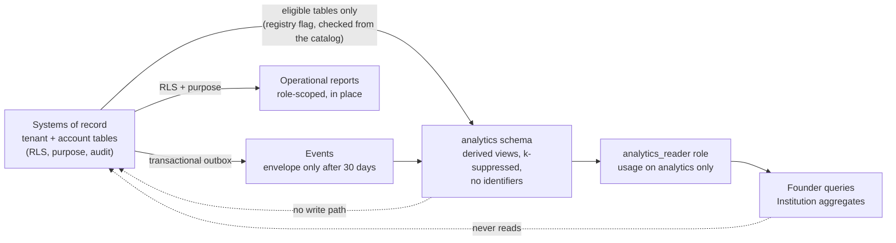

# 6 · Analytics architecture that protects privacy and does not become a shadow system of record

## 6.1 Start from what the repository already promises

This is not a blank slate and the promises are stronger than most analytics designs. They are kept verbatim:

- **Three figures, nothing else.** Activation, weekly active use, 30-day retention, from one table, `public.activity`,
  one row per account per day per mark (`opened`, `course`, `studied`). A fourth needs a fourth question written into
  [`ANALYTICS.md`](../../../ANALYTICS.md) first, then a migration, then owner review ([`ANALYTICS-EVENTS.md`](../../ANALYTICS-EVENTS.md)).
- **No third-party analytics**, enforced by the CSP and `phase5docs.test.ts`.
- **A floor of ten for what a university can read.** Every aggregate an institution can see is suppressed below
  ten students; `cohortfloor.test.ts` reads every SQL floor out of the migrations and fails if any differs from
  `MIN_COHORT`. The owner's own pilot figures are **not** suppressed: `ANALYTICS.md` says the pilot is 5–10 people
  and `supabase/analytics.sql` counts them directly. Suppressing there would blank the instrument and protect
  nobody. The architecture keeps both facts by giving each metric an **audience**.
- **A list of things never measured** (`FORBIDDEN`, `institution-ops.ts`, enforced by `defineMetric`):
  individual risk scores, covert reading-time, mouse or keystroke tracking, attention inference, individual AI
  usage, automated integrity accusations, wellbeing or behavioural scoring, location or presence.
- **The founding rule** of `supabase/analytics.sql`: *every query reads that one table and nothing else*: "a report
  that needs to read a student's work to count how many students there are is a report that gets run less
  carefully each month, by more people, until one day it is a spreadsheet of somebody's syllabus in an email."

The architecture below changes none of that. What it adds is **structure that makes the promises survive growth**:
they are currently held by habit, a document and a handful of tests that read specific files. As the platform
gains tenants, a reporting surface and an institutional dashboard, habit stops scaling.

## 6.2 Four things people call analytics

They have different readers, different data, different risk. Treating them as one is how a warehouse becomes a
system of record.

| Tier | Question | Subject | Data | Reader | Today |
| --- | --- | --- | --- | --- | --- |
| **1 · Product analytics** | Is the product working? | Accounts, as counts | `activity` (3 marks) | Semester's owner | built; `supabase/analytics.sql` |
| **2 · Institutional aggregates** | How is a cohort, course or programme doing? | Cohorts of ≥ 10 | `course_demand_snapshots`, `outcome_aggregates`, per-tenant aggregates | Institution roles with a capability | built for two; no general layer |
| **3 · Operational reports** | Who needs action today? | **Individuals**, to the people entitled to act | The system of record, read under RLS and purpose | Advisors, registrar, faculty | roster/caseload views exist per module; no shared contract |
| **4 · Vendor metrics** | Is the *business* healthy? | **Customers**, not students | `gtm_pilot_metrics`, `account_health_snapshots`, billing | Semester | built; kept in the `commercial` domain, never joined to student data |

**Tier 3 is not analytics.** A caseload list is an operational read of the system of record: authorised by role,
relationship and purpose, logged, and shown with its source and freshness. Building it as a warehouse extract is
how individual-level data leaves the access model. The warehouse (tiers 1, 2) holds **no individual-level row
that a person could be re-identified from**; anything that must show an individual is tier 3, read in place.

## 6.3 Shape

Three barriers, each a thing the database can check rather than a promise:

1. **What may be read.** An analytics view may depend only on tables the registry flags `analytics_eligible`.
   The dependency is read from the catalog (`pg_depend` through nested views), so a view cannot quietly widen
   its reads by selecting from another view that does. Today the one eligible source is `public.activity`.
2. **Who may read.** Two roles, each with `USAGE` on schema `analytics` and nothing else (no `public`, no
   `private`, no `ai`, no function that mints a pseudonym). `analytics_reader` (the owner) reads owner and
   institution views; `analytics_institution_reader` reads **only** the suppressed institution views.
3. **What the output may contain.** No identifier-shaped column (`uuid`, `email`, `*_id`, `handle`, …), no free
   text, and any count under the floor is **withheld** (null), never rounded, because rounding leaks by subtraction.

## 6.4 The rules that stop it becoming a system of record

A warehouse becomes a shadow system of record the first time someone fixes a number in it, or answers a
question from it that the real system should answer. Each rule below prevents one of those steps and is tested.

| # | Rule | How it is enforced | Test |
| --- | --- | --- | --- |
| A1 | **Derived only.** Every base table in `analytics` is registered `derived` or `platform_catalog`; dropping and refilling the schema loses no fact. | `analytics.non_derived_tables()` | `tests/05_analytics.test.sql` |
| A2 | **No identifiers.** No uuid or identifier-named column; the only person-shaped value is a per-epoch pseudonym. | `analytics.identifier_leaks()` | same; control = clean schema is silent, then a table with `user_id`+`email` is flagged (2) |
| A3 | **Reads only eligible sources**, transitively. | `analytics.ineligible_sources()` | same; a view over `profiles` and a view over that view are both caught |
| A4 | **Floor of ten for institution-readable metrics.** `audience = 'institution'` requires `min_cohort >= 10` by `CHECK`; counts under it return null. An `owner` metric may have a lower floor, for the pilot. | `metric_definition` check, `suppress_small()` | same; institution view: 12 published, 3 withheld; owner view shows 3 (control); a floor of 5 on an institution metric is refused |
| A5 | **Forbidden metrics cannot be defined**, mirroring `FORBIDDEN`. | `CHECK` on `metric_definition`; **a parity test with `institution-ops.ts` is owed** (as `cohortfloor.test.ts` does for the floor) | same; `ai_usage` and `risk_score` refused |
| A6 | **A metric is defined before it is measured.** `approved` requires a reviewed date. | `metric_definition` | same |
| A7 | **Pseudonyms do not link across epochs.** `subject_key = HMAC(salt_epoch, id)`; one active salt; rotating makes earlier keys unlinkable to later. | `analytics.subject_key()` (definer; not granted to the reader) | same; the same account yields different keys in two epochs |
| A8 | **A reader reads nothing else, and an institution reader never sees an unsuppressed view.** | role privileges | same; both roles are refused `public.activity`; `analytics_reader` is refused `public.profiles` and `subject_key`; the institution reader is refused the owner view; each role's own view works (control) |
| A9 | **A published figure ties out.** Every metric has a tie-out query against the system of record; a difference beyond a stated tolerance is a data-quality `block` ([07](07-data-quality-and-migration.md)). | `dq_rule` kinds (`row_count`, `orphan`) | `tests/09_data_quality.test.sql` |

Mutation results: nine bugs on this file (institution floor lowered, forbidden list emptied, leak guard blind to
email, source guard blind to nested views, source guard ignoring the eligible flag, the reader granted
`public.activity`, the institution reader granted the owner view, salt never rotating, small cohorts
published) each turn the test red.

## 6.5 From question to metric to event

The path is the one `ANALYTICS-EVENTS.md` already requires, with the registry giving each step a row:

1. **Question** written in `ANALYTICS.md` (owner approval).
2. **`analytics.metric_definition`** row: meaning, grain, floor ≥ 10, source events or tables, owner role.
3. **Source** is either an eligible table or an event type with `analytics_projection = true` and a classification
   floor below `education_record` (the registry refuses the combination).
4. **View** in `analytics`, k-suppressed, no identifiers.
5. **Tie-out** to the system of record.
6. **Approval**: `status = approved` with `reviewed_at`.

The three existing figures, restated from `ANALYTICS.md` so the registry is not empty on day one. Definitions are
quoted from that file, not improved:

| `metric_id` | Meaning (from `ANALYTICS.md`) | Grain | Source | Audience, floor |
| --- | --- | --- | --- | --- |
| `weekly_active_accounts` | Distinct accounts that had the app open, by the (Monday-start, UTC) week their days fall in; the current week is returned with `is_partial`, not hidden | week | `activity` | owner, 1 (pilot); institution, 10 |
| `legacy_course_plus_study_activation` | Of accounts first seen in a week, how many had a course **and** answered a card within **7 days**; cohorts younger than 7 days excluded. **Must stay labelled "legacy course-plus-study"**; the controlled setup-only `student_activated` definition lives in `docs/market-readiness/STUDENT-ONBOARDING-SPEC.md` and is not this | week (cohort) | `activity` | owner, 1 |
| `retention_30d` | Of accounts first seen in a week, how many opened the app again **28 to 34 days** after their first day (a band, not a day); cohorts younger than 34 days excluded | week (cohort) | `activity` | owner, 1 |

These definitions carry the caveats that make them honest ("a pilot of ten people is not a sample"; "the
client's account of itself"); a metric row's `meaning` must carry its own, and a review checks it does.

The pending definitions in `ANALYTICS-EVENTS.md` (`path_created`, `plan_saved`, `backup_saved`, `action_completed`,
`agenda_created`, `conflict_resolved`) are **not** proposed for collection here. They remain subject to D-005
and the one-PR-per-mark procedure. The architecture's job is that when one is approved it enters through the
registry and the guards, not around them.

## 6.6 Institutional aggregates and the audit's "reporting and data exchange"

The audit asks for operational reporting, data export, warehouse pipelines and institutional dashboards.
The architecture answers each without a second system of record:

- **Institutional dashboards (tier 2).** Aggregates per tenant, cohort ≥ 10, in `analytics`, readable by an
  institution role holding a reporting capability, scoped to its tenant by the same RLS as everything else.
  No individual row, no drill-through to a person: a drill-through is a tier-3 read, with its own purpose and
  audit.
- **Operational reports (tier 3).** Role-scoped lists produced from the system of record; each carries its
  source, freshness and an access log line. They are not exported to a warehouse.
- **Data export / secure exchange.** A tenant's own data leaves through a governed package (the tenant manifest in
  [05](05-lifecycle-governance.md) is its checklist), classified by tier. **T3 does not go to a third-party BI
  tool** from Semester; the institution pulls aggregates or a governed extract under its tenant contract.
- **Warehouse pipelines.** Not needed at current volume, and the sizing in [10](10-physical-design.md) says
  when it is: Postgres views and materialized views in `analytics` carry tiers 1–2 until measured refresh cost
  or read load on the primary justifies a read replica, and only then a columnar export of the same derived
  schema. The schema is the contract; the engine is replaceable because every base table is derived (A1).

## 6.7 What this does not do

- It does not collect anything new. No event is added to the pilot's three marks.
- It does not decide whether a k-suppressed aggregate falls outside an erasure request (**counsel**; see
  [05 §5.8](05-lifecycle-governance.md)).
- It does not make `ai.retrieval_log` an analytics source. That table is security evidence, registered
  `analytics_eligible = false`; guard A3 refuses a view over it. Counting AI use per student would break the
  `ai_usage` rule, and the retrieval log's actor is a hash for audit, not a key for metrics.
- It does not replace tier 3 with tier 2: an advisor needs names, and gets them in place, not from a warehouse.

## 6.8 Ownership

| Role | Holds |
| --- | --- |
| Metric owner (a named person, per `DATA-STEWARDSHIP.md`) | The definition, the tie-out, the review date |
| Data steward of the source domain | That the source table is eligible and correctly classified |
| Privacy owner | The floor, the forbidden list, the epoch policy |
| Owner of `ANALYTICS.md` | Approves a new mark; merging it is the production change |

Review cadence and the escalation path are in [12](12-governance-operating-model.md).
