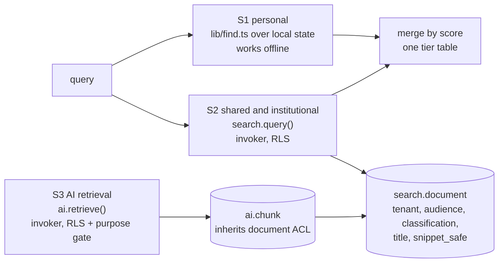

# 8 · Search and retrieval architecture, with security filters

## 8.1 What exists, verified

| Fact | Evidence |
| --- | --- |
| **One search, client-side.** `lib/find.ts` `findEverything` runs over in-memory app state on every keystroke. No network call, no persisted index. | ADR 0006; research of `find.ts` |
| Kinds searched: deadlines, courses, study units, lessons, notes, documents, sheets, decks, tasks, appointments, **the app's own 59 screens**, settings. | `find.ts:84-137` |
| **Not searchable at all:** people/classmates, organisations, listings and opportunities, course reviews, dining, messages, community. | neither `find.ts` nor `desk.ts` imports community or connect |
| Ranking tiers: exact name **100**, prefix **80**, word boundary **60**, name substring **40**, body substring **20**, every-word-any-order **10**, near-miss **8** (name) / **5** (body); top 8 per group; body capped at 20,000 characters. | `find.ts:175-232` |
| Permission filtering exists **only for screens** (`allowed(screen, caps)`, `forRole`); there is no per-record filter because every record searched is the user's own. | `find.ts:668-720` |
| **No server-side search anywhere:** no `tsvector`, no `pg_trgm`, no `GIN`, no search edge function. All 1,022 indexes are btree. | grep of 171 migrations; catalog |
| `docs/architecture/multi-tenant-isolation.md:46`: "no single server-side retrieval service was verified"; `unified-education-graph.md:119`: "No AI retrieval path is broader than the equivalent user search path." `native-baseline-and-connected-mode.md`: "No single server-authorized tenant/purpose index shared with AI." | the three requirements this design answers |
| **Device caches:** `semester-store`, `-files`, `-snapshots`, `-drafts` (up to 20 full copies per document), `-outbox`, `-history`, plus `localStorage` `semester.*` and Cache Storage `semester-shared`. `eraseDevice()` clears all and is held by a test that fails if a new DB is not listed. | `erase.ts:63` |
| **Sign-out does not purge** (a stated choice: "signing out leaves it alone, and Erase from this device removes it"); there is no purge on role or school change; offboarding says nothing about client caches. | `cloud.ts:449`, `erase.ts` header, offboarding migration |

**Visibility rules already in the database** (the ones search must not be looser than):

| Subject | Rule | Gap |
| --- | --- | --- |
| Classmates | `private.classmate(other)`: shared `(term, code)` enrolment **and** both in an open room (`room_open_for`) | `enrollments` is student-declared, so "classmate" means "declared the same course" |
| Profiles | own, or `classmate(user_id) AND age_cleared(user_id)` | **No block check.** Only two policies in the schema mention `blocks` (`messages`, `message_reactions`). A blocked classmate can still read the blocker's handle and `about` and shared courses. |
| Minors | `age_cleared()`: an account that never stated its age is **not** cleared; `is_minor()` | Fail-closed, good |
| Course reviews | `published` and same tenant, or `review:moderate`, or own; **authorship in a separate table** | Good model |
| Talent profiles | `opted_in AND expires_at > now() AND has_capability_anywhere('talent:search')` | Row filter only: `visible_skill_ids` is **not** enforced as a column filter in RLS |
| Opportunities | `published AND (tenant is null or = school_of())`, or publisher / moderator capability | Good |
| Dining | school-scoped reads for locations, hours, menus; own-only for plans, ledger, orders | Good |
| FERPA directory information | **Not modelled** (`COUNSEL-BRIEF.md` row B3) | **counsel** |

## 8.2 Three search surfaces, one ranker, one boundary



- **S1 personal** stays exactly as it is: the student's own notes, tasks, documents and screens, offline, never
  leaving the device. It is the right place for personal data and **must not be moved to the server for
  convenience**.
- **S2 shared** is new: content that has an audience other than the author. It is the only thing the server
  indexes by default.
- **S3 AI** reads the same documents under the same filter (below), through a purpose gate.
- **One ranker** (ADR 0006): S2 reproduces the client's tiers (100/80/60/40/20/8) in `search.query()`, so a
  server result and a local result sort together without a second opinion on relevance. The merge is by score on
  the client; ties break by title.

**The server index never holds a student's own work by default.** An owner-audience document exists only if the
student turns on cross-device search for that source, and the registry flag `search_indexable` records the
decision per table. Absent the flag the document is not built, which is the safe default.

## 8.3 What is indexed, by kind

Counsel items are marked; the default for anything unmarked-and-uncertain is **not indexed**.

| Kind | Source | Audience | Tier | Snippet | Decision |
| --- | --- | --- | --- | --- | --- |
| `course` | `catalog_sections`, `registration_sections` | `tenant` | T0 | title, code | index |
| `event`, `service`, `dining_item` | `institution_actions`, `help_destinations` (the offices a request routes to), `dining_*`, campus services | `tenant` | T0 | title, hours | index |
| `listing` | `opportunities` | `tenant` (null tenant = public) | T0 | title, deadline | index only `published`; tombstone on `removed` |
| `review` | `course_reviews` | `tenant` | T1 | first 200 chars | index only `published`; **never the author** |
| `study_pack` | `study_packs` | `course` | T1 | title | index (enrolled only) |
| `community_post` | `community_posts` | `course` or `tenant` per community | T1 | first 200 chars | index only `published`; tombstone on `removed`/`reduced`/`held` |
| `person` | `profiles` (handle only, never `about`) | `person` | T1 | handle | **classmates only** (existing visibility); an institution-wide directory is **counsel** (FERPA directory information) and is off |
| `talent_profile` | `talent_profiles` | `capability: talent:search` | T1 | headline, **visible skills only** | index only after the column-level filter exists (see 8.1) |
| `note`, `task`, `document` | the student's blobs | `owner` | T2 | n/a | **not indexed** unless the student opts a source in |
| **Never** | `grade_entries`, `academic_record_*`, `student_account_*`, `accommodation_*`, `support_tickets`, `family_*`, `guardian_*`, `consent_record`, `legal_holds`, audit | n/a | T3 | n/a | **a `CHECK` makes it impossible**: classification is `T0`–`T2` only |

A grade is *looked up*, in its own screen, under its own policy. It is never a search result, because a
result list is a surface that can be screenshotted, shared, logged and cached.

## 8.4 The security filter

Evaluated **per query, in the database, by row-level security**, using the same helper functions the base tables
use. Visibility is **not baked into the index**: a revoked share, a new block, a withdrawn enrolment or a minor's
changed age status takes effect on the next keystroke, with no reindex and no cache to invalidate.

| # | Filter | Where | Test | Mutation that turns it red |
| --- | --- | --- | --- | --- |
| F1 | **Tenant**: `tenant_id = private.school_of()`; a user of another school sees nothing, including a document with the identical title | `search_document_read` policy | `tests/06_search.test.sql` | `06b` tenant check removed |
| F2 | **Audience predicate**: owner / tenant / course (enrolled) / capability / person | same policy | same | `06d` function runs as definer (RLS bypassed) |
| F3 | **Classmates only for people**, **adult only**, **never across a block, in either direction** | same policy, via `classmate()`, `age_cleared()`, `blocks` | same; block is checked both ways; control shows the classmate *could* see before the block | `06a` age check removed; `06c` block check removed |
| F4 | **Lifecycle**: tombstoned (`deleted_at`) is invisible at once; `search.remove()` is service-only | policy + function | same | covered by the tombstone assertion |
| F5 | **Classification ceiling**: T3 cannot be inserted | `CHECK` | same | `06e` T3 made indexable |
| F6 | **Safe snippet**: the index holds title and a ≤ 200-character `snippet_safe`, produced by the indexer under review; the original body never enters the index | column `CHECK` | same | n/a (structural) |
| F7 | **Wildcards are literal**: `m%h` matches nothing it should not | `search.query` | same | n/a |
| F8 | **Existence does not leak**: a document the caller cannot see is absent from results; there is no "forbidden" response to distinguish it from "no such thing" | RLS yields absence | same | n/a |
| F9 | **Anti-enumeration** (proposed, not built): `person` queries need ≥ 3 characters, are rate-limited per account (the `zz_rate_limit` trigger pattern already used on 14 tables), and cap results at 20 | `search.query` + trigger | to write | n/a |
| F10 | **No query text in logs**: log the kind, result count and latency, never the text | gateway/function config | review | n/a |

The ranking tiers are asserted too (`math` → exact 100, `mathematics` 80, `intro to math` 60, `pathmath` 40).

**Why `security invoker`, not a definer with a subject parameter.** A definer would have to re-implement
`private.classmate()`, which reads `auth.uid()` internally. Re-implementing an ACL is how two engines drift
apart, and the AI path would then differ from the search path, which `unified-education-graph.md` forbids in
one sentence. Mutation `06d` shows the failure: change `invoker` to `definer` and a non-classmate immediately
sees a student's person document.

## 8.5 The indexing pipeline

```
source row changes ──(same transaction)──▶ outbox: search.document_indexed | search.document_removed
        │                                        │
        │                                        ▼
        │                         indexer (service_role): rebuild title + snippet_safe,
        │                         upsert by (tenant_id, kind, source_id), set source_version
        ▼
   backfill job for a kind: walk the source table in id order, idempotent upsert
```

- **Idempotent** by `(tenant_id, kind, source_id)` (a unique constraint). A replayed event re-writes the same row.
- **`source_version`** carries the source's `row_version`/etag. An indexer that sees an older version than stored
  skips; a gap is a freshness signal.
- **Removal is a tombstone first** (`deleted_at`, instant, hides it) and a delete at the next sweep. A narrowing of
  visibility at the source (a post moved to `held`, a review `removed`) must emit `search.document_removed` in the
  same transaction, or the snippet outlives the decision. This is the one place the index can be *behind* the
  source, because the snippet text is frozen at index time; the audience is not.
- **Freshness is measured, not assumed:** a `stale` data-quality rule on `search.document.indexed_at` per kind
  ([07](07-data-quality-and-migration.md)) and a reconciliation count of source rows vs live documents.
- **Erasure:** `owner_user_id` cascades, so an erased account's documents go with it and appear in
  `account_data_map()` automatically; tenant offboarding is covered by `tenant_id` in the tenant manifest.

## 8.6 Ranking and language

Server and client share the tiers. Typo tolerance on the server is trigram similarity > 0.3 on the title (tier 8),
matching the client's near-miss. `unaccent` is **not** used inside the generated column because it is not
immutable; accents are normalised by the indexer and the query function instead. The text-search configuration
is `simple` (no stemming) so ranking is predictable and language-neutral; per-language configs belong with
localisation work (`LOCALIZATION-PLAIN-LANGUAGE-INTERNATIONALIZATION.md`), not here. Per-kind caps and the
"Places in the app" group stay client-side.

## 8.7 Offline and device rules

| Data | Cache on device? | Purge |
| --- | --- | --- |
| S1 personal | Yes, it is the student's own store | by `eraseDevice()` (exists) |
| S2 results of **T0** (catalog, events) | May cache for offline use | on tenant change |
| S2 results of **T1–T2** from other people (classmate, community) | **Session only, in memory** | on sign-out **and** on tenant or role change |
| S3 | Never cached; context is assembled per request | n/a |

**Gap to close:** sign-out currently leaves device data in place by design. That choice is sound for the
student's *own* data. It is not sound for **other people's** data that search can now return, so the rule above
(session-only for T1–T2 from others) is a requirement of S2, not a change to the existing promise.
Offboarding should also tell the client to purge tenant-scoped caches on next launch (not built).

## 8.8 Performance (targets, not measurements)

No search workload has been measured, because none exists. Targets for a first load test, to be replaced by
numbers: p95 < 150 ms for `search.query` at 100,000 documents per tenant on the production tier; a GIN index
update must not add more than 20 % to the indexer's write latency; reindex of one kind must run at a measured
rate that does not exceed an agreed share of CPU. Sizing assumptions are in [10](10-physical-design.md).
The two indexes are a GIN on the generated `tsvector` and a GIN trigram on `lower(title)`, plus a partial btree
on `(tenant_id, kind) where deleted_at is null` for kind-scoped scans.

## 8.9 What to decide and what to build

| # | Item | Owner |
| --- | --- | --- |
| 1 | **Directory information policy** (which fields, who sets the opt-out): gates the `person` kind beyond classmates | counsel + registrar |
| 2 | Add `blocks` to the `profiles`, `enrollments` and `study_match_optins` read policies (today a blocked classmate sees the blocker) | data architecture + safety owner |
| 3 | Column-level filter for `talent_profiles.visible_skill_ids` before indexing `talent_profile` | career owner |
| 4 | Indexer, outbox events and the `stale` rule for index lag | platform |
| 5 | Anti-enumeration (F9) and a load test | platform |
| 6 | Session-only cache rule for other people's data (8.7) | web/mobile |
