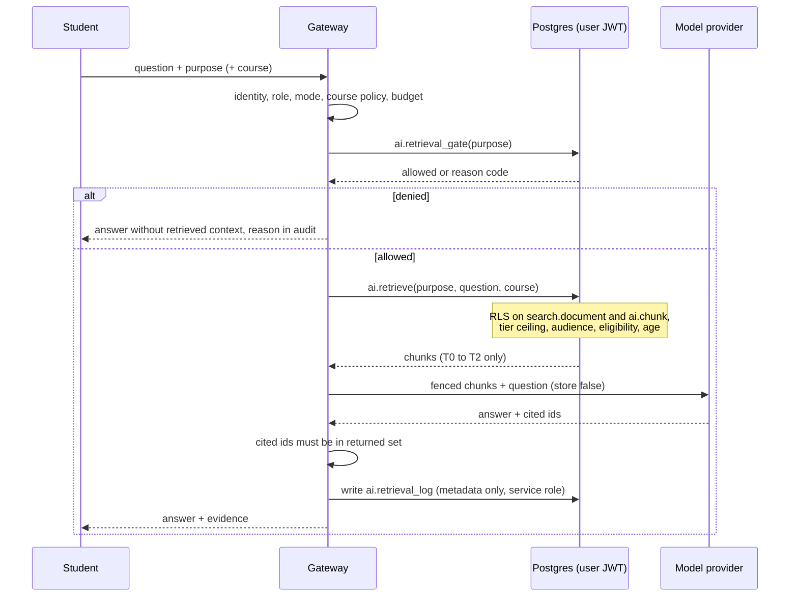

# 9 · AI data access and retrieval controls

## 9.1 What exists, verified against code

There are **two AI paths**, and they do not share a policy.

**Path A: the consumer, shared-key function** (`supabase/functions/claude/index.ts`). A proxy to the model API
behind an activation gate, a JWT check, a global kill switch and a per-user monthly call cap (default 60).
`clamp.ts` rebuilds the request from an allowlist (model, `max_tokens ≤ 16000`, client tools, `web_search`) and
passes `system` and `messages` **through unmodified**. It has no content inspection, no classification check, no
redaction, no tenant policy, no course rules and no audit table; it treats the caller as an individual with no
school. The data boundary is `app/src/lib/context.ts`, **a client-side allowlist**: a modified client can send
anything. The student's standing preferences are appended to every system prompt and bypass `context.ts`.

**Path B: the institutional gateway** (`app/server/institution/intelligence*.ts`; `/v1/intelligence/respond`).
The order in `respond()` is sound: identity must match the request; policy state not `off`; role permitted; mode
allowed; non-assistant agents may only `prepare`; every `sourceIds` entry must be a loaded approved source for the
tenant with a policy binding (`policy_scope`, `policy_course_code`, `policy_term`); tutor and course-guide agents
use exactly one course; the course's `course_ai_rules` must allow the mode; a model within the cost ceiling; budget
reserved then settled; the output validated and every `citedSourceIds` entry checked against the requested set;
an audit row written. Consequential actions are sealed, expire, and need `confirmed === true`, the same actor, and a
timestamp ≤ 5 minutes old, then authoritative read-back (`execute` currently returns `verified: false`, so **no
action can complete today**, which is the safe state).

What neither path does:

| # | Gap | Evidence |
| --- | --- | --- |
| G1 | **Classification is never consulted when context is assembled.** `data_classification_rules.allowed_in_approved_ai` and `_consumer_ai` are read by policy simulation and connector ingestion only. | `routeAllowed`/`withinCeiling` callers; no read in `respond()`, `loadApprovedSources`, `clamp.ts` or the Edge function |
| G2 | **Path A bypasses every tenant policy**, including the per-tenant kill switch (it calls `aiGenerationKilled(admin, null)`). | `functions/claude/index.ts:120` |
| G3 | **Consent is not enforced.** `consentIds: []` is hard-coded; `policyId` is a client string `'<school>:local-default'`; `consent_record` is never read by the gateway; there is no purpose binding. | `converse.ts:473` |
| G4 | **No per-source ACL.** `approved_source` has no classification; `loadApprovedSources` filters only by tenant, id and `authority <> 'prohibited'`. A tenant user who knows a source UUID can request it, subject to role, mode and course-policy checks; **enrolment is deliberately not checked** ("never from self-reported enrollment"). | `intelligence-repository.ts:160` |
| G5 | **No age, minor or guardian check anywhere** in `intelligence*.ts`, `functions/claude` or `converse.ts`. | grep |
| G6 | **No redaction.** `question` (≤ 10,000 chars) and source bodies go to the provider as-is; student-source excerpts (500 chars) on Path A are unscreened. The only redactor (`redact.ts`) serves sync errors. | `openai.ts:78-84` |
| G7 | **Whole-body context, not retrieval.** Up to 100 sources of up to 200,000 characters each are included. There is **no chunking, ranking, per-chunk ACL, embedding or vector store** (`meet.ts:665-670` rejects third-party embeddings because the data would leave the device). | research |
| G8 | **No output-side data controls.** Only citation ids are validated. | `intelligence.ts:253-262` |
| G9 | **Budget is per tenant on Path B and per user (call count) on Path A**; neither has both. | `ai_usage_*`, `count_call` |
| G10 | **`ai_memories` is schema only**: nothing reads or writes it; its `expires_at` has no sweep. If wired, the only control is owner RLS. | grep |
| G11 | `ai_policy.retention_days` applies to usage metadata, not to the audit tables (fixed 180 days). | `sweep_ai_runtime_metadata` |

Good and kept: metadata-only audit (no prompts, no responses, no source text); `store: false` on the provider call;
`clientState` ignored; the confirmation state machine; the kill switch failing closed; `untrusted.ts`
prompt-injection fencing.

## 9.2 Principles

1. **The AI is a client of the data layer, not a privileged reader.** It may be shown nothing the *requesting
   user* could not read through the app. Retrieval therefore runs **in the caller's security context** (their JWT,
   under RLS), never as `service_role`.
2. **Purpose-bound.** Every retrieval names an approved purpose; the purpose fixes the maximum classification, the
   permitted audiences, whether a minor may be served, and whether a course is required.
3. **Classification-bounded and fail-closed.** Anything above the purpose's ceiling, any unknown purpose, unknown
   age, missing tenant policy or engaged kill switch yields **no context**, with a specific reason code for the audit.
4. **Minimum necessary.** Chunks (≤ 2,000 characters), at most 20, selected by relevance. Not whole documents.
5. **Consent-bound for personal data.** A student's own documents are eligible only if the student marked the
   source AI-eligible; the flag is on the chunk, and is checked twice (below).
6. **Provenance on every answer.** Cited evidence ids are recorded as lineage edges, so "what did this rest on, and
   is it still true?" is a query ([04](04-events-and-lineage.md)).
7. **Metadata-only logging**, retained on the gateway's 180-day clock; never text.
8. **Retrieved text is untrusted input**, fenced by the existing `fence()`/`DATA_RULE`.
9. **Consequential actions need a human**, as already built.

## 9.3 The control flow

`ai.retrieval_gate()` is `security definer` (it must read policy tables the caller cannot) but reads only the
caller's own tenant. `ai.retrieve()` is `security invoker`: every table it touches is read as the caller. A
`service_role` retrieval is not offered; it would be a bypass. (Mutation `07d` shows it: change `invoker` to
`definer` and a student's retrieval returns another student's notes.)

## 9.4 What a model may be shown

| Data | Tier | Retrievable | Condition |
| --- | --- | --- | --- |
| Public catalog, events, services | T0 | Any purpose | Tenant policy not `off`; not killed; age rule of the purpose |
| Course materials, rubric, published study packs | T1 | `course_tutor` and similar | **Enrolled** in that course (RLS on the document); `course_ai_rules` allows the mode |
| Student's own notes, drafts, plan | T2 | `study_coach` and similar | Owner only; chunk `ai_eligible` (student opted that source in); tenant policy allows |
| Another student's notes or profile | T1–T2 | **Never** | `person` audience is excluded from every purpose by `CHECK` |
| Education records: grades, enrolment, advising notes, ledger, accommodations | T3 | **Not via retrieval** (the index refuses T3; `ai.purpose.max_tier` stops at T2) | See below |
| Family, guardian, consent, support tickets, holds, audit | T3+ | Never | |
| Anything at T4–T6 | n/a | Never; not stored | |

**T3 by explicit attachment, not retrieval.** The classification floor permits T3 in an *approved institutional*
environment, never consumer AI. This design takes the narrower road: a model sees a T3 record only when **the
person entitled to that record attaches it to this request**, sees what will be sent, and confirms. The
fetch runs under that person's own RLS from the system of record; it is not indexed, not chunked, not cached. That
makes `consentIds` real (the attachment *is* the consent, recorded), keeps education records out of any
background index, and answers "can the AI read my grades?" with "only when you hand it one." **counsel** reviews
whether and where an institution may widen it.

**Staff and guardians.** An AI acting for a staff member sees what that role may read through the same
user-context retrieval and may only `prepare` (existing rule); it never sees a student's T3 content in a consumer
path. Guardian AI is **off** until the guardian-consent/projection model ([01 §1.5](01-canonical-entity-model.md))
exists, because today there is no purpose, field list or expiry to bind it to.

**Minors.** Purposes default to `allows_minor = false`; `age_cleared()` is false for an account that never stated
its age, so unknown age is refused. A purpose that admits minors must list its audiences narrowly (the test purpose
admits only `tenant` T0–T1 content). K-12 edition rules are **counsel**.

## 9.5 The controls, with their tests

All in [`sql/07_ai_retrieval_controls.sql`](sql/07_ai_retrieval_controls.sql); tested against real tenants,
enrolments, ages, kill switches and policies in `tests/07_ai_retrieval.test.sql`. A row citing a mutation id is shown
to fail when that bug is introduced; a row marked "asserted" is checked by the test but has no dedicated mutation yet.

| Control | Behaviour verified | Mutation |
| --- | --- | --- |
| Purpose must exist and be `approved` | a draft purpose serves nothing | n/a (asserted) |
| **Tenant policy** | a tenant whose `semester_intelligence` is `off` gets `policy_off` and no context | `07f` |
| **Kill switch** (global or tenant) | engaged → `kill_switch`, no context; released → service resumes (control) | `07e` |
| **Age** | a minor is refused by a purpose that does not admit minors (`age_not_cleared`); admitted by one that does, for T0 tenant content only | `07a` |
| **Classification ceiling** | a `course_tutor` (T1) never receives a T2 document, **including one in the `tenant` audience** that no other rule would exclude | `07b` |
| **Audience allow-list per purpose** | `course_tutor` excludes owner notes | n/a (asserted) |
| **Enrolment** | a non-enrolled user gets no course material; an enrolled one does | via RLS (`07d`) |
| **Course required** | a purpose with `requires_course` returns nothing without a course | n/a (asserted) |
| **Eligibility** (two barriers: the chunk policy *and* the query) | a chunk not marked eligible is never returned; both barriers are removed together in the mutation, because either alone masks the other | `07c` |
| **Runs as the caller** | another student's notes are never returned to a different user | `07d` |
| **Log is service-only** | a signed-in user can neither write nor read `ai.retrieval_log`; the service role can (control) | `07g` (grant **and** policy) |

Two of these were genuinely subtle and the harness found them: the first "minor" test ran after the student had been
un-enrolled, so the age rule was never exercised; and the first classification test used rows that were already
excluded by audience, so the ceiling was never exercised. Both are fixed, and both mutations now fail the test.

## 9.6 Closing the gaps

| Gap | Fix | Size |
| --- | --- | --- |
| G1 | Gateway calls `ai.retrieval_gate` + `ai.retrieve` instead of loading whole sources; `data_classification_rules` is consulted through `ai.purpose.max_tier` | medium |
| G2 | **Decide Path A's future.** Options: (a) retire it for any user with a school; (b) make `claude` look up `school_of()`, tenant policy, `ai_policy` and the per-tenant kill switch before forwarding; (c) keep it only for individuals with no school. Until one of these, the institutional policy can be bypassed by calling the other function. | small (b), owner decision |
| G3 | `consentIds` populated from the attachment flow (9.4); `policyId` set server-side from `ai_policy.policy_version`, never from the client | small |
| G4 | `approved_source` gains `classification` and `audience`; `ai.chunk` replaces whole-body inclusion; enrolment is checked by RLS on the document | medium |
| G5 | Age/guardian check lives in `retrieval_gate`; the gateway refuses when `age_not_cleared` | done in proposal |
| G6 | A pre-send **redaction step** on the question and student excerpts (emails, tokens, long digit runs, institutional ids), reusing `redact.ts`; a student can see what was redacted | small–medium |
| G7 | Chunking at index time; dense retrieval via pgvector with an **approved-hosting embedding model** (below) | medium |
| G8 | Output scan for the seeded canary strings and for T3-shaped content before display | medium |
| G9 | One budget model: per tenant (dollars) **and** per user (tokens) on both paths | small |
| G10 | Wire `ai_memories` only with: purpose binding (memory is retrievable only by its own purposes), a visible list the student can delete, an `expires_at` sweep, kinds limited to `goal/preference/decision/focus_area/context`, nothing T3 | medium |
| G11 | Apply `ai_policy.retention_days` to the audit tables or document why the two clocks differ | trivial |

## 9.7 Embeddings and the vector store

Not built, and not testable in the validation environment (pgvector is not installable there), so this section
states constraints, not results.

- **Hosting is a constraint, not a preference.** `ai.embedding_model` allows only `on_device` or
  `tenant_approved_region` hosting, with a `data_zone` required for the latter; `ai.chunk.embedding_model` is a
  foreign key to it. A third-party embeddings endpoint that moves text off-device is not representable.
- **A chunk inherits its document's ACL by reference** (`document_id`, `ON DELETE CASCADE`), never by copy. An ACL
  change on the document is an ACL change on every chunk, with no reindex.
- **Embeddings are personal data when derived from personal text.** They are erased with the source (cascade) and
  are in `account_data_map()` automatically. Whether they are in the export is a decision: derived and
  non-reversible in practice, but not *provably* so.
- **Tenant isolation inside an approximate index.** Filtering after an ANN search can return fewer than *k* rows or
  none (the filter removes the nearest neighbours). Candidates: a partial HNSW index per large tenant; partitioning
  by tenant; or iterative index scans. **The choice needs a measured recall test at realistic tenant sizes before
  it is made**, and the lexical path (already tested) is the fallback and the baseline to beat.
- **Model change** re-embeds; the row records the model and `embedded_at`, so a mixed-model index is detectable.
- **The dimension and index DDL** in the proposal are commented, marked **untested**.

## 9.8 Evaluation, red-teaming and logging

- **Leakage corpus.** Seed a canary string into a document each user must not see (another tenant's, another
  student's, a T3 record, a tombstoned one, a blocked person's). For every purpose and every user archetype, assert
  the canary never appears in assembled context. The SQL test is the database half; the gateway half is a
  contract test over `respond()` using the same fixtures. This is the AI analogue of `rootunmount.test.ts`: a
  structural check that does not depend on a model behaving.
- **Evaluation** extends `AI-RECOMMENDATION-EVALUATION-HARNESS.md`: citation correctness (every cited id in the
  returned set, already enforced), refusal on denied context (the answer says it had no context, not that it
  guessed), and regression across model changes.
- **Logging.** `ai.retrieval_log` stores purpose, gate reason, policy version, chunk count, highest tier returned,
  kinds returned, request id, and a **hash** of the actor. Never text, never document ids a person could be
  re-identified from. It is security evidence, **not an analytics source** (registered `analytics_eligible =
  false`), and counting AI use per student is on the platform's never-measure list.

## 9.9 Decisions needed

1. Path A: retire, gate, or limit (G2). This is the largest single exposure and the cheapest to close.
2. Approve the T3-by-attachment rule (9.4), and what an institution may widen. **counsel**
3. Whether embeddings are part of a student's export.
4. The first set of approved purposes and their ceilings (`study_coach`, `course_tutor`, `advisor_prep`, …); each is
   a row, reviewed by the AI governance board in `docs/operating-model/`.
5. Whether `ai_memories` is wired at all this year.
