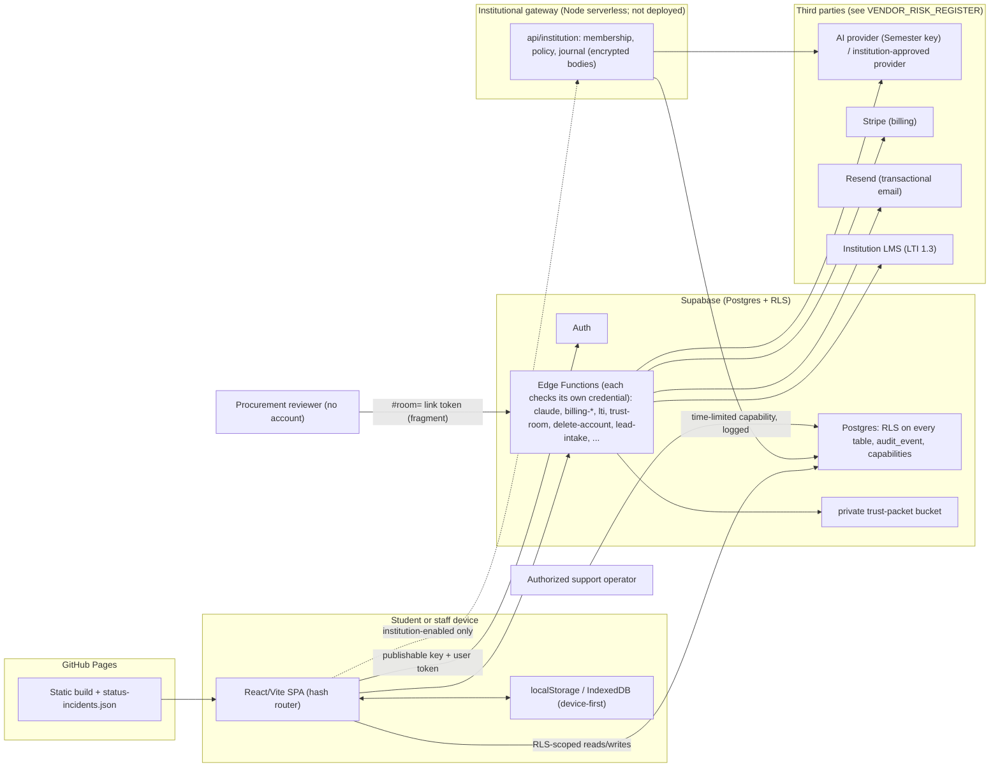

# Cloud Security Plan (master plan)

| Control | Value |
| --- | --- |
| Status | **DRAFT - INTERNAL MASTER PLAN - NOT APPROVED, NOT AN ASSESSMENT RESULT** |
| Owner | Harrison Rubin (interim; single point of failure; backup unassigned) |
| Evidence date | 2026-10-05 at repository revision `5eba494` |
| Labels used | [VERIFIED] [ASSUMPTION] [DRAFT] [INTERNAL] [REVIEW: security] [REVIEW: counsel] [REVIEW: privacy] [REVIEW: accessibility] |
| Audience | Internal |

> Operating document, not legal, security, privacy or accessibility advice. It ties the compliance documents together; it creates no control and proves none.

## Relationship to existing artifacts

| Existing artifact | What it already covers | What this document adds | Why a new document rather than an edit |
| --- | --- | --- | --- |
| [docs/trust/INFORMATION-SECURITY-PROGRAM.md](../../trust/INFORMATION-SECURITY-PROGRAM.md) | The control program by domain, status `PARTIAL / NOT OPERATIONALLY ACCEPTED`, claim ceiling | One page that maps governance and domains A-F to owners, evidence and next action, a dated 30/60/90 sequence, metrics, escalation path and launch gates | The program is a controlled trust document; it does not carry dated sequencing or the user-requested domain layout |
| [docs/security/SECURITY-PROGRAM.md](../../security/SECURITY-PROGRAM.md), [docs/infrastructure/SECURITY-CONTROLS.md](../../infrastructure/SECURITY-CONTROLS.md) | Engineering-side security program and infrastructure controls | Cross-reference only | Not duplicated |
| [docs/integrated-trust/REMEDIATION-SEQUENCE.md](../../integrated-trust/REMEDIATION-SEQUENCE.md) | ordered, test-held remediation items (TR-*; count as generated in that file) with priority and effort | Calendar framing (days 1-90) that sequences a subset by what a single founder can start; no new items | Prevents a second backlog; every item here is a TR id or an explicit new action marked [DRAFT] |
| [docs/trust/CONTROL-FACTS.md](../../trust/CONTROL-FACTS.md) | Generated facts (RLS posture, headers, functions, third parties, kill switches) | Cited, never restated without "as generated in CONTROL-FACTS.md at revision 5eba494" | Numbers drift |
| [docs/ARCHITECTURE.md](../../ARCHITECTURE.md), [docs/trust/DATA-FLOW-MAP.md](../../trust/DATA-FLOW-MAP.md) | Components and logical flows | A single diagram verified against both (section 1) | Reviewers ask for one picture |
| [COMPLIANCE_EVIDENCE_REGISTER.md](COMPLIANCE_EVIDENCE_REGISTER.md) | Per-control rows CER-A01..F15 | This plan references rows by id | Single place for per-control detail |
| [GO-NO-GO-DECISION.md](../../../GO-NO-GO-DECISION.md) | Controlling gate decisions | Section 7 restates gates as a checklist and never overrides | Decision is controlling |

## Gate (what may be done now versus held)

| Activity | Now (GO / GREEN non-activation) | HELD until named gate |
| --- | --- | --- |
| Discovery, synthetic demos, evidence exchange, conditional scoping | Yes. Use synthetic data only | n/a |
| Sending this plan or the register to a prospect | No (internal) | Controlled trust-room packet after review |
| Any live customer data, tenant activation, production integration | No | Blockers 1-8 in GO-NO-GO (section 7) |
| Price quote, order form, payment | No | Paid pilot gate (NO-GO / RED) |

## 1. Architecture and data-flow (derived from ARCHITECTURE.md and DATA-FLOW-MAP.md)

Components verified present in the tree: SPA (`app/`, deployed by `.github/workflows/pages.yml`); Supabase migrations and Edge Functions (`supabase/migrations`, `supabase/functions`); institutional gateway (`app/api/institution/[...path].ts`, `app/server/institution`; not deployed per TR-19); trust-room function (`supabase/functions/trust-room/index.ts`); subprocessor register (`app/src/lib/trust/subprocessors.ts`). [VERIFIED] by those paths; [DRAFT] as a diagram. No arrow implies a flow is enabled, approved or active for any institution.

Trust boundaries, each with the evidence that enforces it (see the register for status):

| Boundary | Enforcement | Evidence | Register row |
| --- | --- | --- | --- |
| Browser to database | Publishable key only; RLS is the authorization boundary; UI role gating is UX only | `docs/architecture/0002-rls-is-the-authorization-boundary.md`; `supabase/rls-coverage.check.sql` | CER-C12 |
| Browser to Edge Function | Function checks its own credential (`verify_jwt = false` on every function per CONTROL-FACTS.md, as generated at revision 5eba494) | `app/src/lib/edgeguards.test.ts` | CER-C13 |
| Tenant to tenant | Policy suites with second-account negative checks | `supabase/tenancy.check.sql` | CER-D16, CER-B13 |
| Device to cloud | Optional sign-in; syncs only declared owned tables | `app/src/lib/cloud.ts` | CER-B06 |
| Student data to AI provider | Metered gateway, provider approval, data-class ceiling, kill switch | `app/src/lib/aikillswitch.test.ts`; `docs/trust/AI-DATA-USE-STANDARD.md` | CER-B09, CER-D24 |
| Reviewer to evidence | Link token in URL fragment, one-minute signed URL, access recorded | `app/src/lib/trustlink.ts`; `supabase/trust-room.check.sql` | CER-F06 |

## 2. Governance (domain A)

| Item | Owner | Status | Evidence | Next action | Register |
| --- | --- | --- | --- | --- | --- |
| Security owner | Harrison Rubin (interim) | Partially evidenced | `OWNER-AND-ACCOUNTABILITY-MATRIX.md` | Name a backup (TR-12) | CER-A01 |
| Privacy owner | Harrison Rubin (interim) | Partially evidenced | `docs/privacy-operations/README.md` | Counsel intake; backup | CER-A02 |
| Risk register | Harrison Rubin (interim) | Partially evidenced | `docs/trust/RISK-TREATMENT-PLAN.md` | Adopt appetite; first review minutes | CER-A04 |
| Policy review cadence | Harrison Rubin (interim) | Partially evidenced | `SEMESTER-OPERATING-SYSTEM.md` | Quarterly calendar | CER-A05 |
| Evidence register | Harrison Rubin (interim) | Verified-repository (index) | `docs/trust/EVIDENCE-REGISTER.md` | Produce artifacts | CER-A06 |
| Security metrics | Harrison Rubin (interim) | Planned | `app/src/lib/governance/error-budgets.ts` | Section 4 | CER-A07 |
| Executive escalation | Harrison Rubin (interim) | Partially evidenced | `docs/integrated-trust/INCIDENT-RESPONSE.md` | Section 5 | CER-A08 |

## 3. Domains B-F (summary; detail lives in the register)

| Domain | Where it stands | Biggest gaps | Canonical docs | Register rows |
| --- | --- | --- | --- | --- |
| B Data governance | Schema inventory generated; every table has a retention answer held by test; export/erase map is catalogue-derived; subprocessor register held to CSP by test | No signed provider terms; vendors unassessed; no production reconciliation; operator side of rights requests absent; device-held export gap | [DATA_INVENTORY_TEMPLATE.md](DATA_INVENTORY_TEMPLATE.md), [DATA_RETENTION_DELETION_PLAN.md](DATA_RETENTION_DELETION_PLAN.md), [VENDOR_RISK_REGISTER.md](VENDOR_RISK_REGISTER.md) | CER-B01..B19 |
| C Identity and access | Capability-based least privilege with audited grants; console step-up; SSO/SCIM built, enabled for nobody | No MFA evidence for provider consoles; no student MFA; no access review; break-glass not consumed | `docs/trust/IDENTITY-AND-ACCESS-MANAGEMENT-STANDARD.md` | CER-C01..C14 |
| D Application and cloud | CI gates, secret scan, RLS and definer sweeps, headers specified, logical restore rehearsed | No independent test; DAST static preview only; headers not served by current host; provider restore never done; no alerting | `docs/trust/SECURE-DEVELOPMENT-LIFECYCLE.md`, `docs/trust/BACKUP-RESTORE-AND-ROLLBACK-RUNBOOK.md` | CER-D01..D26 |
| E Incident response | Plan, runbook, message composer, status feed, one founder document tabletop | No second person, alert route, send path, counsel, target exercise | [INCIDENT_RESPONSE_PLAN.md](INCIDENT_RESPONSE_PLAN.md) | CER-E01..E12 |
| F Procurement | RFP library test-held; HECVAT readiness register; trust-room mechanism | No HECVAT completed; no DPA; no ACR; no pentest; no named customer | [HECVAT_ROADMAP.md](HECVAT_ROADMAP.md), [SECURITY_QUESTIONNAIRE_LIBRARY.md](SECURITY_QUESTIONNAIRE_LIBRARY.md), [TRUST_CENTER_INVENTORY.md](TRUST_CENTER_INVENTORY.md) | CER-F01..F15 |

## 4. Security metrics list [DRAFT]

No metric below has a measured value today (TR-27: no objective has a measured value). Targets are [ASSUMPTION] proposals for the founder to accept; none may appear in customer material.

| Metric | Definition | Source | Cadence | Current | Proposed target [ASSUMPTION] |
| --- | --- | --- | --- | --- | --- |
| Open critical/high findings | Confirmed findings past their SECURITY.md clock | findings register `docs/security/FINDINGS-REGISTER.md` | Monthly | Not measured | 0 past clock |
| Time to fix by severity | Confirmation to fix, per severity | same | Monthly | None held against a real finding | Within SECURITY.md days (2/14/60/180, internal targets) |
| Dependency advisories open (high+) | `npm audit` high or above on production graph | CI `ci.yml` | Per release | 0 at 2026-10-02 audit (point in time) | 0 |
| Secret-scan findings | Gitleaks leaks on tree/diff | CI | Per release | 0 at 2026-10-02 scan (point in time) | 0 |
| Privileged accounts with MFA evidence | Consoles with filed enforcement proof / consoles in use | register CER-C01 | Monthly | 0 evidenced | 100% |
| Access review completion | Reviews completed on schedule | CER-C08 | Quarterly | None | 100% |
| Restore test age | Days since last timed provider restore | CER-D20 | Quarterly | Never (logical rehearsal only) | <= 90 days |
| Measured RTO/RPO | From a timed restore | CER-D20 | Per exercise | None | Measured, then decided |
| Alert acknowledgement time | Alert to first human acknowledgement | route from TR-07 | Monthly | No route | Decide after first measurement |
| Incident exercises held | TT-nn entries filed vs calendar | `docs/integrated-trust/TABLETOP-CALENDAR.md` | Quarterly | 1 document walkthrough | Calendar met |
| Rights requests answered inside agreed time | Requests closed vs due date | `data_subject_request` | Monthly | No operator side | After counsel sets a clock |
| Vendors reviewed in date | High/Medium vendors with filed review / total | VENDOR_RISK_REGISTER | Quarterly | 0 reviewed | 100% before real data |
| Evidence freshness | Register rows with artifact inside cadence | EVIDENCE-REGISTER | Monthly | Nothing reads freshness | Computed |
| Policy review currency | Policies reviewed inside cadence | CER-A05 | Quarterly | Not measured | 100% |

## 5. Executive escalation path [DRAFT]

Interim reality: one person holds every seat. The path below is what a second person must be able to follow; until one exists it is a plan, not a capability (TR-12).

| Step | Trigger | Who decides | Interim holder | Notes |
| --- | --- | --- | --- | --- |
| 1 Detect and triage | Alert, report, customer message | Incident commander | Harrison Rubin | Suspected cross-tenant exposure is P0 until disproven |
| 2 Executive decision | P0/P1, any pause of launch, any customer-visible commitment | Founder | Harrison Rubin | Single holder; a second reader of the closing summary is required by INCIDENT-RESPONSE.md, so the summary waits a day |
| 3 Counsel | Notification duty, contract term, regulator or law-enforcement contact, statement about cause | Qualified counsel | unassigned [REVIEW: counsel] | Do not decide notification yourself |
| 4 Customer authority | Any named institution affected | Institution sponsor/IT/privacy contact | Not yet named | Contacts per customer, none exist |
| 5 Provider escalation | Provider-side cause | Provider support route | Harrison Rubin | Provider terms/contacts per vendor row |

## 6. 30 / 60 / 90 day security remediation sequence [DRAFT]

Day 0 = 2026-10-05 [ASSUMPTION]. Dates are start targets for a single founder, not completion promises; items marked (person) need someone outside the repository. Effort: S = a day or two, M = a week or two, L = longer (same scale as TR). Every item cites its TR id or register row; nothing here is a new control.

### Days 1-30 (to 2026-11-04): make the evidence honest and close cheap gaps

| # | Action | Owner | Ref | Effort | Depends on |
| --- | --- | --- | --- | --- | --- |
| 1 | Reconcile contradicting registers (including D-1..D-7 in the register) | Harrison Rubin | TR-04 | S | none |
| 2 | Remove `continue-on-error` from the dependency audit step | Harrison Rubin | TR-05 | S | none |
| 3 | Decide the severity scale (P0-P3 view of SEV1-4) by dated decision | Harrison Rubin | TR-06 | S | none (person: founder) |
| 4 | File MFA enforcement proof per provider console (redacted) | Harrison Rubin | CER-C01 | S | none |
| 5 | Inventory the omitted keys and record the first rotation log entry | Harrison Rubin | TR-09 | S | none |
| 6 | Enable CodeQL variable or record why not; file first result | Harrison Rubin | CER-D05 | S | repo plan |
| 7 | Read the provider backup window off the dashboard and file it | Harrison Rubin | CER-B15, TR-10 | S | none |
| 8 | Identify a named backup and a second reviewer for the AI switch (candidates only) | Harrison Rubin | TR-12 | S | person |
| 9 | Open counsel intake using the review queue | Harrison Rubin | `LEGAL-REVIEW-QUEUE.md`, TR-21 | S | counsel [REVIEW: counsel] |
| 10 | Adopt the security program and risk appetite by dated decision | Harrison Rubin | CER-A03, A04 | S | none |

### Days 31-60 (to 2026-12-04): operate controls once, with evidence

| # | Action | Owner | Ref | Effort | Depends on |
| --- | --- | --- | --- | --- | --- |
| 11 | Run erasure and export through the real function with a synthetic account | Harrison Rubin | TR-08 | M | none |
| 12 | Restore a real provider backup into the second project and measure it (cost approval needed per the 2026-10-03 tabletop decision) | Harrison Rubin + second operator | TR-10, TT-03 | M | person; approval |
| 13 | First access review of `role_grants` | Harrison Rubin | CER-C08 | S | none |
| 14 | Vendor reviews for the High-tier vendors (Supabase, Vercel, Stripe, Anthropic) | Harrison Rubin | CER-B12 | M | vendor documents under NDA |
| 15 | Serve security headers from a host that sends them; add a live-header smoke | Harrison Rubin | TR-17 | M | hosting decision |
| 16 | Tabletops TT-01 (cross-tenant) and TT-02 (AI switch release by second reviewer) | Harrison Rubin + second person | TR-30 | S each | person |
| 17 | Alert route to a second person with a planted failure | Harrison Rubin | TR-07 | S | person |
| 18 | Counsel review of DPA and incident-notification exhibit drafts | counsel | TR-21, TR-22 | L | counsel [REVIEW: counsel] |

### Days 61-90 (to 2027-01-03): independent validation starts

| # | Action | Owner | Ref | Effort | Depends on |
| --- | --- | --- | --- | --- | --- |
| 19 | Scope and engage an independent assessor against a non-production target | Harrison Rubin | TR-16 | L | firm; authorized target; budget |
| 20 | Provision the target runtime/credential for authenticated DAST | Harrison Rubin | CER-D06 | M | TR-19 |
| 21 | Engage a qualified accessibility evaluator; run the AT protocol on the golden path | Harrison Rubin | TR-25 | L | evaluator [REVIEW: accessibility] |
| 22 | Deploy the gateway and configure the production probe; record the first day | Harrison Rubin | TR-19 | M | hosting decision |
| 23 | Begin measuring service-level objectives for a first month | Harrison Rubin | TR-27, TR-28 | M | TR-19 |
| 24 | Draft HECVAT answers against a real buyer's workbook (Lite first) | Harrison Rubin | [HECVAT_ROADMAP.md](HECVAT_ROADMAP.md) | M | a buyer; version |
| 25 | Apply the branch ruleset once a second reviewer exists | Harrison Rubin | TR-46 | S | person |

## 7. Launch gate list

Restated from [GO-NO-GO-DECISION.md](../../../GO-NO-GO-DECISION.md); a gate is open only on the evidence that document names.

| Gate | Required before | Evidence (to file under docs/evidence/) | Register rows |
| --- | --- | --- | --- |
| G1 Authorized published candidate, hosted CI green | any activation | Immutable SHA and run links | CER-D01, D10 |
| G2 Independent security assessment and clean DAST rescan | paid/broad | Reports with no open launch-blocking finding | CER-D06, D09 |
| G3 Qualified accessibility review | individual/paid/broad | Dated report and approved ACR position | CER-F07, F08 |
| G4 Counsel-approved public policies and paper | individual/paid/broad | Versioned approvals; executed DPA | CER-F04, F13 |
| G5 Entity, signing, price, tax, payment, insurance authority | paid/broad | Authority matrix, advice, coverage | CER-A12 |
| G6 Staffed support, monitoring and incident coverage | any supported launch | Rota with backup; alert drill | CER-A13, D18, E10 |
| G7 Recovery, rollback, rights and offboarding operated on the target | any target activation | Dated records with witnesses | CER-D20, D23, B06, B07 |
| G8 Named customer scope and acceptance | institutional | Signed approvals, UAT, two-tenant acceptance | CER-F15 |

## Evidence state

All statements cite repository paths at `5eba494` or dated files under `docs/evidence/`. Nothing here shows a control operating in production.

## Claim ceiling

Permitted: "Semester has a documented, evidence-linked security program in a repository, with a sequenced remediation plan." Not permitted: that any control is complete, operated, independently verified or compliant.

## Prohibited claims

SOC 2, ISO 27001, FERPA/COPPA/GDPR/HIPAA compliance, HECVAT completion, penetration test, WCAG conformance, uptime/RTO/RPO, 24/7 operations, encryption-at-rest statement without provider evidence, live SSO/SCIM/LTI.

## Professional review required

Independent security assessor [REVIEW: security]; counsel [REVIEW: counsel] for notification, DPA and retention durations; privacy lead [REVIEW: privacy]; accessibility evaluator [REVIEW: accessibility]. None named in the repository.
