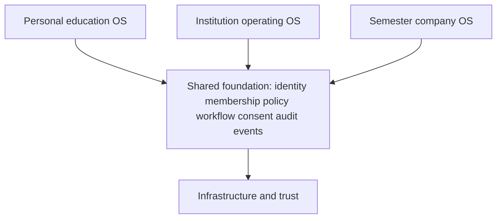
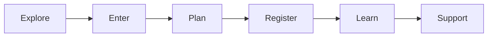
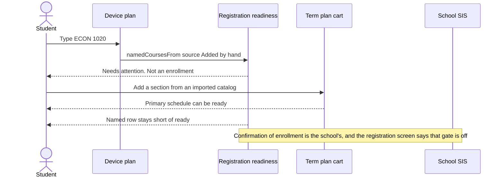

# Ecosystem connections

**As of** 2026-10-06. **Source** `docs/specifications/connected-ecosystem.pdf` (12 pages). This page depicts the target and names the repository surface that already carries each connection. A box here is not a claim that the journey is deployed or authoritative.

The three environments share one platform and keep separate records: a student’s notes, an institution’s academic record, Semester’s employee records, and a developer sandbox.

## Four connection types

| Type | What moves | What must not happen | Where the repository already draws the line |
| --- | --- | --- | --- |
| Experience | Navigation and approved context | Opening a screen grants access | `forRole` and `rolejourney.ts`. Client role is not a capability. |
| Workflow | Requests, approvals, tasks, receipts | A referral discloses the whole case | Advisor agenda on the readiness checklist says sharing is opt-in. No advisee grant is created by naming a course. |
| Data | Authorized records or projections | A copy becomes a second official record | Device plan `source: Added by hand`. Term plan cart is planning. Official registration stays gated. |
| Operational | Health, configuration, evidence, support | Platform staff receive every customer record | `OPERATIONS_ONLY` versus `STUDENT_RECORD` in `lib/rolelaunch.ts`. |

## Learner spine, as far as this tree goes

| Stage | Repository | Authority |
| --- | --- | --- |
| Explore | Applicant `launchpad`, company site | Self-authored. Official admission is the school’s. |
| Enter | Account and SSO surfaces; first run needs no account | Live identity provider unverified. |
| Plan | Device registration plan, Term plan, My Path snapshot | Device and imported file. Not the registrar. |
| Register | `Registration.tsx` behind the school gate | External SIS until the gate is on and a command is confirmed. |
| Learn | Course, study, and assessment screens | Not re-audited in this batch. |
| Support | Meetings, campus support screens | A role choice is not a caseload. |

Graduation, transcript, alumni, and employer stages are specified. They are not this batch.

## The connection this batch completes

Naming a course and choosing a section are different facts. The readiness checklist now says so.

`pathReadiness` id `named` is that row. `courses` remains the cart. `namedCoursesFrom` ignores any course whose source is not `Added by hand`, so a syllabus import does not get called a typed code.

## Journeys the specification asks to judge as wholes

| Journey | This tree | Still missing |
| --- | --- | --- |
| Marketing to a saved student action | First-run plan, no account | Marketing CTA and resumed account context were not changed |
| Registration to roster and schedule | Plan, cart, gated official screen | Authoritative confirmation |
| Student to advisor to an office | Advisor agenda row, opt-in copy | No referral with minimized context |
| Support to engineering | Specified in the PDF | Not implemented here |
| Checkout to settlement | Stripe adapter in shadow on main | No charge in this work |
| Contract to deployment | Operations docs | No tenant was configured |
| Role end to access removal | Specified | Not this batch |

A connection is complete only when the PDF’s questions have answers: who starts it, who owns the record, what crosses, which policy applies, what failure does, what is audited, who supports it, and how it ends. The named-course row answers those for one connection. It does not answer them for the others.
