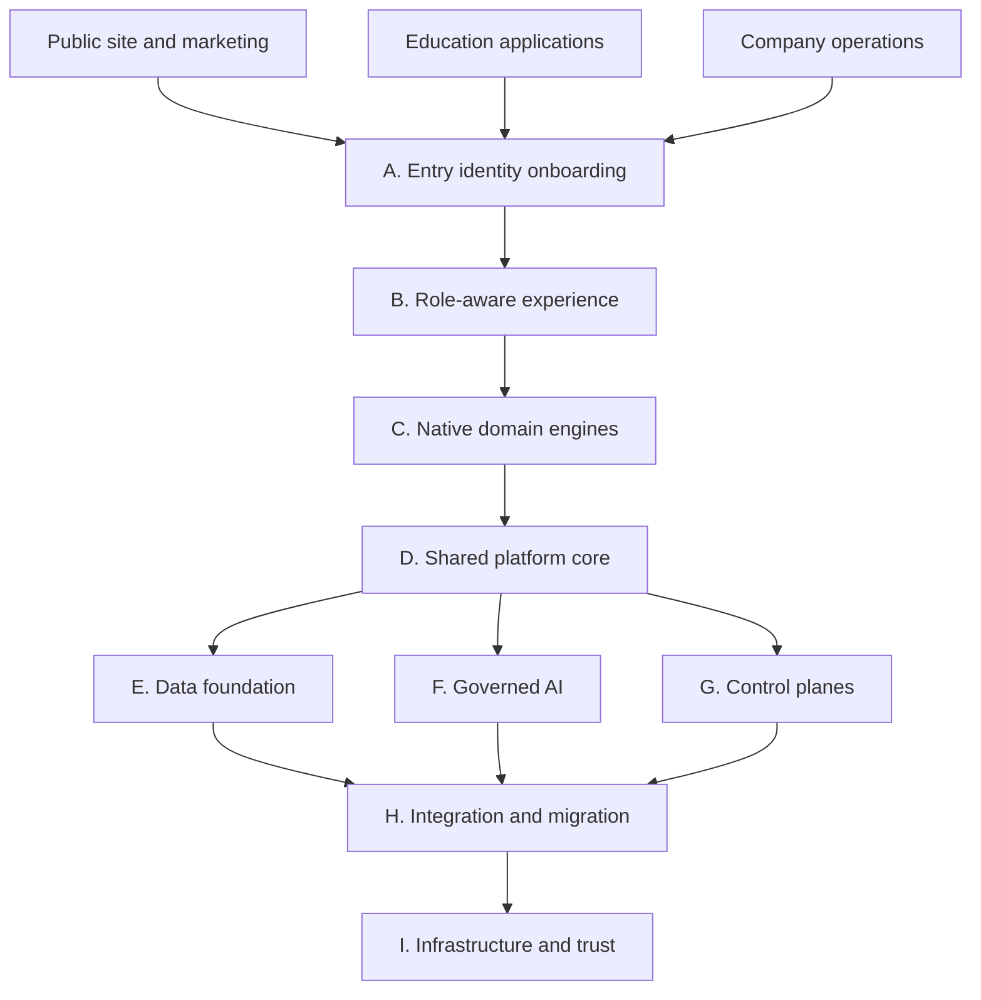
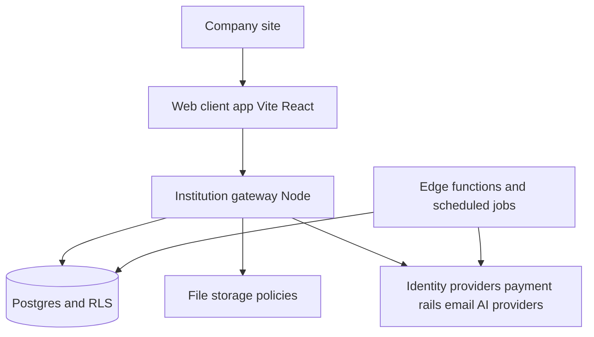
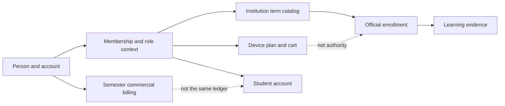
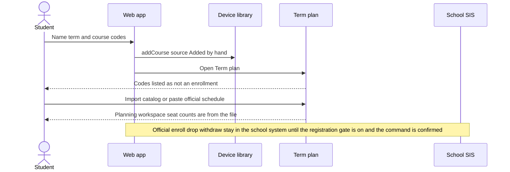
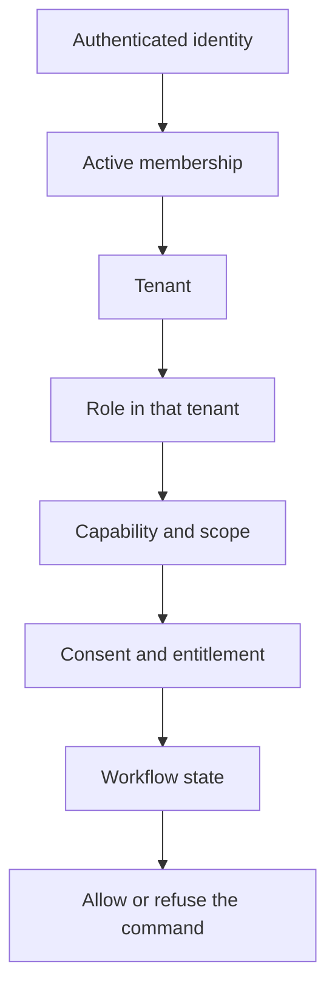
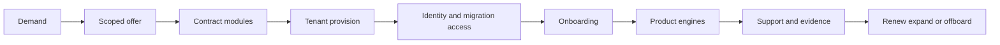
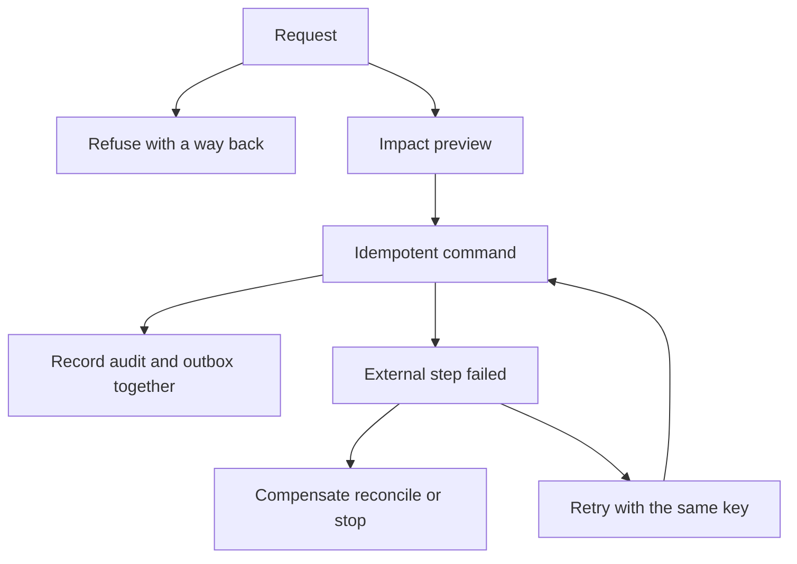

# Target architecture

The target is the nine-layer Education Operating System in `docs/specifications/semester-mainframe.pdf`. This page records that target and the boundaries the repository must keep while it is built. It does not raise any readiness score.

Existing program pages remain the detailed design: `docs/operations/SHARED_CONTROL_PLANE.md`, `INSTITUTION_OPERATING_SYSTEM.md`, `OPERATIONS_COMMAND_CENTER.md`, and `SEMESTER_COMPANY_OPERATING_SYSTEM.md`. This page does not replace them.

## Whole system context

## Runtime and container boundaries

One platform, several deployables. Identity, policy, and record authority are not copied per client.

The client’s chosen screen is not an authorization decision. The gateway and RLS evaluate the action.

## Data authority and domain relationships

A shared graph is not permission to read every node. Commercial billing, student accounts, payment settlement, and statutory reporting stay separate. Raw card data is not stored.

## Registration-readiness sequence

## Role and tenant context

A person who is a student at one institution and a teaching assistant in one course switches workspace on purpose. Privileges are not merged. A missing role gets the narrower screen set (`forRole` in `app/src/lib/role.ts`).

## Company and customer lifecycle

Founder and employee views are governed oversight. They are not an automatic route into student, HR, financial, or security records. `OPERATIONS_ONLY` and `STUDENT_RECORD` in `app/src/lib/rolelaunch.ts` are the repository’s expression of that rule.

## Failure and recovery

Technical rollback, a compensating transaction, an authorized correction, external reconciliation, and an irreversible action are different. Enrollment in an external SIS is not reversed by deleting a device course.

## Rules that bind every later phase

- Reuse the canonical account, membership, capability, consent, and audit models.
- Do not add a permission system per console.
- Do not present a mock console as a working system.
- Do not transfer system-of-record authority without the proof named in `INTEGRATION_AND_MIGRATION.md`.
- AI calls the same commands a person may call, and may not enroll, grade, or move money on its own.
