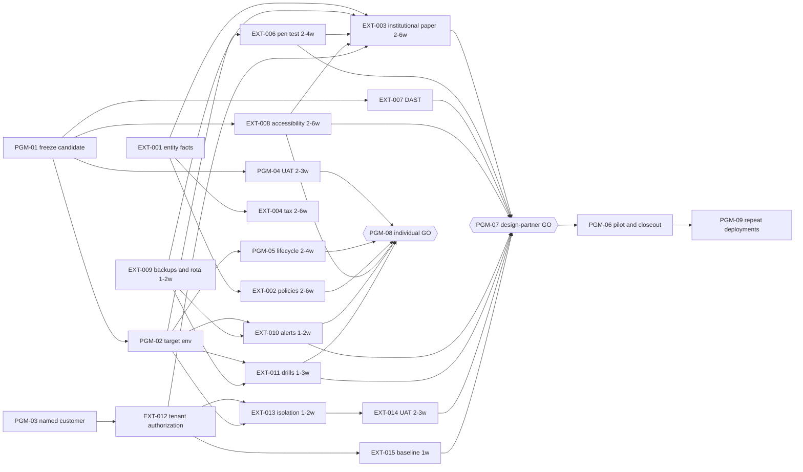

# 02 · Dependencies and critical path

> Part of the [program pack](README.md). Held by
> [`app/src/lib/ops/program.test.ts`](../../app/src/lib/ops/program.test.ts): the node
> tables below are parsed, the graph is checked for cycles and unknown ids, every
> external evidence item is a node, and the path figures are recomputed. Edit a
> number here without its cause and the test fails.

## How to read this

- A **node** is something that has to be true before a motion can be authorized.
  `EXT-nnn` nodes are the 18 items of the
  [external evidence queue](../finalization/EXTERNAL-EVIDENCE-QUEUE.md), unchanged.
  `PGM-nn` nodes are the program's own: internal work or a decision the queue
  assumes but does not list.
- **Needs** comes from the queue's *Preconditions* column and from the
  [go/no-go decision](../../GO-NO-GO-DECISION.md). Where the source does not say, the edge is
  not drawn; an edge nobody can cite is a guess.
- **Weeks** are the repository's own ranges from the
  [launch-readiness checklist](../market-readiness/LAUNCH-READINESS-CHECKLIST.md)
  (assessed 2026-10-02). That page says estimates *begin only after the named owner
  and environment/customer prerequisites exist*, so every figure is a lower bound on
  elapsed time. `—` means **no estimate exists anywhere in the repository**. It is
  not zero, and the motion table below names every such node on each path. `0`
  means a decision or signature that takes no work of its own.
- Nothing here is a date. No start date, funding or customer exists in the
  repository, so the program has no calendar to schedule against (assumption
  RAID-A01).

## Nodes

| Node | Work | Needs | Weeks | Basis for the weeks |
| --- | --- | --- | --- | --- |
| PGM-01 | Freeze an authorized candidate: one immutable SHA, hosted CI green, PostgreSQL 17 suites passing | — | — | none; go/no-go priority 1, FR-009 |
| PGM-02 | An authorized target environment exists for the drills, DAST, monitoring and tenant tests | PGM-01 | — | none; the queue names "authorized target" but the repository names none |
| PGM-03 | A named institution and executive sponsor exist | — | — | customer-dependent; FR-002 |
| PGM-04 | Representative student UAT of the individual first win | PGM-01 | 2–3 | checklist row "working onboarding and first win" |
| PGM-05 | Account sync and lifecycle accepted in the target environment | PGM-02 | 2–4 | checklist row "account/privacy/export/deletion clarity" |
| PGM-06 | Design-partner pilot run and measured closeout | PGM-07 | — | pilot-dependent; the [90-day program](../90-DAY-LAUNCH-PROGRAM.md) is the only shape |
| PGM-07 | Launch-council GO for design-partner activation | PGM-01, EXT-002, EXT-003, EXT-006, EXT-007, EXT-008, EXT-009, EXT-010, EXT-011, EXT-012, EXT-013, EXT-014, EXT-015 | 0 | a signature |
| PGM-08 | Launch-council GO for invitation-only individual validation | PGM-04, PGM-05, EXT-002, EXT-008, EXT-009, EXT-010, EXT-011 | 0 | a signature |
| PGM-09 | Repeat scoped deployments after the first | PGM-06 | — | pilot-dependent; checklist "repeatable multi-customer core" |
| EXT-001 | Company, entity, IP and signing facts | — | — | none; founder plus corporate counsel |
| EXT-002 | Counsel-approved public policies | EXT-001 | 2–6 | checklist row "terms/privacy/payments/refunds" |
| EXT-003 | Counsel-approved institutional paper | EXT-001, EXT-006, EXT-008, EXT-009, EXT-012 | 2–6 | checklist row "agreement structure/legal review" |
| EXT-004 | Tax and accounting position | EXT-001 | 2–6 | checklist row "pricing/contract/insurance authority", which bundles EXT-004 and EXT-005 |
| EXT-005 | Insurance decision and coverage | EXT-001 | — | covered by the EXT-004 bundle row; not additive |
| EXT-006 | Independent security review and penetration test | PGM-01, PGM-02 | 2–4 | checklist row "no P0 security/reliability issue" |
| EXT-007 | HawkScan/DAST evidence bound to the candidate | PGM-01 | — | none for triage and remediation; see issue RAID-I01 |
| EXT-008 | Qualified accessibility evaluation | PGM-01 | 2–6 | checklist row "accessible critical flows" |
| EXT-009 | Staffed operating ownership: backups, rota, tested escalation | — | 1–2 | checklist row "staffed support/contact" |
| EXT-010 | Target monitoring and alert-delivery tests | PGM-02, EXT-009 | 1–2 | checklist row "error monitoring/alerts" |
| EXT-011 | Restore, rollback, incident and data-rights drills on the target | PGM-02, EXT-009 | 1–3 | checklist row "restore/rollback/incident tests" |
| EXT-012 | Named-tenant authorization by the customer's approvers | PGM-03 | — | customer-dependent |
| EXT-013 | Target-tenant role, isolation and audit acceptance | PGM-02, EXT-012 | 1–2 | checklist row "tenant isolation/authorization proof" |
| EXT-014 | Representative user acceptance with the customer | EXT-012, EXT-013 | 2–3 | checklist row "limitation disclosures/UAT" |
| EXT-015 | Outcome baseline and success authority | EXT-012 | 1 | checklist row "success scorecard/reporting" |
| EXT-016 | Reference and testimonial permission | EXT-015, PGM-06 | — | none; follows a completed pilot |
| EXT-017 | Provider contracts, DPAs, regions and assurance | EXT-001 | — | none |
| EXT-018 | Production identity and integration acceptance | EXT-012, EXT-017, PGM-02 | — | customer-dependent |

## Motions and their paths

Each motion requires the nodes listed and everything those nodes need. The
paid-pilot row is the manual-data profile (`paid-institutional-manual-pilot`),
which omits EXT-018; the connected-data profile adds it, and the enterprise row
includes it. The gate sets follow
[`GO-NO-GO-DECISION.md`](../../GO-NO-GO-DECISION.md) priorities 1–10.

| Motion | Requires | Weeks (estimated part) | Unestimated nodes on the path |
| --- | --- | --- | --- |
| Invitation-only individual validation | PGM-08 | 2–6 | EXT-001, PGM-01, PGM-02 |
| Design-partner activation | PGM-07 | 4–12 | EXT-001, EXT-007, EXT-012, PGM-01, PGM-02, PGM-03 |
| Paid institutional pilot (manual data) | PGM-06, EXT-004, EXT-005, EXT-017 | 4–12 | EXT-001, EXT-005, EXT-007, EXT-012, EXT-017, PGM-01, PGM-02, PGM-03, PGM-06 |
| Broad enterprise sale | PGM-06, PGM-09, EXT-004, EXT-005, EXT-016, EXT-017, EXT-018 | 4–12 | EXT-001, EXT-005, EXT-007, EXT-012, EXT-016, EXT-017, EXT-018, PGM-01, PGM-02, PGM-03, PGM-06, PGM-09 |

**The estimated part is not the schedule.** The paid and enterprise rows are
the design-partner row plus a pilot that has no estimate, so their figures
repeat 4–12 only because nothing sourced can be added. Read the right-hand
column first: it is the list of things nobody has sized.

## Critical path

Longest chain by the upper estimate, found by the test:

| Motion | Path |
| --- | --- |
| Invitation-only individual validation | EXT-001 → EXT-002 → PGM-08 |
| Design-partner activation | PGM-01 → EXT-008 → EXT-003 → PGM-07 |

## What the graph says

1. **Every path starts at a node with no estimate.** PGM-01 (candidate freeze)
   is the only engineering node among them; EXT-001 (entity facts) and PGM-03
   (a named customer) are not engineering at all. The 4–12 weeks for
   design-partner activation is the time *after* those exist.
2. **The long pole is people outside the company.** EXT-008 then EXT-003 (a
   qualified accessibility evaluator, then counsel) set the design-partner
   figure. Neither can be produced by the company, by rule
   ([queue](../finalization/EXTERNAL-EVIDENCE-QUEUE.md): "these gates cannot be closed by adding
   repository documents, tests, or status labels").
3. **Merging code does not move the date.** No open pull request closes an
   `EXT` node. Pull requests feed preconditions, judging by their titles and paths and none yet merged (a security program for EXT-006
   and EXT-007, an SRE catalog for EXT-010, a counsel-coordination set for
   EXT-001–003) but the closing artifact comes from outside. The ledger is in
   the [first status report](STATUS-2026-10-04.md#in-flight-work-activity-not-progress).
4. **Everything bound to a SHA is waiting on PGM-01.** EXT-006, EXT-007 and
   EXT-008 each need a frozen candidate, and the evidence they sit beside
   (dependency audit, secret scan, repository verification) expires in 28–29
   days. With 29 merges to `main` since 3 October 00:00 CT, a candidate
   that is not cut as a tag will not stay one (RAID-R02).
5. **The nearest motion is invitation-only individual validation**, bounded at
   2–6 weeks once PGM-01, PGM-02 and EXT-001 exist, and its long poles are again
   outside review (EXT-002 counsel, EXT-008 accessibility).

## Track B: the target-architecture conversion

The [CTO pack](../target-architecture/README.md) (D-1144, status *proposed*) schedules
M0–M7 relative to a T0 that does not exist (no funding or start date). It is
**not a node above**: none of the four current motions requires the conversion,
and its first hires are a hypothesis. It touches this graph at two points only.

| Conversion item | Touches | Why |
| --- | --- | --- |
| M0 second operator (platform/SRE) | EXT-009 | the only staffing change in the pack that retires the single-operator risk FR-006 |
| C4 first real adapter "as the design partner dictates" | EXT-012, EXT-018 | its scope is set by the customer, so it cannot start before PGM-03 |

Track A (this graph) feeds Track B, not the reverse: representative UAT,
isolation results and a measured pilot are the inputs M1–M3 say they need.
