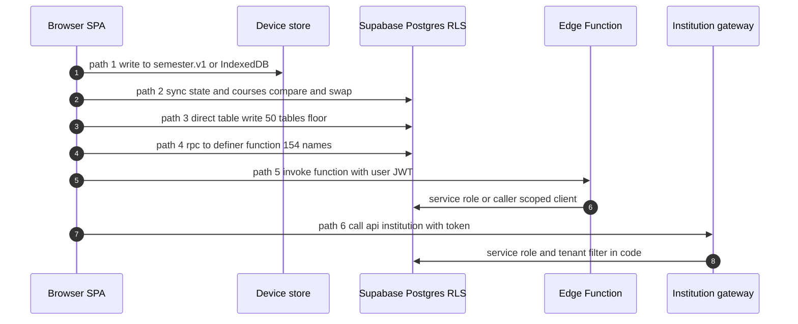
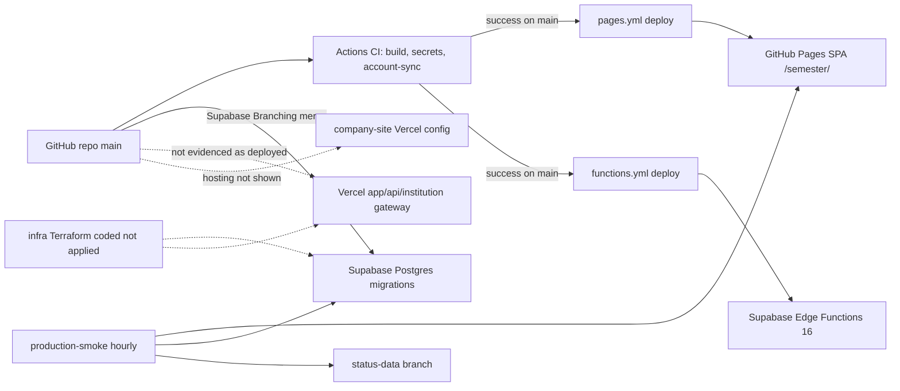

# Architecture: current state (as built)

| | |
| --- | --- |
| Purpose | Describe the system as the repository builds it today: layers, how a student write travels, how tenancy and authorization are decided, how AI, sync and integrations run, where it is deployed and where data lives. Each element carries evidence and one label. |
| Scope | `app/`, `app/server/`, `app/api/`, `packages/*`, `supabase/`, `.github/workflows/`, `infra/`, `company-site/`. "As built" means what the code and configuration in the tree say; it does not say what production runs. |
| Method | Synthesis of `docs/architecture/tenancy/tenant-boundary-map.md`, `docs/architecture/security/privileged-surface-map.md`, `docs/architecture/ai/ai-policy-enforcement-map.md`, `docs/program/CAPABILITY_TRACEABILITY_MATRIX.md`, `docs/governance/FITNESS_FUNCTIONS.md`, `docs/ARCHITECTURE.md` and `docs/architecture/0001..0012`, plus spot checks: `ls supabase/functions`, `grep -c '^\[functions\.' supabase/config.toml`, `sed -n` over `.github/workflows/pages.yml`, `app/vercel.json`, `company-site/vercel.json`, `supabase/DEPLOY.md`, `app/src/lib/sync/classes.ts`, `app/src/lib/cloud.ts`. Nothing run against production. |
| Date | 2026-10-04 |
| Status | Phase 0 baseline — evidence-cited, not a readiness claim |

Labels are the Phase 0 vocabulary: `OPERATIONAL-VERIFIED`, `OPERATIONAL-UNDER-GOVERNED`, `PARTIAL`, `CLIENT-ONLY-DEMO`, `DOCUMENTED-UNIMPLEMENTED`, `RETIRE-CANDIDATE`, `UNKNOWN-INVESTIGATE`. No element below is `OPERATIONAL-VERIFIED`: no repo evidence shows production operation (see `docs/program/BASELINE_AUDIT.md` section 4). Target counterparts are in `docs/program/ARCHITECTURE_TARGET_STATE.md`; context diagrams are in `docs/architecture/c4/current-system-context.md`.

## 1. Layers

| Layer | What it is | Evidence | Label |
| --- | --- | --- | --- |
| Client SPA | React 19 + Vite 8 + TypeScript, hash router, 89 screens, served from GitHub Pages at `/semester/`; works signed out | `docs/ARCHITECTURE.md` "Current system"; `app/src/screens.tsx`; `.github/workflows/pages.yml` | `OPERATIONAL-UNDER-GOVERNED` |
| Device state | One persisted blob `semester.v1` (354 fields in `app/src/state/shape.ts:1192`) in IndexedDB `semester-store`, falling back to `localStorage`; attached files in IndexedDB `semester-files`, never synced | `app/src/state/persist/db.ts`; `app/src/lib/files.ts`; `docs/architecture/0001-local-first-with-supabase.md` | `OPERATIONAL-UNDER-GOVERNED` (not encrypted at rest: R-030) |
| Supabase Postgres | 178 migrations, 354 catalog objects (319 public tables, 29 private) per `database/*.md`; RLS declared on all; capability model `private.has_capability`; 110 check suites | `supabase/migrations/`; `database/TENANT_ISOLATION_MATRIX.md`; `supabase/check.sh:52` | `PARTIAL` (`docs/architecture/tenancy/tenant-boundary-map.md` row 4) |
| Edge Functions | 16, all `verify_jwt = false`, each checking its own credential; 13 hold the service-role key | `supabase/config.toml`; `docs/architecture/security/privileged-surface-map.md` section 4 | `OPERATIONAL-UNDER-GOVERNED` |
| Institution gateway | One Vercel function `app/api/institution/[...path].ts` delegating to `app/server/institution/*`: token verify, membership reload, prepare-only actions, journal, rate limit, SCIM, intelligence. 0 adapters registered | `app/server/institution/gateway.ts`, `context.ts`, `adapters.ts:32`; `app/vercel.json` | `PARTIAL`; deployment `UNKNOWN-INVESTIGATE` |
| Productivity command service | `app/server/productivity/service.ts` with an in-memory repository; nothing mounts it | `app/server/productivity/memory.ts:25`; `docs/program/CAPABILITY_TRACEABILITY_MATRIX.md` section 2.1 | `PARTIAL` |
| Shared packages | `packages/contract`, `institution` (policy decision point `policy.ts:422`), `offline-sync`, `platform` (8 engines, 0 importers from `app/`) | `grep -rn "@semester/" app/src app/server`; `docs/program/CAPABILITY_TRACEABILITY_MATRIX.md` section 2.1 | `PARTIAL` (`platform` engines `DOCUMENTED-UNIMPLEMENTED` on any request path) |
| Operations code | Pages deploy, functions deploy, hourly production smoke, scans, drift check | `.github/workflows/` (12 files) | `OPERATIONAL-UNDER-GOVERNED` |
| Marketing site | Static `company-site/` with its own CSP | `company-site/vercel.json`, `company-site/index.html` | `OPERATIONAL-UNDER-GOVERNED`; hosting target `UNKNOWN-INVESTIGATE` |

## 2. Runtime paths for a student write

The browser holds only the publishable Supabase key (`app/.env.production`, header says public by design). There are six distinct ways a write leaves the page. Counts come from the traceability matrix probe (`.from()`/`.rpc()` regex over `app/src`, non-test; the direct-write count is a floor).

| # | Path | What happens | Authority and tenant derivation | Evidence | Label |
| --- | --- | --- | --- | --- | --- |
| 1 | Device only | Edit is written to `semester.v1` / `semester-files`; nothing leaves the device when signed out | None needed; no server holds it | `app/src/lib/privacy.ts`; `app/src/state/persist/db.ts`; matrix legend "ST", "IDBF" | `OPERATIONAL-UNDER-GOVERNED` |
| 2 | Account mirror | When signed in, `app/src/lib/cloud.ts` mirrors owned tables (68 `OWNED_TABLES`, `cloud.ts:1094`) field by field and whole-document with compare-and-swap on `updated_at` (`public.state`, `public.courses`) | RLS: `auth.uid() = user_id`; no tenant column on these `(user_id, id, data jsonb, updated_at, deleted_at)` tables | `app/src/lib/cloud.ts:651-660`; `docs/architecture/data-architecture/README.md` finding 7 | `OPERATIONAL-UNDER-GOVERNED` |
| 3 | Direct table write (`.from(t).insert/update/upsert/delete`) | 226 call sites over 112 distinct tables; 50 tables written (floor) including record-change, student-account, payment-plan, config, workflow, migration, approval | RLS policy per table; tenant predicate varies per table (`has_capability(...,'school',tenant_id)` in 351 policy lines, `same_school`/`school_of` in 48 lines) | `app/src/lib/record/api.ts`, `finance/api.ts`, `config/api.ts`, `workflow/api.ts`, `migration/api.ts`; `docs/architecture/tenancy/tenant-boundary-map.md` row 4 | `PARTIAL` (R-003) |
| 4 | RPC to a `security definer` function | 154 distinct `.rpc()` names (157 call sites). Gate is in the function body: `auth.uid()`, `private.has_capability`, `private.school_of`. 205 are executable by `authenticated`, 0 by `anon` per the repo's catalog reading | Pinned `search_path`, EXECUTE allowlist | `supabase/grants.check.sql`; `docs/DEFINER-RLS-REGISTER.md`; `app/src/lib/definerregister.test.ts`; `supabase/definer-sweep.check.sql` | `PARTIAL` (tenant map row 3) |
| 5 | Edge Function | `supabase.functions.invoke` or `/functions/v1/<name>`: `claude`, `billing-checkout/cancel/portal`, `canvas`, `fetchcal`, `delete-account`, `lead-intake`, `lti` score report, `trust-room`, `support-reply-notify`; `billing-webhook`, `calendar`, `push`, `integration-tick` are called by Stripe, calendar clients and cron, not by the student page | Each function authenticates itself (`getUser(token)`, Stripe signature, cron secret, link token, LTI JWT); actor from JWT | `docs/architecture/security/privileged-surface-map.md` section 4 | `OPERATIONAL-UNDER-GOVERNED` (10 of 16) |
| 6 | Institution gateway | `app/src/lib/university.ts` calls `VITE_UNIVERSITY_GATEWAY_URL` -> `/api/institution/*`; verified token, membership reload, prepare-only action, journal row, receipt | Tenant from `institution_membership`; client `X-Tenant-Id` only compared (`tenant_mismatch`) | `app/server/institution/membership.ts:createMembershipResolver`; `context.ts:contextFor`; `gateway.test.ts` | `PARTIAL`; deployment `UNKNOWN-INVESTIGATE` |

Decision rule observed in code: sends, shares, exports, calendar writes and institution-facing writes need a preview and explicit confirmation (`docs/ARCHITECTURE.md` invariant 5); the gateway is prepare-only and its action `execute` is stubbed (`app/server/institution/intelligence-runtime.ts:72` per the AI map). Official, financial and irreversible writes are refused offline and never queued (`app/src/lib/sync/classes.ts`).

## 3. Tenancy mechanism

| Item | As built | Evidence | Label |
| --- | --- | --- | --- |
| Term and key | `school` / `tenant` / `institution` are one key: `public.schools.id text`; `tenant_id text references public.schools(id)` (newest tables), `school_id` (`profiles`, older), `scope_id` under `scope_kind='school'` (`role_grants`); 151 FKs to `schools` | `supabase/migrations/20260921170000_schools.sql`; `docs/architecture/tenancy/tenant-boundary-map.md` section 1 | `PARTIAL` |
| Derivation A (browser to RLS) | `profiles.school_id`, writable only through `claim_school()` (confirmed email domain in `schools.email_domains`) or an approved `school_membership_requests` row; staff authority from `role_grants` via `private.has_capability(cap,'school',tenant_id)` | `20260922012000_capabilities.sql`; `20260930185000_school_membership_enforcement.sql` | `PARTIAL`: `schools.enforce_membership` defaults false for every school and gates rooms only |
| Derivation B (gateway) | Token -> `institution_identity_provider` -> `institution_membership` -> `RequestContext`; then service-role queries with `.eq('tenant_id', identity.institutionId)` in application code | `app/server/institution/context.ts`; `intelligence-repository.ts` (lines 79, 85, 116, 149, 166) | `PARTIAL`: isolation by convention; no structural test (R-004) |
| Derivation C (`app.tenant_id()` per transaction with forced RLS) | Design only; `grep -rn 'app.tenant_id' supabase/migrations` returns nothing; `FORCE ROW LEVEL SECURITY` appears 0 times | `docs/platform/ISOLATION.md`; `database/TENANT_ISOLATION_MATRIX.md` | `DOCUMENTED-UNIMPLEMENTED` |
| Tenant lifecycle | `contextFor` hard-codes tenant `status: 'active'` ("no tenant lifecycle yet") | `app/server/institution/context.ts` | `PARTIAL` |
| Module mode | `public.tenant_module_mode (tenant_id, module, mode in ('connect','core'), frozen)` with no direct insert/update policy; changes through a request and approvals | `supabase/migrations/20260930010000_module_mode.sql:71-84` | `PARTIAL` (table exists; no native Core module is evidenced) |
| Cross-tenant proof | No per-class negative suite; `supabase/integration-rls-matrix.check.sql` sweeps integration tables only | `database/README.md`; `docs/architecture/tenancy/tenant-boundary-map.md` section 6 | `PARTIAL` (R-001, P0) |

## 4. Authorization mechanism

| Item | As built | Evidence | Label |
| --- | --- | --- | --- |
| Boundary | Row-level security is "the authorization boundary" (ADR 0002); client role gating in `app/src/lib/role.ts` is UX only | `docs/architecture/0002-rls-is-the-authorization-boundary.md`; `docs/ARCHITECTURE.md` | `PARTIAL` |
| Roles and capabilities | `app_roles`, `role_capabilities`, `role_grants (subject, role, scope_kind, scope_id)`; platform admin status is meant to grant no data entitlement | `20260921223000_role_grants.sql`; `20260922012000_capabilities.sql`; `20260921161500_roles.sql:private.is_app_admin` | `PARTIAL` (`is_app_admin()` callers not enumerated) |
| Policy decision point | `decide()` in `packages/institution/src/policy.ts:422` with ADR 0007 vocabulary; one non-test caller `app/server/productivity/service.ts:380`; the gateway does not call it | `docs/architecture/0007-policy-decision-point.md`; `docs/governance/FITNESS_FUNCTIONS.md` row 6 | `PARTIAL` (R-019) |
| Privileged access | Break-glass (two-person duty, expiry within four hours, audit before effect); student-granted time-boxed support access; operator console with fresh-MFA claim and duty matrix | `20260929110000_console_approvals_and_break_glass.sql`; `20260925103000_support_access.sql`; `app/src/screens/Console.tsx` | break-glass `OPERATIONAL-UNDER-GOVERNED`; support `PARTIAL` (agent capability is platform scope: R-008) |
| Authentication | Supabase Auth (optional sign-in); institution SSO config and SCIM through the gateway; students have no MFA or passkey enrolment | `app/src/lib/ops/trustcontrols.ts:228`; `app/server/institution/membership.ts`; `20260928200000_scim_gateway.sql` | `PARTIAL` (R-022) |
| Feature gating | Build-time `VITE_*` flags (73 per the matrix) passed by the Pages build; entitlement resolver runs in shadow only | `.github/workflows/pages.yml:118-210`; `docs/ENTITLEMENT-RESOLUTION.md` status line | `PARTIAL` (R-020; contradicts invariant 9) |
| Audit | Four separate stores (`private.gateway_audit`, `public.audit_event`, `role_grant_audit_event`/`moderation_audit_event`, hash-chained `private.console_audit_event`); gradebook export and account erasure migrations carry no audit reference; domain outbox has one producer | `docs/architecture/tenancy/tenant-boundary-map.md` section 5; `20261004123000_productivity_commands.sql:351` | `OPERATIONAL-UNDER-GOVERNED` (R-009) |

## 5. AI paths

Source: `docs/architecture/ai/ai-policy-enforcement-map.md` section 2 (paths P1..P12). Tenant AI policy is evaluated before the model call on one path only.

| Path | Entry | Policy before invocation | Label |
| --- | --- | --- | --- |
| P1 Shared-key function (Anthropic) | `supabase/functions/claude/index.ts:60` | Plan, call and dollar meter per account; global kill switch; no school, no tenant policy | `PARTIAL` |
| P2 Institution gateway `respond` (OpenAI only) | `app/server/institution/intelligence.ts:124`; wired in `intelligence-runtime.ts:35` | Identity scope, tenant state, role, allowed modes, agent action class, source approval, course scope, budget, then `generate` (line 234); kill switch at `:441` | `PARTIAL`; refuted as "not enforced" for this path |
| P4 gateway `confirm` | `intelligence.ts:473` | Does not re-check tenant policy or role; execute stubbed | `PARTIAL` |
| P5-P7 student's own key or proxy | `app/src/lib/claude.ts:886 ask()`, `openai.ts:182` | None: no tenant policy, kill switch, `decideDoor` or consent read; 25 non-test files import `ask()` | `OPERATIONAL-UNDER-GOVERNED` |
| P8 Ask assistant tool loop | `app/src/ai/converse.ts:420-700` | School `aiOff` categories bypassed by `read_grades`, `read_attendance`, `find_deadlines` (`converse.ts:440` vs `:668`) | `PARTIAL` |
| P12 Retrieval | `intelligence-repository.ts:160`; `packages/institution/src/retrieval.ts` unwired | Exact-id lookup of tenant-approved rows; per-person source authorization absent; no embedding or vector store exists | loader `PARTIAL`; policy `DOCUMENTED-UNIMPLEMENTED` |

Gateway deployment: ADR 0004 says "written, tested, and not deployed"; the 2026-09-29 drill file records the institution gateway as "not deployed" (`docs/evidence/ai/killswitch-drill-2026-09-29T22-51-50-121Z.json`); the activation record is entirely `pending-owner`. No redaction, DLP or output scan exists on any path.

## 6. Sync and offline

| Element | As built | Evidence | Label |
| --- | --- | --- | --- |
| Whole-state sync | Device-first; when signed in, `cloud.ts` pushes with compare-and-swap on `updated_at`, merges per field, offers a choice on a two-device edit | `app/src/lib/cloud.ts:18,629`; `app/src/lib/merge.ts`; `app/src/lib/conflicts.ts` | `OPERATIONAL-UNDER-GOVERNED` |
| Write classes offline | `device-only`, `synced`, `held-send`, `online-only`, `never-queued`; a test reads the source and fails on a write without a class | `app/src/lib/sync/classes.ts`; `classes.test.ts` | `OPERATIONAL-UNDER-GOVERNED` |
| Held-send outbox | IndexedDB outbox for outward actions sent by the student, one tap | `app/src/lib/sync/outbox.ts` | `OPERATIONAL-UNDER-GOVERNED` |
| Task sync engine | Writes `public.tasks` directly with no tenant or policy version; off by default | `app/src/lib/sync/engine/ownership.ts:32`; `tasks-transport.ts` | `PARTIAL` (R-030) |
| CRDT replication and encrypted vault | `packages/offline-sync` (24 ts files) with no importers; vault unmounted; web local data not encrypted at rest | `docs/architecture/crdt-replication.md`; `docs/program/RISK_REGISTER.md` R-030 | `DOCUMENTED-UNIMPLEMENTED` (code exists, not on any path) |
| Service-worker caches | `SHELL`, `MEDIA`, `SHARE_CACHE`; clearing on sign-out or account switch not established | `app/public/sw.js`; `app/src/lib/shared.ts:53` | `UNKNOWN-INVESTIGATE` |

## 7. Integrations

| Integration | As built | Evidence | Label |
| --- | --- | --- | --- |
| Institutional adapters (SIS, LMS, advising, housing and others) | Registry `adapters = []` in the gateway; integration `ADAPTERS = []`; the University surface answers 503 without an approved connection; reference programs in `examples/` are `MOCK_DEMO` | `app/server/institution/adapters.ts:32`; `app/server/integration/registry.ts:15`; `examples/README.md` | `DOCUMENTED-UNIMPLEMENTED` |
| Integration control plane | Composite tenant keys, connection-bound worker, approval, kill switches; `integration-tick` driven by `pg_cron` with a token checked in the database | `20260927170000_integration_control_plane.sql`; `supabase/functions/integration-tick/index.ts`; `supabase/integration-control-plane.check.sql` | `PARTIAL` |
| LMS via LTI | `supabase/functions/lti` verifies an RS256 launch JWT; tenant from `lti_registration.tenant_id`; frame-ancestors allows `https://brightspace.vanderbilt.edu` | `supabase/functions/lti/index.ts:192-218,650`; `app/vercel.json` CSP | `PARTIAL` |
| Canvas and ICS fetch | `canvas` and `fetchcal` proxy user-supplied hosts; SSRF controls not reviewed | `supabase/functions/canvas/index.ts`; `fetchcal/index.ts` | `UNKNOWN-INVESTIGATE` |
| Google, Microsoft, Zoom, Apple sign-in and APIs | Browser connects directly to those hosts per CSP `connect-src`; scope definitions in `app/src/lib/oauthscopes.ts`, `connect.ts` | `app/vercel.json`; `app/src/lib/oauthscopes.ts` | `UNKNOWN-INVESTIGATE` (Phase 0 did not read these files beyond names) |
| Stripe (individual billing) | `billing-checkout`, `billing-cancel`, `billing-portal`, `billing-webhook` (signature verified); one live monthly acceptance record; annual, refund, dispute not exercised | `supabase/functions/_shared/stripe.ts`; `docs/evidence/BILLING-LIVE-ACCEPTANCE-2026-10-03.md` | `OPERATIONAL-UNDER-GOVERNED`; institutional billing `DOCUMENTED-UNIMPLEMENTED` |
| Email (Resend) | `lead-intake`, `support-reply-notify`; lead emails off until two secrets are set | `supabase/functions/lead-intake/index.ts`; `docs/COMMERCIAL-CORE.md` | `OPERATIONAL-UNDER-GOVERNED` |
| Web Push | `push` Edge Function, VAPID key, `push_queue`, cron-driven | `supabase/functions/push/index.ts:77-88`; `supabase/scheduler.sql` | `OPERATIONAL-UNDER-GOVERNED` |
| OpenStreetMap tiles and geocoders | Tiles in CSP `img-src`; Nominatim and Photon in `connect-src` | `app/vercel.json` | `UNKNOWN-INVESTIGATE` (not read) |
| Anthropic and OpenAI | See section 5 | | |
| SIS, IdP/SSO | SSO membership and SCIM in gateway (`postgres-scim.ts`); no SIS adapter | `app/server/institution/membership.ts` | `PARTIAL` |

## 8. Deployment topology

| Element | As built | Evidence | Label |
| --- | --- | --- | --- |
| GitHub Pages SPA | `pages.yml` runs on `workflow_run` of CI success on `main`, pinned to `head_sha`; build gets the `VITE_*` flags and refuses a malformed gateway URL; ships about 200 MB of audio; 1,327 hosted runs all time | `.github/workflows/pages.yml` header and lines 118-299; `inventory-platform.md` | `OPERATIONAL-UNDER-GOVERNED`; `app/vercel.json` headers do not apply to Pages (R-027) |
| Supabase project | One production project; Postgres 17 (`supabase/config.toml:60`); migrations reach production through Supabase's own branching deploy on every merge, not through a repo workflow; no rollback path | `supabase/DEPLOY.md` ("two pipelines"); `ROLLBACK.md`; `MONITORING.md` | `UNKNOWN-INVESTIGATE` (R-028: whether Branching currently applies migrations is not in the repo) |
| Edge Function deploy | `functions.yml` after CI success, `--no-verify-jwt`, account-wide `SUPABASE_ACCESS_TOKEN`, no environment reviewer; a second deploy path (platform) exists and a three-day freeze went unnoticed in September | `.github/workflows/functions.yml:60,189-206,239`; `supabase/DEPLOY.md` | `OPERATIONAL-UNDER-GOVERNED` (R-017) |
| Vercel gateway | Config exists (`functions."api/institution/[...path].ts".maxDuration = 30`, `no-store`); Terraform module `vercel_gateway` coded; whether a Vercel project and `VITE_UNIVERSITY_GATEWAY_URL` exist in production is not in the repo | `app/vercel.json`; `infra/terraform/modules/vercel_gateway`; `docs/infrastructure/README.md` table row "SPA on GitHub Pages; institution gateway on one Vercel function" | `UNKNOWN-INVESTIGATE` |
| Company site | `company-site/vercel.json` carries CSP naming the Supabase project origin and a GitHub Pages origin; HawkScan scans an isolated copy with production headers; production host not stated in workflows | `company-site/vercel.json`; `.github/workflows/hawkscan.yml:100-106` | `UNKNOWN-INVESTIGATE` |
| Infrastructure as code | Three Terraform modules, three envs, Rego policy tests; "Nothing below has been applied"; `drift.yml` and `infra-apply.yml` have 0 hosted runs | `infra/README.md`; `inventory-platform.md` | `DOCUMENTED-UNIMPLEMENTED` (coded, not applied) |
| Branch governance | `.github/rulesets/main.json` defines required checks `build`, `secrets`, `account-sync`; live ruleset count 0, `main` `protected:false` at readback | `.github/rulesets/main.json`; `docs/BRANCH-PROTECTION.md`; `docs/governance/FITNESS_FUNCTIONS.md` row 13 | `DOCUMENTED-UNIMPLEMENTED` (R-014) |
| Monitoring | Hourly `production-smoke.yml` writes to branch `status-data` (75 commits; about 24 per day expected); no notify step | `.github/workflows/production-smoke.yml:9,94-95`; `MONITORING.md` | `OPERATIONAL-UNDER-GOVERNED` (R-016) |
| Scheduled DB work | `pg_cron` and `pg_net` call `push` and `integration-tick`; `supabase/scheduler.sql` is applied by hand, not as a migration | `supabase/scheduler.sql`; `20260928101000_integration_tick_auth.sql` | `UNKNOWN-INVESTIGATE` (applied state not provable) |

## 9. Data stores

| Store | Holds | Tenant key | Evidence | Label |
| --- | --- | --- | --- | --- |
| Browser IndexedDB `semester-store`, `semester-files`, `semester-outbox`; `localStorage` `semester.*` (98 distinct keys); service-worker caches | Student working copy, files, held sends | none (per device) | `app/src/state/persist/db.ts`; `app/src/lib/files.ts`; `app/public/sw.js` | `OPERATIONAL-UNDER-GOVERNED` |
| Supabase Postgres `public` (319 tables) and `private` (29) | Account mirror, identity, records, gradebook, finance, community, integration, audit, billing | `tenant_id`/`school_id` on 155 tenant-scoped objects; 170 of 319 public tables carry a tenant-like column; 38 `tenant_id` columns have no FK to `schools` | `database/DATA_CLASSIFICATION_REGISTER.md`; `docs/architecture/data-architecture/README.md` finding 5 | `PARTIAL` |
| Supabase Storage | 2 private buckets: `community-media`, `trust-packet`; object keys carry no tenant prefix; real Storage API not exercised in CI (`ci.yml:589`) | by DB row only | `20260928032000_community.sql`; `20260928100000_trust_room.sql` | `PARTIAL` |
| Supabase Vault | `integration_cron_secret` and similar | n/a | `20260928101000_integration_tick_auth.sql` | `UNKNOWN-INVESTIGATE` |
| Stripe | Authoritative billing state for individuals; invoices mirrored | per user | `supabase/functions/_shared/billingwebhook.ts` | `OPERATIONAL-UNDER-GOVERNED` |
| Search index, vector store, warehouse, cache server | None exist: search is a client-side ranker; no `vector` extension; analytics is hand-pasted operator SQL; 1,022 btree indexes, 0 GIN/GiST/trigram/vector | n/a | `app/src/lib/find.ts`; `docs/architecture/data-architecture/README.md` finding 9; `supabase/analytics.sql` | `CLIENT-ONLY-DEMO` (search); `DOCUMENTED-UNIMPLEMENTED` (vector) |
| GitHub `status-data` branch | Hourly probe samples for status pages | n/a | `.github/workflows/production-smoke.yml:9` | `OPERATIONAL-UNDER-GOVERNED` |

## Open questions / not verified

1. Whether the Vercel gateway project exists and which URL `VITE_UNIVERSITY_GATEWAY_URL` has in production (`.github/workflows/pages.yml:124` reads it; the value is not in the repo).
2. Whether Supabase Branching applies migrations on each merge today (`supabase/DEPLOY.md` describes it; `MONITORING.md` step 5 reads the deploy record by hand).
3. Where `company-site/` is hosted in production; the CSP names a GitHub Pages origin and the Supabase project origin, and `company-site/vercel.json` exists, but no workflow deploys it.
4. Table owner and `rolbypassrls` of production roles; whether definers run as a bypass role.
5. Whether `scheduler.sql`, the Vault secret and `pg_cron` jobs are applied in production.
6. The Google, Microsoft, Zoom, Apple and OpenStreetMap integration code (`app/src/lib/connect.ts`, `oauthscopes.ts`) was identified by name and CSP only, not read.
7. Whether service-worker caches clear on sign-out (R-030 and tenant map row 8).
8. The unmeasured performance of the shared `private.has_capability` predicate now that break-glass adds a second lookup (`docs/architecture/tenancy/tenant-boundary-map.md` row 16).
9. Counts that depend on regex probes (50 directly written tables, 154 RPC names, 89 `Screen` ids) are floors or unreconciled; see `docs/program/BASELINE_AUDIT.md` open questions.
