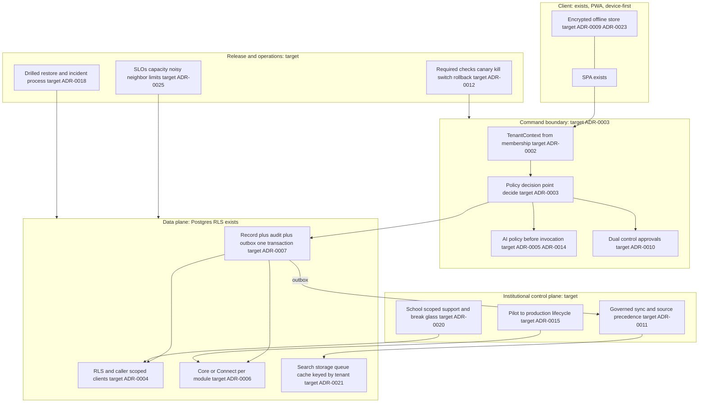

# Architecture: target state (what the proposed ADRs imply)

| | |
| --- | --- |
| Purpose | State the target architecture that the 25 proposed ADRs imply together, organised along the program spine, and mark every element `target, not built` with its gap from the current state and the ADR that governs it. |
| Scope | The architecture only. It is not a plan, a schedule, a price, or a claim about what will exist. Every ADR cited is **Proposed, unratified** (`docs/decisions/proposed/ADR-0001..0025`; each states "no agent can accept it"); nothing below is a decision until the owner accepts it. |
| Method | Read each ADR's `Decision` section (`awk '/^## Decision$/{f=1;next} /^## /{f=0} f'`), mapped to the current state in `docs/program/ARCHITECTURE_CURRENT_STATE.md` and to risks in `docs/program/RISK_REGISTER.md`. The target-architecture proposal already on main, `docs/target-architecture/01..09` (D-1144), is cited, not restated. |
| Date | 2026-10-04 |
| Status | Phase 0 baseline — evidence-cited, not a readiness claim |

**Namespaces.** `docs/architecture/0001..0012-*.md` are the accepted architecture records (for example `0007-policy-decision-point.md`). `ADR-0001..0025` below are the proposed program ADRs in `docs/decisions/proposed/`. The two series use different filenames and are held apart by `ADR-0001`'s link check; "ADR-0007" below always means the proposed audit-and-outbox ADR, and "arch 0007" means the accepted policy-decision-point record.

## 1. Proposed ADR index

| ADR | Decision in one line (from the file) | File |
| --- | --- | --- |
| 0001 | Record decisions as ADRs and keep them true with automated fitness functions | `ADR-0001-adopt-adr-governance-and-fitness-functions.md` |
| 0002 | Tenant derived from verified membership in one place; never from a client or a query convention | `ADR-0002-one-trusted-membership-derived-tenant-context.md` |
| 0003 | Every state-changing command asks the one policy decision point before it runs | `ADR-0003-enforce-policy-decisions-at-the-command-boundary.md` |
| 0004 | Request-path code stops using RLS-bypassing credentials by default; definer ownership and grants measured | `ADR-0004-remove-runtime-rls-bypass-and-harden-definer-ownership.md` |
| 0005 | Tenant, course and user AI policy evaluated server-side before any model call, retrieval or tool lookup | `ADR-0005-enforce-tenant-course-user-ai-policy-before-model-invocation.md` |
| 0006 | Modules default to Connect; become Core per school and per module only through a two-person switch with a kill switch | `ADR-0006-adopt-native-first-core-and-connect-module-modes.md` |
| 0007 | A sensitive mutation commits its record, audit row and outbox event in one transaction | `ADR-0007-require-audit-and-transactional-outbox-for-sensitive-mutations.md` |
| 0008 | Service-only objects enumerated and kept out of the browser surface; browser surface is an allowlist | `ADR-0008-separate-service-only-objects-from-browser-accessible-surfaces.md` |
| 0009 | Institution-sourced device data persisted encrypted, cleared on sign-out, synced under written rules | `ADR-0009-adopt-encrypted-offline-persistence-and-governed-sync.md` |
| 0010 | Grades, records, finance, permission grants and high-risk exports require a second person, enforced in the database | `ADR-0010-require-dual-control-for-grades-records-finance-permissions-and-exports.md` |
| 0011 | One declared authority per field; conflicts become reconciliation items; failing integrations degrade to labelled stale data | `ADR-0011-standardize-integration-source-precedence-reconciliation-and-degraded-operation.md` |
| 0012 | Required checks, staged rollout with kill switch, exercised rollback | `ADR-0012-require-staged-release-gates-canary-kill-switches-and-rollback.md` |
| 0013 | Accessibility checks block a release; qualified manual evaluation precedes any paid pilot | `ADR-0013-make-accessibility-a-release-blocking-quality-requirement.md` |
| 0014 | Every AI path has a risk tier, a pre-activation evaluation record and a fixed list of prohibited actions | `ADR-0014-define-ai-risk-tiers-evaluations-and-prohibited-actions.md` |
| 0015 | A school moves from pilot to production only through enforced, evidence-bound lifecycle gates | `ADR-0015-establish-institutional-pilot-to-production-lifecycle.md` |
| 0016 | One dated price book enforced at quote, entitlement and meter | `ADR-0016-make-commercial-plans-and-entitlements-technically-enforceable.md` |
| 0017 | Data classification, retention, holds, rights, export and offboarding | `ADR-0017-establish-data-classification-retention-holds-rights-export-offboarding.md` |
| 0018 | Incident, escalation and DR commitments exist only where a drill exercised them | `ADR-0018-establish-incident-response-security-escalation-and-dr-governance.md` |
| 0019 | Each of records, grades, registration and money has one system of record, append-only history and an audit reference | `ADR-0019-define-records-gradebook-registration-and-ledger-source-of-truth-rules.md` |
| 0020 | Staff access to customer data is school-scoped, consent- or break-glass-based, logged and reviewed | `ADR-0020-define-support-access-break-glass-and-customer-data-boundaries.md` |
| 0021 | No tenant-bearing index, bucket, queue, cache, warehouse or vector store ships without a tenant key and a conformance test | `ADR-0021-define-multi-tenant-search-storage-queue-cache-analytics-and-vector-boundaries.md` |
| 0022 | Public and procurement statements only from approved wording bound to current evidence | `ADR-0022-define-procurement-evidence-trust-center-lifecycle-and-public-claims-approval.md` |
| 0023 | Offline and device data follow a classed, encrypted, revocable lifecycle; the PWA is claimed only as what it is | `ADR-0023-define-mobile-device-security-local-encryption-revocation-and-offline-lifecycle.md` |
| 0024 | Marketplace opens only through a gated, class-limited design with a licensed processor holding funds | `ADR-0024-define-marketplace-provider-onboarding-disputes-refunds-payouts-and-policy-controls.md` |
| 0025 | SLOs, capacity and per-tenant limits measured on the real path before any availability or scale number is promised | `ADR-0025-define-mass-user-scalability-slos-capacity-and-noisy-neighbor-controls.md` |

Verified with `ls docs/decisions/proposed` (25 files) and `grep -h "^| Status" docs/decisions/proposed/ADR-0*.md | sort | uniq -c` (25 `Proposed`).

## 2. Target shape in one picture

Everything on this diagram is `target, not built` unless the label says otherwise. Solid boxes marked "exists" are the current components the target keeps (ADR 0001 local-first and ADR 0002 RLS stay; arch `0002`, `0011`, `0012`).

## 3. Elements by spine stage

Columns: **Element** (every row is `target, not built` unless the "Current" cell says a part exists); **Current state** with evidence; **Gap**; **Governing ADR**; **Risk**.

### Stage 1. Repository and product blueprint

| Element | Current state | Gap | ADR | Risk |
| --- | --- | --- | --- | --- |
| Modular monolith with domain modules and anti-corruption adapters; legacy only through adapters | arch `0011`, `0012` accepted; `app/src/architecture/` ratchet; `docs/target-architecture/01..09` is "proposal, not built" (`docs/program/PHASE_0_1_RECONCILIATION.md`) | No `domains/` tree; no per-module native domain model; D-1144 conversion plan not executed | ADR-0006 (module eligibility), ADR-0001 | R-029 |
| One capability register keyed to owner, tests, release status | 60 rows in `app/src/lib/rollout-capabilities.ts` all `verified`; 105-row matrix in `docs/program/CAPABILITY_TRACEABILITY_MATRIX.md` not adopted into code | Registers contradict (R-029); owner placeholders only | ADR-0001 | R-029 |
| Per-tenant feature control, not build flags | 73 `VITE_*` flags in `.github/workflows/pages.yml:118-210`; `tenant_module_mode` and `tenant_rollout` tables exist | Invariant 9 (`docs/ARCHITECTURE.md`) contradicted | ADR-0006, ADR-0012 | R-020 |

### Stage 2. Traceability, ADRs and risk ownership

| Element | Current state | Gap | ADR | Risk |
| --- | --- | --- | --- | --- |
| ADR process with fitness functions that fail on a stale ADR | `docs/governance/ADR_REVIEW_POLICY.md`, `FITNESS_FUNCTIONS.md` (20 functions, 0 required checks) | `check-adr-links` covers only an allowlist (`app/src/lib/runbooklinks.test.ts`) | ADR-0001 | R-029 |
| Risk and exception ownership by role with expiry | `docs/program/RISK_REGISTER.md` (36 rows); one dated exception `infra/policy/exceptions.json` (expires 2026-12-31) | Every role is the founder; backups unassigned (`OWNER-AND-ACCOUNTABILITY-MATRIX.md`) | ADR-0001, ADR-0018 | R-018 |
| Release evidence bound to dated, unexpired records | `app/src/lib/ops/evidence.ts` renders `docs/EVIDENCE-REGISTER.md` (20 rows) | Evidence not bound to the deployed candidate; attestation covers the CI bundle, not the deployed Pages bytes | ADR-0012, ADR-0022 | R-034 |

### Stage 3. Security, tenancy and recovery foundation

| Element | Current state | Gap | ADR | Risk |
| --- | --- | --- | --- | --- |
| Membership-derived tenant context in one place (`TenantContext`), client tenant only compared | Two derivations (`profiles.school_id`; gateway `institution_membership`); `app.tenant_id()` design only | One resolver; structural test that a bare `.from(<tenant table>)` under `app/server/**` or `supabase/functions/**` fails; tenant lifecycle states (today hard-coded `active`) | ADR-0002 | R-001, R-004, R-005 |
| Command boundary: every state-changing handler calls the policy decision point, default deny, adoption ratchet | `decide()` has 1 non-test caller (`app/server/productivity/service.ts:380`); gateway does not call it | Adoption of gateway routes, exports, role changes; `scripts/architecture/policy-adoption.mjs` does not exist | ADR-0003 | R-019 |
| No runtime RLS bypass by default; service-role use enumerated; FORCE RLS decided per class | 13 of 16 Edge Functions hold the service-role key; 0 `FORCE ROW LEVEL SECURITY`; owner and `rolbypassrls` unmeasured | Catalog readings of `relowner`/`rolbypassrls`; caller-scoped clients where a JWT exists (as `productivity-sourcecheck` does); definer reconciliation | ADR-0004 | R-004, R-006, R-017 |
| Browser surface as an allowlist; service-only register | `anon` DML on about 24 owner-scoped tables, proposal `database/proposed/anon_grant_reduction.sql` unapplied; `schools` readable by `anon` with every column | `database/SERVICE_ONLY_REGISTER.md`; `authenticated` allowlist (270/129); view in place of `anon` select on `schools` | ADR-0008 | R-007 |
| Audit and outbox in one transaction for each sensitive mutation; tenant-queryable audit view over four stores | One outbox producer (`20261004123000_productivity_commands.sql:351`); gradebook export and erasure carry no audit reference | Sensitive-action registry; first outbox domains (gradebook passback, registration); outbox sweep (none exists) | ADR-0007 | R-009 |
| Dual control for grades, records, finance, role grants, bulk export | Approval and break-glass mechanism exists in `20260929110000_console_approvals_and_break_glass.sql`; one person holds every seat | Executing definers refuse without a consumable approval; two eligible approvers per school; independent holders | ADR-0010 | R-018 |
| Data classes, retention, holds, rights, export, offboarding | `private.account_data_map()`, `legal_holds`, hold-aware sweeps, `erase_account` exist; classes rule-derived, 19 of 354 read by a person | Reviewed classification; tenant data manifest; offboarding evidence | ADR-0017 | R-006 |
| Recovery that has been exercised; incident and escalation commitments only where drilled | `supabase/restore-drill.sh` never run; `RESTORE.md` empty; one local rehearsal | Live restore into a second project with a non-author witness; measured RTO/RPO; named backup operator; alert delivery | ADR-0018, ADR-0012 | R-002, R-016, R-034 |
| Cross-tenant negative suite per class (the Phase 1 gate) | `supabase/integration-rls-matrix.check.sql` covers integration tables only | Generated from `database/schema/table-classification.json`, run on staging | ADR-0002, ADR-0021 | R-001 |
| Required status checks and staged rollout | `.github/rulesets/main.json` defined, not applied; CI red about half the time on `main` | Apply and read back the ruleset; main-health; migration rollback notes; per-feature kill switch with drill within 90 days | ADR-0012 | R-014, R-015, R-028 |

### Stage 4. Native governed product domains

| Element | Current state | Gap | ADR | Risk |
| --- | --- | --- | --- | --- |
| Core mode per school and module, with eligibility checked at request time | `tenant_module_mode` exists (`20260930010000_module_mode.sql`); no module is evidenced as native | Native domain models, adapters, tests, kill switch, rollback note per module | ADR-0006 | R-031, R-032 |
| One system of record for official records, grades, registration, money; append-only history | Gradebook-only learning domain (`20260929310000_gradebook.sql`); registration state machine exists; no assignments, submissions, rubrics tables | Per-tenant per-domain authority setting defaulting to `provider`; second-person approval of grade release; server model for assignments and assessments | ADR-0019 | R-032 |
| AI policy before any model call, retrieval or tool lookup; risk tier, evaluation record, prohibited-action list per path | Enforced on gateway `respond` only; `ask()` (25 importers) and `converse.ts` bypass; no redaction or output scan | Server tenant lookup in the shared-key function; `aiAllows` into lookup tools; per-person source authorization; classification tier on `approved_source`; evaluation record before activation | ADR-0005, ADR-0014 | R-010, R-011, R-012, R-013, R-033 |
| Encrypted, revocable offline lifecycle; governed sync | Not encrypted at rest; `packages/offline-sync` vault unmounted; classes in `app/src/lib/sync/classes.ts` exist | Class-labelled persistence; sign-out clears stores and caches; conflict display per ADR-0011; no "encrypted" claim until a test shows ciphertext | ADR-0009, ADR-0023 | R-030 |
| Server document model for documents, sheets, decks, files | Device-only; two storage buckets | Server model with tenant prefix and conformance test | ADR-0021 | R-021 |
| Accessibility as a release-blocking requirement | `app/src/a11y/*.test.tsx` (axe), `app/scripts/accessibility-smoke.mjs` journeys; no qualified manual evaluation (EXT-008) | Required checks; per-journey contracts; assessor report before any paid pilot | ADR-0013 | R-024 |
| Student MFA or passkey | Operator console only (`app/src/lib/ops/trustcontrols.ts:228`) | Enrolment for students and fresh-MFA for high-risk acts | ADR-0010, ADR-0023 | R-022 |

### Stage 5. Institutional control plane and integrations

| Element | Current state | Gap | ADR | Risk |
| --- | --- | --- | --- | --- |
| Declared authority per field, reconciliation items, labelled stale data, kill switches drilled | Five source labels exist; `SOURCE_OF_TRUTH` is display text in `app/src/lib/integration/catalog.ts`; no precedence engine | Precedence as data; reconciliation items; staleness by class; versioned contracts | ADR-0011 | R-031 |
| Real adapters (SIS, LMS, advising, others) | `adapters = []`; reference programs are `MOCK_DEMO` | A real-provider exercise precedes any "integrated" statement | ADR-0011, ADR-0015 | R-031 |
| School-scoped support and review capabilities; staff-read log visible to school admins | `support-reply-notify` `mayAnswer` reads platform scope; `community:review` platform scope | Scope by school or gate by `support_access_grant`; extend `support_access_event` to console reads | ADR-0020 | R-008 |
| Tenant-keyed search, storage, queue, cache, warehouse, vector store, each with a conformance test against the real service | None exist as tenant-bearing services; storage keys carry no tenant prefix; real Storage API not exercised in CI | Five-check admission rule; path `tenant_id/...`; negative test on the real service | ADR-0021 | R-001 |
| Pilot-to-production lifecycle with enforced gates | `docs/operating-model/PILOT-TO-PRODUCTION.md` describes it; `tenant_rollout` exists | Gates enforced in code and bound to evidence (isolation suite, rollback named) | ADR-0015 | R-001, R-002 |

### Stage 6. Commercial operations and procurement evidence

| Element | Current state | Gap | ADR | Risk |
| --- | --- | --- | --- | --- |
| One dated price book enforced at quote, entitlement and meter | Individual prices only ($7.99, $59 in `app/src/lib/plans.ts:58`); institutional prices `quote`; deal-desk is a pure function not wired to quotes | Price book decision; entitlement resolver out of shadow; storage, active-student and overage meters (only AI is metered) | ADR-0016 | R-023 |
| Public claims and procurement answers from approved wording bound to current evidence | 0 of 40 `claims.ts` entries `available`; 15 candidate overstatements in `docs/legal/PUBLIC_CLAIMS_APPROVAL_REGISTER.md` | Lifecycle with approver, expiry, withdrawal; counsel on counsel-required rows | ADR-0022 | R-024, R-035 |
| Trust center and security questionnaires | `docs/TRUST-CENTER.md`; HECVAT readiness only | Evidence-linked answers, owners beyond one person | ADR-0022 | R-024 |
| Marketplace | `DOCUMENTED-UNIMPLEMENTED`; D-1236 holds it | Gated design, licensed processor, listing classes | ADR-0024 | R-035 |
| Counsel-reviewed legal set | 13 drafts, 77 `[DECIDE]`, none in force; counsel not engaged | Counsel engagement (Q-00) | ADR-0017, ADR-0022 | R-025 |

### Stage 7. Paid institutional pilots

| Element | Current state | Gap | ADR | Risk |
| --- | --- | --- | --- | --- |
| Pilot admission gates: isolation suite green for the pilot's classes, named rollback, membership enforcement reviewed | Not evidenced; `enforce_membership` default false everywhere | All Stage 3 and 5 elements for the pilot's tables; qualified accessibility report | ADR-0015, ADR-0013, ADR-0002 | R-001, R-002, R-005 |
| Support, incident and SLA commitments that match staffing | `docs/trust/SLA.md` `NOT_STARTED`; one responder; site claims "24/7" | Named backup, alert delivery, drilled playbooks; no commitment before then | ADR-0018, ADR-0016 | R-016, R-018, R-024 |
| Quote-to-cash for institutions | "nothing here charges an institution" (`docs/COMMERCIAL-CORE.md`) | Ordering, invoicing, collections operations; counsel and accountant questions Q-07, Q-13 | ADR-0016 | R-023 |

### Stage 8. Contract conversion and scalable mass-user operations

| Element | Current state | Gap | ADR | Risk |
| --- | --- | --- | --- | --- |
| Pilot-to-annual conversion with entitlement enforcement | `docs/PILOT-TO-ANNUAL-CONVERSION.md`; resolver shadow-only | Enforcement point decided; contract data in `contracts/<tenant id>.json` (none committed) | ADR-0015, ADR-0016 | R-023 |
| SLIs, SLOs, capacity model, per-tenant limits, HTTP-level load tests | DB-level load only (`supabase/load.sh`); `supabase/load/edge/edge.mjs` manual; `lib/sre` has no production importer | Baseline on the real path; alert reaching a human; noisy-neighbour limits; no published availability number until a quarter of probe history | ADR-0025 | R-016, R-036 |
| Mass-user operations: partitioning, outbox sweeps, tenant-partitioned jobs | 0 partitioned tables; outbox has no sweep; every retention window is a row-by-row delete (`docs/architecture/data-architecture/README.md` findings 10, 12) | Design and measurement | ADR-0025, ADR-0021, ADR-0017 | R-036 |

## 4. Current to target delta

| Dimension | Current (evidence) | Target (ADR) | Distance |
| --- | --- | --- | --- |
| Tenant derivation | Two derivations; gateway filters by convention (`app/server/institution/intelligence-repository.ts`) | One `TenantContext`; repository helper; structural test (ADR-0002) | Refactor gateway repositories and 13 service-key Edge Functions |
| Authorization at command | RLS plus definer gates; `decide()` 1 caller | PDP at every state-changing handler, default deny, ratchet (ADR-0003) | Adoption work plus a ratchet script |
| RLS bypass | Service role in 13 functions and gateway; FORCE 0; owner role unmeasured | Enumerated service-role register; caller-scoped clients; FORCE per class (ADR-0004) | Measurement first, then per-class decisions |
| Browser surface | 270 SELECT / 129 write tables to `authenticated`, no allowlist; `anon` over-grants | Allowlist plus service-only register (ADR-0008) | Write the allowlist; apply proposed revoke |
| Audit and events | Four audit stores; one outbox producer | One transaction per sensitive mutation; tenant-queryable view (ADR-0007) | Registry plus two domains first |
| Two-person control | Console approvals exist; one operator | Enforced in executing definers, two eligible approvers per school (ADR-0010) | Code plus staffing |
| AI policy | Gateway only | Every path, before invocation, with tiers and evaluation records (ADR-0005, ADR-0014) | Wire `ask()` or retire direct paths for managed accounts |
| Tenant feature control | 73 build flags | Per-tenant modes and rollout (ADR-0006, ADR-0012) | Replace sensitive flags |
| System of record | Gradebook only; no assignments/submissions | Authority setting per domain; append-only history (ADR-0019) | New domain models |
| Integrations | 0 adapters; `MOCK_DEMO` examples | Precedence, reconciliation, drilled degraded mode (ADR-0011) | Real-provider exercise |
| Offline and device | Plaintext in browser; vault unmounted | Classed encrypted lifecycle (ADR-0009, ADR-0023) | Device-tested store |
| Tenant-bearing stores | No tenant-bearing search/queue/cache service; storage keys untenanted | Five-check admission rule (ADR-0021) | Pre-condition for adding any |
| Release | `main` unprotected; CI red about half the time; migrations via Branching, no rollback | Required checks, canary, kill switch, exercised rollback (ADR-0012) | Apply ruleset; diagnose red CI |
| Recovery | Never exercised on live project | Drilled restore, named backup, alert delivery (ADR-0018) | Operations, not code |
| Accessibility | Automated checks; no manual evaluation | Release-blocking plus assessor report (ADR-0013) | External assessor |
| Pricing and entitlement | Individual prices only; resolver shadow | One price book enforced at quote, entitlement, meter (ADR-0016) | Owner decision, then code |
| Public claims | 0 of 40 available; overstatements | Evidence-bound approval lifecycle (ADR-0022) | Withdraw or source claims; counsel |
| Marketplace | Documented only | Gated design (ADR-0024) | Held by D-1236 |
| Scale | No SLOs; DB-level load only | Measured SLOs, limits, HTTP load (ADR-0025) | Measurement program |
| Pilot lifecycle | Described, not enforced | Gates enforced and evidence-bound (ADR-0015) | Code plus evidence |

## 5. What this target does not decide

- Whether the pilot path is direct RLS or the gateway (ADR-0002 item 3 leaves it to the founder; the gateway's deployment is not evidenced).
- Whether `app.tenant_id()` plus FORCE RLS (Path C) is adopted; ADR-0002 defers it to Phase 2 evaluation.
- Whether to extract any service; arch `0011` says only when a stated trigger fires.
- Any price, SLA, availability number, scale target or compliance statement. Counsel and accounting questions stay with qualified professionals (`LEGAL-REVIEW-QUEUE.md`).
- The order of work and staffing: this document describes shape, not schedule.

## Open questions / not verified

1. All 25 ADRs are Proposed; none is accepted, so this target is a reading of proposals and may change when the owner decides. Item 3 of ADR-0002 (pilot path) is the first fork.
2. ADR bodies were read for their `Decision` sections; their Impact, Implementation and fitness-function sections were not cross-checked against `docs/governance/FITNESS_FUNCTIONS.md`.
3. `scripts/architecture/policy-adoption.mjs`, `app/src/lib/tenantquery.test.ts` and `database/SERVICE_ONLY_REGISTER.md` are named by ADRs as future files; `ls` confirms none exists today.
4. Whether `docs/target-architecture/01..09` (D-1144) and these ADRs agree on module boundaries was not compared.
5. The mapping of each element to a spine stage is this document's judgement; the program's own stage names are used, the placement of individual elements is not provided by any source.
6. Mass-user scale targets, availability targets and pricing targets are not in the repository (`commercial/READINESS_GAP_MATRIX.md` section 1); the target state therefore carries no numbers for them.
