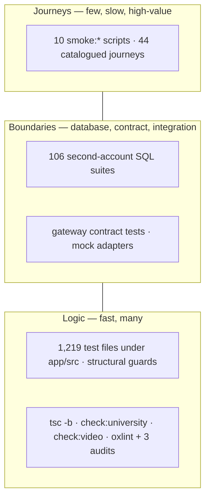

# 01 · Test strategy, pyramid, test data, environments, device and browser matrix

> Part of the [quality-system pack](README.md). Status: **proposed**.
> Controlling document: [`TEST-STRATEGY.md`](../engineering-operations/TEST-STRATEGY.md).
> Its evidence ladder is reused unchanged; this page adds what it does not have
> — the measured shape of the suite, the budgets, the data and the matrix.

## 1. Principles

Each says **how it is held**, in the way `07-ENGINEERING-STANDARDS.md` does. A
principle held only by review is one somebody talks themselves out of on a Friday.

| # | Principle | Held by |
| --- | --- | --- |
| P1 | **Test the smallest layer that can fail, then every boundary it touches.** A UI rule is a unit test; a permission is a SQL suite with a second account; a journey is a browser run. Never the reverse | review, plus 03's per-suite acceptance criteria |
| P2 | **Authorization is proved with a second account.** A policy is wrong only in a way you notice when another person is involved ([`supabase/check.sh`](../../supabase/check.sh) says so in its header). Every table and every action has a negative test | `rls-coverage.check.sql` (every table has RLS); the conformance runner owed in 03 §3 |
| P3 | **A guard that has never failed is not a guard.** Revert the fix under the new test and watch it go red, then restore. Include a control | PR template checkbox; `CLAUDE.md`; a dated line in the PR body naming the planted fault |
| P4 | **Native first is a build failure.** Journeys run with every adapter replaced by a failing stub and must pass natively ([07 §9](../target-architecture/07-ENGINEERING-STANDARDS.md)) | the provider-degraded run (03 §4) — **owed** |
| P5 | **Deterministic before live.** Required suites use fixtures, a held clock and recorded provider responses. Live/model/provider suites are scheduled, scored and filed, and never block an unrelated pull request (the repo's own reasoning for the advisory `npm audit` step in `ci.yml`) | the suite's tier in [04](04-GATES-AND-CI.md) §3 |
| P6 | **Claims follow evidence.** A result is cited with revision, command, runtime, seed, totals and artifacts, or not cited. "Partial" is not a pass | the manifest ([05 §4](05-HARNESS-OWNERSHIP-EVIDENCE.md)); `TEST-COVERAGE-MATRIX.md` prohibited claims |
| P7 | **No real person's data in any test environment.** Fixtures are synthetic and visibly labelled | fixture catalog ([08](08-REPOSITORY-AND-FIXTURES.md) §3); `VITE_DEPLOY_ENVIRONMENT` |
| P8 | **A clean reading is a claim about the probe too.** Every probe has a control that proves it can say "dirty" | the control blocks in `journey-catalog.test.ts` set the pattern |

## 2. The pyramid, measured

The numbers are from the repository at `dac31c9`, counted rather than assumed.
"Target" is **proposed**.

| Layer | Today (measured) | Runs in | Gap | Target budget |
| --- | --- | --- | --- | --- |
| **Static / guard** | `tsc -b`, `check:university` (NodeNext), `check:video`, `oxlint` + `styles`/`labels`/`terms` audits, `npm audit`; structural tests (`rootunmount`, `isolation`, `donotbuild`, `screens`, `widthgate`) | `ci.yml` `build` | module-boundary and migration-lint checks do not exist (CTO pack 06 §1, **new**) | ≤ 3 min |
| **Unit / property / component** | 1,219 test files under `app/src` plus `app/server/**` and `app/scripts/*.test.*`; run in order, shuffled (`test:shuffle`) and in two time zones (`test:zones`: `America/Chicago`, `Pacific/Kiritimati`) | `build` | no property-based tests for merge/sync/policy (`fast-check` is **new**, 03 §5) | ≤ 8 min; ≥ 85 % of all test *count* at this layer |
| **Database / policy** | 106 `*.check.sql` suites against Postgres 17, one throwaway cluster | `build` | no PDP↔RLS conformance; `FORCE ROW LEVEL SECURITY` not yet present | ≤ 6 min |
| **Contract** | gateway tests; recorded mock adapters (`mock-sis`, `mock-campus`); event envelope tests | `build` | **no contract for our own HTTP API** — there is no OpenAPI document in the repository (`git ls-files` finds none) | OpenAPI diff on every PR (CTO pack 07 §1) |
| **Integration (real services)** | `account-sync`: a local Supabase stack, two browsers, the real Auth path | `account-sync` job | only the account lifecycle runs on the real stack; module tests against real Postgres are SQL-only | one module-level real-Postgres run per owning module |
| **Browser journey** | 10 `smoke:*` scripts: `cold`, `a11y`, `golden`, `sync`, `pilot`, `institutional`, `gateway`, `performance`, `production`, `public-production` | `build` (`cold`, `a11y`, `golden` ×2), `account-sync` (`sync`), hourly `production-smoke.yml` (`production`, `public-production`) | **four of the ten run in no workflow** (`gateway`, `pilot`, `institutional`, `performance`); **Chromium only** in CI (`playwright install --with-deps chromium`); no WebKit, no Firefox | ≤ 10 min for the PR subset |
| **Load / soak** | `supabase/load.sh` (pgbench, p95 budgets, invariants), 4 × 6 s soak windows | `build` | nothing loads PostgREST, GoTrue or edge functions ([`LAUNCH-READINESS-TEST-PLAN.md`](../LAUNCH-READINESS-TEST-PLAN.md) says so) | k6 profiles at 1× and 2× (03 §8) |
| **Recovery** | `restore.sh`, `rehearse.sh` in CI; one filed logical rehearsal | `build` | production has never been restored | monthly isolated restore (03 §10) |
| **Security** | `secrets` job (gitleaks), HawkScan workflow, `injection.live.test.ts`, supply-chain tests | `secrets`, `hawkscan.yml` | HawkScan is not a required check; no isolation fuzz | 03 §1 |
| **Human** | none filed | — | no assistive-technology pass, no UAT | release gate G6, CF acceptance |

**Reading the shape.** The base and the top are healthy. The *middle* is the
risk: database suites are strong, but nothing proves that the HTTP/RPC surface
students and institutions actually call matches a published contract, and the
policy decision point (3 actions today) is not yet compared against RLS. Those
two — contract and conformance — are the first quality investments, ahead of
any new browser test.

### Wall-clock budget (proposed)

| Stage | Budget | Mechanism |
| --- | --- | --- |
| Pull-request required checks, p90 | ≤ 15 min | parallel jobs, affected-only once the workspace exists (CTO 02 §1) |
| Main (integration) full set, p90 | ≤ 40 min | sharded vitest (`--shard`), PG suites split across two clusters |
| Nightly extended (chaos subset, soak, cross-browser, live eval) | ≤ 2 h | scheduled workflow |
| Weekly | DR drill (isolated restore), full cross-browser, full load profile | scheduled workflow |

A budget breach is a defect against the suite, owned like any other
([06](06-DEFECTS-AND-DASHBOARDS.md)): it is not solved by dropping a test.

## 3. Test data

Four tiers. Each has one owner, one reset rule and one hard prohibition.

| Tier | What | Where it lives | Reset | Never |
| --- | --- | --- | --- | --- |
| **D0 factories** | in-memory builders for a single object (a course, a task, an event); the clock is injected | `app/src/lib/**` today; `packages/test-fixtures` target | every test | touch the network or `Date.now()` |
| **D1 second-account personas** | synthetic users that walk a policy: owner, same-tenant peer, wrong role, other-tenant admin, revoked, expired | inside each `*.check.sql` (rolled back at the end) | transaction rollback | persist |
| **D2 tenant world** | six synthetic tenants, a persona per role, edge-case people ([08 §3](08-REPOSITORY-AND-FIXTURES.md)) | `packages/test-fixtures` (target); `supabase/load/seed.sql` seeds the load world today | per run, from a seed | contain production-derived rows |
| **D3 synthetic production tenant** | one labelled tenant inside production for probes ([07](07-PRODUCTION-VERIFICATION.md)) | production, ring 0 | nightly purge of probe-created rows | hold or reach real tenants' data |

Rules that apply to every tier:

- **Deterministic.** A fixture takes a seed and a clock. The same seed is the
  same world; a failure prints the seed so it can be replayed (the same idea as
  `test:shuffle -- --sequence.seed=N`).
- **Visibly synthetic.** Names come from a reserved list, e-mail addresses use
  the `.invalid` TLD, tenant names start `zz-test-`. A probe that finds a
  non-reserved name in a non-production dataset fails.
- **Edge people are first-class.** Transfer student, minor with guardian,
  accommodation holder, legal-hold subject, deprovisioned user, student at two
  tenants, alumnus after offboarding. Most defects in this domain live there.
- **Time is data.** Terms, registration windows, grade release and billing
  cycles are fixture rows. The suite runs with the clock held at three points:
  mid-term, registration week, and a daylight-saving boundary.
- **Production snapshots never come down.** If a bug needs production shape, the
  tenant-scoped anonymiser runs *inside* production and only its output leaves
  (CTO pack 05 §6).

## 4. Environments and what runs where

| Environment (CTO 05 §2) | Data | Suites that run | Who looks at the result |
| --- | --- | --- | --- |
| **local** | D0, D1; `supabase start` for the real stack | the gate for the file you changed: `npx vitest run <file>`, `supabase/check.sh <suite>` | the author |
| **preview** (per pull request) | D0–D2, a DB branch when a migration is touched | gate `pull-request` | the reviewer, via the check list |
| **integration** | D2 against vendor *sandboxes* (Canvas dev, LTI reference, Stripe test mode, IdP test tenant) | gate `integration`: contract and connector suites, nightly extended | module owner |
| **staging** | anonymised/synthetic only; production-parity topology | gate `staging`: journeys, load 1×, migration forward + rehearsal, chaos subset | release owner + a second person |
| **canary** (within a ring) | real traffic, sticky by (tenant, person) | automatic analysis ([CTO 05 §4](../target-architecture/05-ENVIRONMENTS-AND-ROLLOUT.md)); synthetic probes | automatic abort; on-call |
| **production** | real tenants + D3 | hourly and post-deploy synthetic checks | on-call |
| **demo** | synthetic, labelled | smoke only | sales owner |

Staging is where the quality system is **weakest today**: `STAGING.md` records
its "matches production" claim as *unproven*, and the gate `staging` is only as
meaningful as that parity. The parity rule in CTO 05 §2 (same modules,
different variables, nightly plan drift) is therefore a quality dependency, not
only an infrastructure one.

## 5. Device and browser matrix

**Measured today:** CI runs Chromium only, at 1280×900 and 390×844 (also 320 px
for the 400 % reflow case, and 402×874 / 420×900 / 1440×1000 in individual
smokes). There is no WebKit, no Firefox, no real device, no assistive technology
in any automated run. Everything below the first tier is therefore **owed**.

| Tier | Environment | How it runs | When | Blocks |
| --- | --- | --- | --- | --- |
| **T1 · automated, blocking** | Chromium (latest stable) at 1280×900, 390×844; 320×900 reflow; reduced motion; dark and light; `forced-colors: active` | `smoke:*` in CI | every pull request | merge |
| **T2 · automated, scheduled** | WebKit (Safari engine) and Firefox at the same viewports | the same scripts with `SMOKE_BROWSER=webkit\|firefox` (**new**; the scripts take Playwright from `SMOKE_PLAYWRIGHT` already) | nightly | `staging` promotion; a failure is a defect with an owner, not a quarantine |
| **T3 · network and device conditions** | Chromium with throttled 3G, a 400 ms RTT profile, offline toggles, a 4× CPU slowdown; low-memory phone profile | Playwright CDP emulation in `smoke:performance` and `smoke:sync` | nightly | `staging` promotion |
| **T4 · real devices** | one current iPhone + Safari + VoiceOver; one mid-range Android + Chrome + TalkBack; a managed Windows laptop + Edge | scripted manual run, results filed in `docs/evidence/` | each release candidate; before `tenant-launch` | `tenant-launch` |
| **T5 · assistive technology** | NVDA + Firefox, VoiceOver + Safari (mac and iOS), TalkBack, JAWS + Chrome (institutions ask for it), Windows high contrast, 200 % and 400 % zoom, keyboard only, speech input | the manual script ([03 §6](03-SUITES.md)), performed by a qualified person | each release candidate touching UI; annually by an independent assessor | `tenant-launch` (G6) |
| **T6 · native shells** | iOS and Android Capacitor builds (CTO C6), device posture, SQLCipher, push, biometrics | device farm + manual | once `apps/mobile` exists | its own release |

**Support policy (proposed, for the owner to accept):** latest two major
versions of Chrome, Edge, Firefox and Safari, and the two latest iOS and Android
releases. A browser outside that list is "best effort": a bug is accepted if it
reproduces on a supported one. The policy is a **product statement** and
belongs in the public site's compatibility page only after T2 runs green for a
month.

### What the matrix does not claim

Passing T1–T3 is *not* WCAG conformance, *not* cross-browser support, *not* field
reliability. Those are claimed only from T4/T5 filed results and an independent
assessment, per the prohibited-claims lists in the controlling documents.
