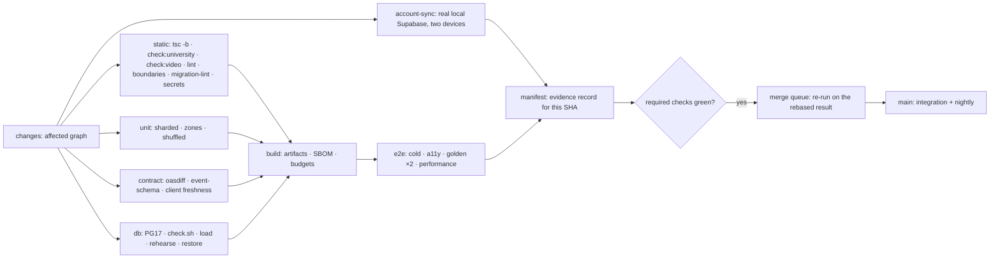

# 04 · Quality gates and CI

> Part of the [quality-system pack](README.md). Status: **proposed**.
> The pipeline gates here are the *mechanism* that checks the Definition of Done
> in [`QUALITY-MANAGEMENT.md`](../operating-model/QUALITY-MANAGEMENT.md); the
> launch gates G1–G10 in [`RELEASE-GATES.md`](../RELEASE-GATES.md) remain the
> controlling statement of what a *tenant* needs. The CTO pack's promotion
> table ([05 §8](../target-architecture/05-ENVIRONMENTS-AND-ROLLOUT.md)) and CI
> target ([06 §1](../target-architecture/06-DELIVERY-AND-OPERATIONS.md)) are
> adopted as is; this page adds the quality content of each stop.

## 1. The seven gates

The names are fixed in code (`QUALITY_GATES` in
[`journey-catalog.ts`](../../app/src/lib/governance/journey-catalog.ts)) and every
journey names the first gate at which it must pass. A change is stopped at the
first gate it fails; nothing skips one.

| Gate | When | Enforced by | Blocks | Wall-clock (proposed) |
| --- | --- | --- | --- | --- |
| `commit` | a developer or agent commits | local hook; **advisory** | nothing, by design | ≤ 60 s |
| `pull-request` | a PR is opened or updated | required status checks + review | merge | ≤ 15 min p90 |
| `integration` | merge to `main`, and nightly | the same workflow on `push`; scheduled extended workflow | promotion to staging | ≤ 40 min; nightly ≤ 2 h |
| `staging` | a release candidate is built | promotion workflow | promotion to ring 0 | ≤ 2 h |
| `canary` | a ring or a revision receives traffic | automatic analysis | traffic increase; **automatic rollback** | per step, see §2 |
| `production` | after any production deploy | post-deploy verification + hourly probe | the release being called done | ≤ 10 min after deploy |
| `tenant-launch` | a tenant is about to be activated | signed checklist | activation for that tenant | per tenant |

### What is actually enforced today — read this before relying on the table

- `.github/rulesets/main.json` **defines** three required checks (`build`,
  `secrets`, `account-sync`), one approving review, code-owner review, strict
  up-to-date, and no force-push. **`BRANCH-PROTECTION.md` records that the ruleset
  has not been applied** (its "Applied" table is empty). This pack did not read
  GitHub's live settings and does not claim they are on.
- `build` is one serial job: dependency audit (advisory,
  `continue-on-error`), `tsc -b`, `oxlint` + `styles` + `labels` + `terms`,
  `check:university`, `check:video`, `npm test`, `test:zones` (two zones),
  `test:shuffle`, `vite build`, budgets, then Chromium installed and the
  cold / a11y / golden (twice, once with human help on) smokes, course-data
  validation, **PG 17** with `check.sh`, `load.sh`, `rehearse.sh`, `restore.sh`.
- `contrast.yml` is **scheduled daily at 07:00 UTC**, not on pull requests.
  `hawkscan.yml` runs on pull requests and `main` but is **not** in the required
  list. `pages.yml` and `functions.yml` deploy after `CI` succeeds on `main`.
- `production-smoke.yml` probes the deployed app and PostgREST **hourly**, and an
  institutional probe only when both production URLs are configured (a
  half-configuration fails loudly, which is the right behaviour).

So the strongest honest statement today is: *the pull-request gate is
defined and mostly automated; whether it is enforced depends on a setting no
commit can make.* Closing that is the first quality action, and it is the
owner's ([README Q2](README.md)).

## 2. What each gate requires

Commands run from `app/` unless they start `supabase/` (`CLAUDE.md`: the repository
root has no scripts, so `npm test` there silently does nothing).

### `commit` — local, advisory

| Check | Command | Why |
| --- | --- | --- |
| Main-first | `git fetch origin main && git log --oneline -30 origin/main`, then grep for the thing | two pieces of work were built and opened here before their authors found the identical fix had landed ten and forty-four minutes earlier |
| Secrets in the staged diff | the `gitleaks` config in `.gitleaks.toml` | the cheapest leak is the one never committed |
| Fast static | `npx tsc -b --noEmit` on the changed project; `npm run lint` | feedback in seconds, not after a queue |
| The file you changed | `npx vitest run <file>`; `supabase/check.sh <suite>` | P1 |

A local hook is a convenience. It is never evidence, and a gate that exists only
as a hook does not exist.

### `pull-request`

Required (today's three, plus the ones the pack proposes — see Q2):

| Check | Source | Status |
| --- | --- | --- |
| `build` — types, lint and audits, `check:university`, `check:video`, tests in order, in two time zones, shuffled; build; budgets | `ci.yml` | exists |
| `account-sync` — the real account lifecycle across two devices against a local Supabase | `ci.yml` | exists |
| `secrets` — changed files and every file the branch carries | `ci.yml` | exists |
| second-account SQL suites (106) and load, rehearsal, restore | inside `build` | exists; **split into its own `db` job** so a failure is attributable |
| `contract` — OpenAPI diff, event-schema compatibility, generated-client freshness | CTO 06 §1 | **new** |
| `migration-lint` — tenant column, RLS + `FORCE`, expand/contract | 03 §3 | **new** |
| `boundaries` — module import graph | CTO 02 §3 | **new** |
| `journey-catalog` — the test in `journey-catalog.test.ts` runs inside `npm test` already; it is named here so that removing it is visible | this pack | **new, in this change** |
| `manifest` — writes the evidence record for the exact SHA (§4) | 05 §4 | **new** |
| `dast` — HawkScan | `hawkscan.yml` | exists, **not required**; proposed required once its noise is measured |

Also required, by review rather than by a job:

- The PR body states **which new guard was shown red against which planted
  fault** (`.github/pull_request_template.md`, last checkbox).
- A change to a policy, permission, retention rule, data flow, AI behaviour or
  migration fills the *Change advisory* section.
- A decision is `docs/decisions/D-<this PR's number>.md`; the test refuses a log
  section or a number written twice.
- The branch is rebased on `origin/main` **before** pushing, not after CI says so.

### `integration`

Everything in `pull-request`, then: the four smokes **no workflow runs today** (`smoke:gateway`, `smoke:pilot`, `smoke:institutional`, `smoke:performance`) — a script nobody runs is a claim nobody checks; the full unit suite sharded; `test:zones` and
`test:shuffle`; connector contract suites; the provider-degraded run (03 §4);
`npm audit --audit-level=high` and the SBOM (`npm run sbom`); axe over the whole
rendered app; **nightly** — T2 browsers (WebKit, Firefox), the 10,000-schedule
sync properties, the live AI sets (03 §7), the 4-hour soak, the chaos subset
against the staging-shaped stack.

### `staging`

All automatic and recorded in the manifest:

| Check | Source |
| --- | --- |
| `smoke:golden`, `smoke:sync`, `smoke:cold`, `smoke:a11y`, `smoke:performance` on the release candidate's immutable artifact | `package.json` |
| load profiles L1–L5 at 1× (03 §8) | new |
| migration forward **and** rollback rehearsal on a production-sized synthetic database; any lock over 1 s rejects it | CTO 06 §4 |
| chaos C1, C3, C8 with the SLO intact (03 §9) | new |
| isolated restore not older than 30 days (03 §10) | `restore-drill.sh` |
| T2 and T3 cross-browser and network conditions green for the candidate | 01 §5 |
| AI sets S1, S3, S4, S7 on the exact build | 03 §7 |
| journeys gated at `staging` or earlier: **no regression in status** against the previous candidate | catalog |

### `canary`

Taken from the CTO pack unchanged, because it is already numeric: a revision
receives 1 % → 5 % → 25 % → 100 % of requests, sticky by (tenant, person), each
step held ≥ 15 minutes (≥ 1 hour at 25 %), and advances only if

- error rate on canary ≤ baseline + 0.5 percentage points and ≤ 2× baseline;
- p95 ≤ baseline × 1.2 on the five critical journeys;
- zero new `5xx` signatures, zero PDP-vs-RLS disagreements, zero outbox-relay stalls;
- **no `audit_event` write failures — any is an immediate abort.**

The quality system adds two requirements: the **synthetic probes** for the
journeys marked `synthetic` ([07](07-PRODUCTION-VERIFICATION.md)) must be green
on the canary revision, and the ring's kill switch must have been exercised
(`drill:killswitch`) within the last month.

### `production`

After every deploy: post-deploy verification (07 §2) passes within 10 minutes;
the **release record** exists with the manifest attached; the rollback plan
rehearsed on staging for *this* release's migration set is linked; flags changed
are listed. A deploy without these is not "done" — it is "deployed".

### `tenant-launch`

A tenant is activated only when **all** of the following are on file, each with a
date and an owner who is not the author:

| Evidence | Where it comes from |
| --- | --- |
| Release gates G1–G10 each **MET** or knowingly waived by the founder with reason, disclosure and expiry (the rules `launchreadiness.ts` enforces: no P0/P1 waiver, none without a reason) | `RELEASE-GATES.md`, `launchreadiness.ts` |
| Journeys for the roles being activated: every journey gated at or before `tenant-launch` whose roles the tenant uses is `automated`, **or** has a signed, dated, expiring waiver | the catalog — a P0 journey cannot be waived |
| Tenant isolation report (03 §1) for the tenant and its ring | `tools/isolation-fuzz` |
| Accessibility: T4/T5 results filed for this release candidate (G6), limitations published | 03 §6 |
| AI: S1–S9 filed for the model in use (G7) | 03 §7 |
| Disaster recovery: an isolated restore within 90 days; per-tenant drill for silo tenants | 03 §10 |
| Named-customer UAT for the activated flows, signed by the customer's role — **a company self-test cannot substitute** | `CRITICAL-FLOW-TEST-PLAN.md` |
| Support: a named queue owner, runbook, status page component; a tabletop run | `QUALITY-MANAGEMENT.md` release gate |
| Signatures: Product, Engineering, Security and privacy, Accessibility, Support, Operational monitoring, and the tenant where it asked | `quality-gates.ts` `RELEASE_APPROVALS` |
| Readiness score meets the stage: design partner 70 / pilot 85 / GA 90 / enterprise 95 (high-stakes +5/+5/+5/+2), no dimension under 60, one rung at a time | `release-readiness.ts` (`promote()` refuses to skip) |

## 3. Which checks block, and why advisory is a decision

A check is **required** if a red result is always a defect in the change.
A check is **advisory** if a red result can come from outside the change — and
the repository already states the reasoning (the `npm audit` comment in
`ci.yml`): an advisory published overnight turns a pull request about a button
red, and the author learns to merge past a red check, "a habit that costs more
than the step is worth." So:

| Class | Examples | Blocks merge? | Rule |
| --- | --- | --- | --- |
| **Deterministic, change-attributable** | types, lint, unit, SQL suites, contract diff, migration lint, boundaries, journey catalog, secrets | **yes** | no retry, no quarantine ([05 §2](05-HARNESS-OWNERSHIP-EVIDENCE.md)) |
| **Environmental** | dependency advisories, DAST against a moving target, vendor sandboxes, live model sets | no — annotated; **blocks the next promotion** if still red | an owner and a date on every red |
| **Scheduled** | contrast daily, nightly extended, weekly DR | no | a failure opens a defect automatically; it blocks `staging` |
| **Human** | assistive-technology pass, UAT, restore witness | n/a | blocks `tenant-launch` only |

## 4. The CI job graph (target)

Every existing step is preserved by name; the change is *parallel and
attributable*, not different.



A **merge queue** is a quality control, not a convenience: on 15 September `main`
took sixteen merges in an hour and duplicate fixes were found only afterwards.
The queue re-runs the required set on the rebased result so a green-on-its-own-
branch collision (`VALIDATED.md` item 4) cannot land.

## 5. Workflow templates

**Templates, not run on Actions.** They are the content of the first pull
requests in [08 §6](08-REPOSITORY-AND-FIXTURES.md). Constraints the repository
already enforces and a new workflow must satisfy: `permissions:` declared at the
top; every Action pinned by commit SHA and listed in `ACTIONS` in
`supplychain.test.ts` with its publisher and what its token can do; no
`pull_request_target` on untrusted code. The two SHAs below are the ones
`production-smoke.yml` already uses.

```yaml
# .github/workflows/quality-nightly.yml — extended suites that are too slow or
# too environmental for a pull request. A failure opens a defect; it does not
# block an unrelated change, and it does block promotion to staging.
name: Quality nightly
on:
  schedule: [{ cron: '23 5 * * *' }]
  workflow_dispatch:
permissions:
  contents: read
concurrency:
  group: quality-nightly
  cancel-in-progress: false
jobs:
  cross-browser:
    runs-on: ubuntu-latest
    timeout-minutes: 45
    strategy:
      fail-fast: false
      matrix:
        browser: [webkit, firefox]
    steps:
      - uses: actions/checkout@3d3c42e5aac5ba805825da76410c181273ba90b1 # v7
      - uses: actions/setup-node@820762786026740c76f36085b0efc47a31fe5020 # v7
        with: { node-version: 22 }
      - run: npm ci
        working-directory: app
      - run: npm run build
        working-directory: app
      - name: Install the browser under test
        run: |
          npm install --no-save playwright
          npx --yes playwright install --with-deps ${{ matrix.browser }}
      - name: Journeys in ${{ matrix.browser }}
        working-directory: app
        env:
          SMOKE_BROWSER: ${{ matrix.browser }}   # new: the scripts honour it
          SMOKE_PLAYWRIGHT: /tmp/smoke/node_modules/playwright
        run: |
          npm run smoke:cold
          npm run smoke:a11y
          npm run smoke:golden
  sync-properties:
    runs-on: ubuntu-latest
    timeout-minutes: 30
    steps:
      - uses: actions/checkout@3d3c42e5aac5ba805825da76410c181273ba90b1 # v7
      - uses: actions/setup-node@820762786026740c76f36085b0efc47a31fe5020 # v7
        with: { node-version: 22 }
      - run: npm ci
        working-directory: app
      - name: 10,000 seeded schedules; a failing seed is printed
        working-directory: app
        env: { SYNC_SCHEDULES: '10000' }
        run: npx vitest run src/lib/sync/sim
  # live-ai (needs the evaluation key; its own budget), soak (supabase/load.sh
  # with LOAD_SOAK_WINDOWS=480), chaos-subset and dr-verify follow the same
  # shape and are added by the pull requests in 08 §6.
```

```yaml
# The manifest job: one record per SHA (05 §4). It runs even when an earlier job
# failed — a red run is evidence too — and it cannot make a red run green.
  manifest:
    if: always()
    needs: [build, account-sync, secrets]
    runs-on: ubuntu-latest
    steps:
      - uses: actions/checkout@3d3c42e5aac5ba805825da76410c181273ba90b1 # v7
      - run: node app/scripts/manifest.mjs --sha "$GITHUB_SHA" --out manifest.json
      - uses: actions/upload-artifact@<sha> # must be added to ACTIONS first
        with: { name: manifest-${{ github.sha }}, path: manifest.json, retention-days: 400 }
```
