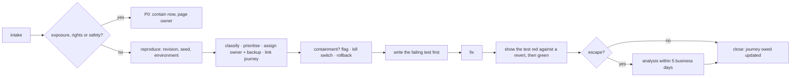

# 06 · Defects, severity, triage, escape analysis and quality dashboards

> Part of the [quality-system pack](README.md). Status: **proposed**.
> Severity is **not reinvented**: P0–P3 are defined in
> [`ON-CALL-AND-ESCALATION-POLICY.md`](../engineering-operations/ON-CALL-AND-ESCALATION-POLICY.md)
> and the community and AI documents use the same letters. The metrics are the
> ones [`QUALITY-MANAGEMENT.md`](../operating-model/QUALITY-MANAGEMENT.md)
> already lists for monthly review; this page defines how each is computed.

## 1. Severity and priority

One scale, because three vocabularies (a "Sev-1" in the CTO pack, P0–P3 in the
policy, critical/serious/moderate/minor for accessibility) is how a defect gets
three different answers. **P0–P3 is the scale.** The accessibility SLA names map
onto it below.

| Priority | Definition (the policy's, unchanged) | Examples in this product | Release effect |
| --- | --- | --- | --- |
| **P0** | active exposure, cross-tenant access, destructive integrity loss, or immediate safety or rights harm | a school reads another school's roster; a restore resurrects an erased person; a grade changes without an audit row; crisis language answered as if by a person | blocks **every** gate; contain first (kill switch, flag, rollback), then fix |
| **P1** | a core workflow is unavailable, a major accessibility barrier, or a serious integrity or reliability risk | sign-in fails for a ring; a journey cannot be finished with a keyboard; offline writes silently lost; webhook double-charges | blocks the affected motion; **blocks `tenant-launch`** |
| **P2** | a defect with a workaround, or a quality gap that does not endanger data or access | a stale source label; a suite below its floor; a flaky required test; an a11y *moderate* | tracked; blocks nothing alone, **three open in one journey block it** (proposed) |
| **P3** | minor, cosmetic, or an improvement | a copy slip not in the retired-vocabulary list | tracked |

Rules that are tests or checks today are marked.

- **Unresolved P0 or P1 blocks the affected motion** (`CRITICAL-FLOW-TEST-PLAN.md`).
- **No waiver for a P0 or P1**; any other waiver needs a reason, a disclosure and
  an expiry, and only the founder may accept one (`launchreadiness.ts` — held by
  `launchreadiness.test.ts`).
- Severity is by **harm and blocked outcome**, not by how hard the fix is or how
  loudly someone asked (`PRODUCTION-SUPPORT-RUNBOOK.md`). Security, privacy,
  accessibility, data-integrity, academic-deadline and "is this official?"
  ambiguity route immediately to the named domain owner.
- Targets below are **internal**, as the policy says: *"These are internal
  severity definitions, not promised clocks."* No document and no sales claim
  may turn them into a response guarantee.

| Priority | Triage | Contain | Fix lands (proposed internal target) |
| --- | --- | --- | --- |
| P0 | immediately, on-call | immediately | the same day or a stated mitigation; review in 5 business days |
| P1 | within 1 business day | within 1 business day | the next release train |
| P2 | weekly triage | — | within 30 days |
| P3 | weekly triage | — | backlog, reviewed quarterly |

**Accessibility mapping** (`ACCESSIBILITY-GOVERNANCE.md` SLAs unchanged — critical
5 business days, serious 30 days, moderate 90 days, minor next major release):
*critical* → P1, or P0 where it blocks a safety, rights or deadline path;
*serious* → P1 if it blocks a P0/P1 journey else P2; *moderate* → P2; *minor* → P3.

## 2. Taxonomy

Each defect carries four independent attributes, so a month of them can be
cut the ways that matter: *what kind of mistake*, *where it was made*, *where it
was found*, *whether it escaped*.

### Class (what kind of mistake)

| Class | Meaning |
| --- | --- |
| `isolation-leak` | data reachable across tenants (or between users where scope is user) |
| `authz-bypass` | an action allowed that policy refuses, or client state trusted |
| `policy-divergence` | PDP and RLS disagree |
| `integrity-loss` | a write lost, duplicated, mis-ordered or applied twice |
| `sync-conflict` | convergence or conflict-display failure |
| `freshness-source` | a fact shown without the right source or time label |
| `ai-unsafe` | an injection followed, a policy ignored, an unsupported claim presented as sourced |
| `ai-quality` | a wrong or ungrounded answer within policy |
| `a11y-barrier` | a person using assistive technology cannot finish |
| `performance` | a budget, SLO or soak drift missed |
| `resilience-gap` | a predictable failure becomes an outage or a silent wrong state |
| `migration` | a schema or data change that loses or locks |
| `config-flag` | a flag, ring, kill switch or entitlement behaves wrongly |
| `claim-exceeds-evidence` | a public statement ahead of the evidence (`PUBLIC-CLAIMS-APPROVAL-REGISTER.md`) |
| `ux-dead-end` | a state with no next action |
| `observability-gap` | something that failed and nobody could see |
| `test-defect` | a flaky test, a false green, a probe answering a narrower question than the one asked |
| `regression` | a previously fixed defect, same class and area, returning (a *flag*, set on top of the class) |

`test-defect` is a class on purpose. The repository's own history of it is the
reason: a probe that keyed on `__reactContainer$` read every file as leaking, a
probe that scanned `document.body` reported `leaving.test.tsx` clean when it was
not. Defects *in the quality system* are tracked, counted and owned like any other.

### Introduced in · Found in

`introduced`: requirements · design · code · migration · config · dependency ·
content · test. `found`: the gate or layer that caught it — `commit`,
`pull-request`, `integration`, `staging`, `canary`, `production`, `customer`,
`audit`. The distance between the two is the measurement that matters.

### Escape

A defect is an **escape** when it is found at a gate *later than a gate whose
suite should have caught it*, or by anyone outside engineering. The flag is set at
triage and confirmed by the analysis in §4.

### Where defects live

GitHub Issues in this repository, with labels `defect`, `P0`–`P3`,
`class:<name>`, `introduced:<x>`, `found:<gate>`, `journey:J-XX-NN`, `escape`,
`regression`. The journey label is how a defect reaches the catalog: **an open
P0/P1 on a journey is shown on its row**, and a journey with one cannot be
`automated`. Security and privacy exposures are **not** filed as public issues;
they follow `SECURITY.md` and are summarised here only after containment.

## 3. Triage

**Intake** — CI failures; the hourly probe and any alert; support tickets and the
help-request queue; in-app feedback (`feedback.check.sql`); the pilot problem log;
security and accessibility reports; customer UAT; the nightly extended run.

**Triage owner** — the Quality Lead with the module owner, **weekly** for P2/P3,
**within one business day** for P1, **immediately** for P0. With one person
staffing everything, this is also the honest statement of the single-point risk
the CTO pack already records ("paging one person 24×7 is a risk, not an
operating model"): the triage table lists who covers whom, and "nobody" is a row.

**The reproduction record** (a defect without it is *needs info*, not triaged):
revision, environment, fixture or seed, steps, expected, observed, and the support
reference (`correlationId`) when there is one.

**Closure is a test, not a comment.** A defect closes when (1) a test that fails
for the defect now exists, (2) it was shown red against the revert and restored,
(3) the journey's `owed` is updated in the same change, (4) a *class* guard is
added where the defect shows a class can recur (see §4), and (5) for an escape,
the analysis is filed.

## 4. Escape analysis

Blameless, written within **5 business days** of the fix (the CTO pack's
post-incident window), filed as `docs/evidence/escapes/<date>-<issue>.md`.

| Section | What it must say |
| --- | --- |
| **What happened** | the user-visible fact, with the support reference and the revision it was seen on |
| **First bad revision** | found by bisect; the time between it and detection is the **time to detect** |
| **Which gate should have caught it** | name the suite from [03](03-SUITES.md) and the gate from [04](04-GATES-AND-CI.md) |
| **Why it did not** | exactly one of the causes below, with evidence — "the test was bad" is not an answer, *which way* it was bad is |
| **The instance fix** | the change, and the test **shown red against a revert** |
| **The class guard** | what would have caught *the next one like it* — the structural check, not another instance test. If none is possible, say so and why |
| **Quality-system changes** | the journey row's `owed`, a suite floor raised, a fixture or persona added, a gate changed |
| **Measures** | time to detect; time to contain; time to resolve; users and tenants affected |

**Why a gate missed it** — the closed list, so a quarter's analyses can be counted:

1. *No test existed for that behaviour or boundary.*
2. *A test existed but guarded a narrower question* (the probe answered a
   different question than the one asked).
3. *A test existed and was green for the wrong reason* — it never failed against
   the bug, or the control was missing.
4. *The data or state that triggers it is not in the fixtures* (an edge person, a
   boundary date, scale).
5. *The environment differs from production* (staging parity; a flag; a region).
6. *The suite ran, was red or skipped, and the gate did not stop on it.*
7. *The behaviour is only visible to a person* (accessibility, comprehension).
8. *The change bypassed the gate* (a waiver, an admin bypass — every bypass is
   recorded on the pull request, `BRANCH-PROTECTION.md`).

**Worked example — the shape, from the repository's own record.** `CLAUDE.md`
records that `packages/institution` re-exported a module from
`supabase/functions/_shared/` on #803: every local gate passed and CI failed with
`TS1287`, because `tsc -b` and the gateway's `module: NodeNext` typecheck read
`.ts` files differently. *First bad revision:* the re-export. *Which gate:*
`pull-request`, `check:university`. *Why it did not at the author's desk:* cause 5
(the local gate was `tsc -b`, a different configuration from CI's). *Instance
fix:* remove the import. *Class guard:* the rule "code under `supabase/functions/`
stays out of anything the gateway imports", and `check:university` named as a
**separate** gate rather than a duplicate. That one was caught in CI, so it is
**not an escape**; the same record, had it reached `main`, would have been one.
The point of the example is the *last* line of each analysis: the class guard.

## 5. Quality dashboards

Six boards, each with an owner, a source and a cadence. **Every number links to
the artifact it came from** (manifest, issue query, workflow run) — a dashboard
whose figures cannot be traced is an opinion with a chart.

| Board | Question it answers | Reviewed | Source |
| --- | --- | --- | --- |
| **D1 · Release readiness** (per candidate) | is *this SHA* fit to promote? | each candidate | the manifest, gate results, open P0/P1 |
| **D2 · Quality trend** (monthly, `QUALITY-MANAGEMENT.md`'s table) | is the system getting better? | monthly | issues, manifests, probe history |
| **D3 · Suite health** | can we trust the tests? | weekly | manifests, CI history |
| **D4 · Production verification** | are the journeys working *now*? | continuous | the hourly probe, post-deploy checks (07) |
| **D5 · Defect aging and escapes** | what are we slow to fix, and what got through? | weekly | issues |
| **D6 · Tenant launch board** | what stands between this tenant and activation? | per tenant | [04 §2 `tenant-launch`](04-GATES-AND-CI.md) evidence list |

### Metric definitions

| Metric | Definition | Better | Board |
| --- | --- | --- | --- |
| **Defect escape rate** | defects flagged `escape` ÷ all defects closed in the month | lower | D2, D5 |
| **Regression rate** | defects with the `regression` flag ÷ all closed | lower | D2 |
| **Mean time to detect** | first-bad-commit time → detection, over escapes | lower | D2 |
| **Mean time to resolve** | detection → fix deployed, by priority | lower | D2, D5 |
| **Accessibility defect aging** | open a11y defects by age against the SLA | lower | D5 |
| **Source-freshness failures** | defects of class `freshness-source`; probes that found a missing label | lower | D2 |
| **Connector failure recovery time** | alert → healthy, per connector | lower | D4 |
| **AI evaluation failures** | failed cases per set per run; any S3/S4/S7 failure is a P0 | lower | D2, D1 |
| **Support contacts per feature** | tickets tagged to a journey ÷ active users of it | lower | D2 |
| **Adoption against intended outcome** | the charter's own hypothesis, not a cross-feature ranking | higher | D2 |
| **Flake events per 1,000 job-runs** | a job that failed then passed on the same SHA with no code change | **zero** for required suites | D3 |
| **Open quarantines · oldest age** | non-required suites only (05 §2) | lower, none past 14 days | D3 |
| **Skipped tests, by reason** | from the manifest; unexplained skips fail the manifest | lower | D3 |
| **Suites below floor** | count; should be zero | zero | D3 |
| **Gate wall-clock p90** | per gate vs budget (04 §1) | lower | D3 |
| **Time `main` was red** | minutes per week | lower | D3 |
| **Journeys: automated / partial / owed** | `summary()` from the catalog | automated up, owed down | D1, D6 |
| **P0 journey owed items** | total count of owed lines on P0 journeys | down | D1, D6 |
| **Synthetic availability by journey** | good probes ÷ eligible probes; **no data is "no data", never healthy** (`SLO-SLI-DRAFT.md`) | higher | D4 |
| **Days since last isolated restore** | vs the 30/90-day gates | lower | D1, D6 |

**Privacy.** Dashboards hold aggregates and identifiers of *our* artifacts only.
No student-level data, and no per-person production-engagement counts; any
analytics-derived figure obeys the repository's minimum-cohort rule (a tested
constant, never a convention).

**Build order (cheapest first).** D3 and D1 come straight from the manifest, so
they exist the day the manifest does. D4 reuses what is already recorded: the
`production-smoke.yml` `record` job writes each hour's result to the `status-data`
branch for the status pages' 90-day bars — the quality board reads that branch
instead of starting a second store. D2, D5 and D6 start as a committed weekly
report (`docs/evidence/quality/<week>.md`) generated from issues and manifests,
and become a console view when someone other than the author reads it weekly.

## 6. The sign-off sheet

One page per release candidate, attached to the release record: the manifest
hash; D1 as of the candidate; open P0–P3 with owners; waivers (each with reason,
disclosure, expiry); and a line each for **Product, Engineering, Security and
privacy, Accessibility, Support and customer success, Operational monitoring**
and, where the tenant asked, **the tenant** — the six release signatures
`governance/quality-gates.ts` defines. A signature is a person accepting a risk,
not a box being ticked; the sheet refuses the same name twice on a high-stakes
release, and a line signed by the author of the change is marked *author* and does
not count toward the requirement.
