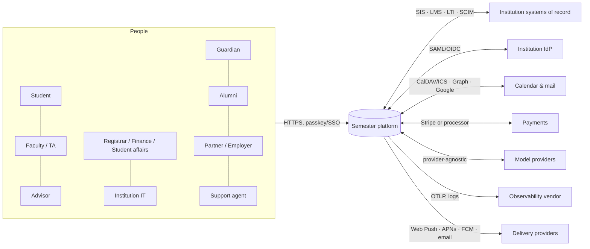
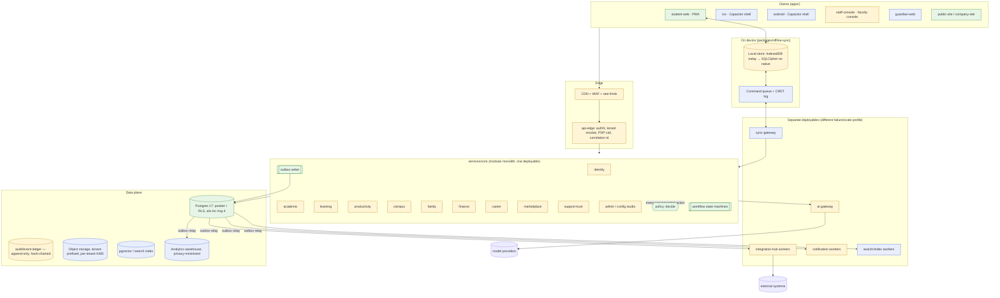
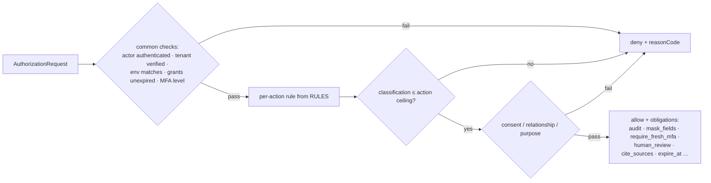
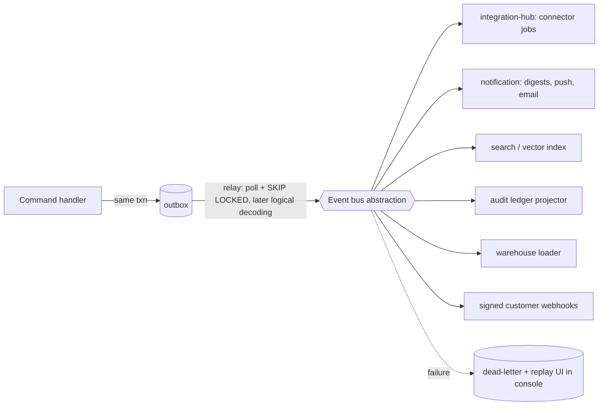
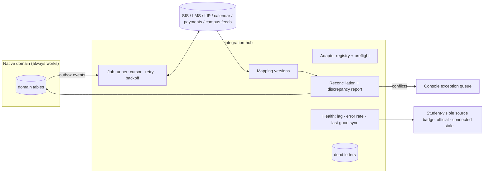
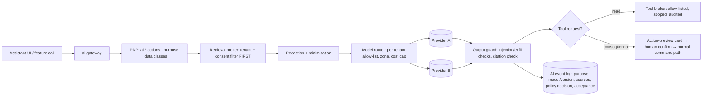
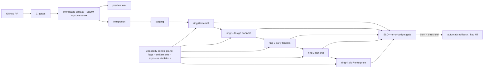

# 01 · Target architecture

> Part of the [CTO architecture pack](README.md). Status: **proposed**. Nothing
> here is accepted until its ADR is (see [03](03-TECHNOLOGY-DECISIONS.md)).
> Every box is labelled **EXISTS**, **PARTIAL** or **TARGET** so the diagram
> cannot be read as a description of what runs today.

## 0. The shape in one paragraph

Semester becomes a **modular monolith with enforced domain seams, a policy
decision point in front of every consequential action, a transactional outbox
behind every state change, and a device that keeps working when everything
else is down.** Domains are separate *modules* (own code, own schema, own
tests, own owner, own contract) deployed as one `core` runtime until a written
extraction trigger fires ([04](04-DOMAIN-BOUNDARIES-AND-OWNERSHIP.md) §4).
Three things *are* separate deployables from day one because their failure or
scaling profile differs: the **AI gateway**, the **integration workers**, and
the **sync gateway**.

This is deliberately not "microservices on Kubernetes". The accepted
[ADR 0003](../architecture/0003-no-application-server.md) and the
[platform constitution](../PLATFORM-CONSTITUTION.md) say simple, modular,
secure, scalable *enough*, and ADR 0003 says it "will be genuinely tested by
Phases 6–15". This pack is that test. Its conclusion: a server is now
warranted (long-running connector jobs, a sync protocol, a PDP that must not
live in a Deno edge function), but a *service mesh* is not. The seams are
built so extraction is a deploy change, not a rewrite.

## 1. System context (who and what touches Semester)



Rule that falls out of this picture (the audit's "native first, connected when
available"): **every arrow on the right is an `Adapter` behind the integration
module. Deleting any one of them must leave every native workflow working.**
That is a CI test, not a slogan ([07](07-ENGINEERING-STANDARDS.md) §9).

## 2. Container view



Legend: green = exists in the repository and is exercised by tests; amber =
partial (the concept exists, the boundary does not); blue = does not exist.
The honest summary: **the policy decision point, the event envelope and
outbox, and the workflow machines exist as libraries
(`packages/institution/src/{policy,events,workflow}.ts`, ADRs
[0007](../architecture/0007-policy-decision-point.md)–[0010](../architecture/0010-correlation-ids-and-error-envelope.md))
but `decide()` has three actions and no producer writes to the outbox.** The
rebuild's first job is to make those two true everywhere, not to add boxes.

## 3. The request path (the one picture every engineer memorises)

```mermaid
sequenceDiagram
  autonumber
  participant C as Client
  participant E as api-edge (BFF)
  participant P as PDP decide()
  participant M as Domain module
  participant DB as Postgres (RLS on)
  participant O as Outbox
  C->>E: POST /v1/{domain}/commands/{name}  (Idempotency-Key, X-Correlation-Id)
  E->>E: verify session · resolve tenant from session (never a header) · rate limit
  E->>P: AuthorizationRequest{actor, tenant, action, resource, context}
  P-->>E: allow(obligations[]) | deny(reasonCode, userMessage, userAction)
  alt deny
    E-->>C: 403 ErrorEnvelope{reasonCode, userMessage, userAction, correlationId}
  else allow
    E->>M: Command + obligations
    M->>DB: BEGIN; set_config('app.tenant_id', …, true); domain write
    M->>O: INSERT outbox(SemesterEvent) — same transaction
    M->>DB: INSERT audit row (if action has auditEvent) — same transaction
    DB-->>M: COMMIT
    M-->>E: CommandResult{status, auditEventId}
    E-->>C: 200/202 + X-Request-Id + X-Correlation-Id
  end
```

Invariants (each is a test in [07](07-ENGINEERING-STANDARDS.md)):

1. **Tenant comes from the verified session**, never from a client-supplied
   header or body field. (`TenantVerification` already enumerates how:
   `membership | sso_issuer | lti_deployment | service_binding`.)
2. **Domain write, outbox row and audit row commit or roll back together.** No
   dual write to a bus. A bus is a *consumer* of the outbox.
3. **RLS stays on even though the PDP exists.** The PDP answers "may this actor
   do this *kind* of thing"; RLS answers "can this *connection* ever see this
   *row*". A bug in one is not a breach.
4. **A refusal always carries `reasonCode`, `userMessage` and, where one
   exists, `userAction`** (no dead ends — `DO-NOT-BUILD.md` rule 8).

## 4. Policy architecture



- **Today:** pure function `decide(request, now)`; `POLICY_ACTIONS` has **3**
  actions (`support.case.read_context`, `ai.retrieve_source`,
  `grade.passback.submit`); everything else is authorised by RLS and client
  UX.
- **Target:** every command in the command catalogue ([07](07-ENGINEERING-STANDARDS.md) §2) is a
  `POLICY_ACTION`; adding a command without one fails CI.
- **Relationship data** (guardian↔student, advisor caseload, TA↔section) lives
  as tuples in Postgres (`relationship(subject, relation, object, tenant_id,
  valid_from, valid_to, source)`); the PDP reads them through a port. If a
  graph store is ever warranted (OpenFGA/Cedar) it replaces that port, not the
  callers ([03](03-TECHNOLOGY-DECISIONS.md) P-06).
- **Policy is versioned data plus code.** `context.policyVersions` already
  exists; every decision is replayable against the version that made it.
- **Break-glass** is a policy action with `require_fresh_mfa`, `expire_at`, dual
  control and an always-on audit obligation. There is no "admin bypass" code
  path.

## 5. Data architecture

| Store | Holds | Authoritative for | Tenancy control |
| --- | --- | --- | --- |
| Postgres (pooled) | all transactional domain data | everything Semester owns | `tenant_id` on every row, `ENABLE`+`FORCE` RLS, `app.tenant_id` set per transaction, negative tests per table |
| Postgres (silo) | same schema, one DB per ring-4 tenant | same | identical migrations; routing in `api-edge` |
| Ledger (`audit_event`, `domain_event`) | append-only, hash-chained rows | evidence | write-only role; no `UPDATE`/`DELETE` grant; periodic anchor hash to object storage (WORM) |
| Object storage | files, exports, generated media | bytes only; metadata in Postgres | `tenants/{tenant}/{class}/{yyyy}/…` prefix, signed URL ≤ 5 min, per-tenant data key (envelope encryption) |
| pgvector / search | embeddings, FTS | derived only | tenant filter applied **before** retrieval; AI context built from filtered set |
| Warehouse | aggregates, product analytics | derived only | k-anonymity floor, no raw student content, tenant-scoped views |
| Cache/queue | ephemeral | nothing | keys prefixed `t:{tenant}:`; consumers re-validate tenant from the event, not the queue |
| Device store | local-first personal data | the student's *drafts* and *offline queue*, never institutional truth | per-tenant/person/device key; wiped on revoke ([06](06-DELIVERY-AND-OPERATIONS.md) §7) |

Source precedence (from the audit, enforced by `SourceKind` which exists:
`institution_verified | imported | student_entered | estimated`): an institution-verified
record always wins over an imported one, which wins over student-entered, which
wins over an estimate; the loser is **kept** with provenance and surfaced as a
conflict, never silently overwritten.

Current state to be honest about: 171 migrations and 106 SQL check suites exist;
the repository's own isolation baseline found no created application table
without an RLS-enable declaration, **and no `FORCE ROW LEVEL SECURITY`**
([multi-tenant-isolation](../architecture/multi-tenant-isolation.md)). Adding
`FORCE` (so table owners are bound too) is the first data-plane hardening step
([09](09-CONVERSION-PLAN.md) wave C0).

## 6. Event architecture



- Envelope: the existing `SemesterEvent` (id, type, version, producer,
  environment, tenant, actor, subject, correlationId, causationId,
  idempotencyKey, dataClassification, retentionClass, payload). 50 event types
  are catalogued in `EVENT_TYPES`; **a producer adds its type in the same
  change as its first consumer** (existing rule, keep it).
- Delivery semantics: **at-least-once, consumer-idempotent** (`ReceiptLedger`
  exists: `processOnce`). Ordering is guaranteed only per `subject`.
- Bus implementation is a port. Phase 1–3: Postgres (`outbox` + `SKIP LOCKED`
  relay). Replace with a managed queue/stream only when a trigger in
  [03](03-TECHNOLOGY-DECISIONS.md) P-04 fires.

## 7. Integration architecture



Connector contract (extends what exists in `app/server/institution/adapter.ts`
and `app/server/integration/`):

```ts
export interface ConnectorAdapter<TExternal, TNative> {
  readonly id: string;                    // 'canvas', 'banner', 'google-calendar'
  readonly capabilities: readonly ConnectorCapability[]; // 'read:courses' | 'write:grades' | …
  preflight(ctx: TenantContext): Promise<PreflightReport>;       // config + credentials + scopes, no side effects
  pull(ctx: TenantContext, cursor: SyncCursor | null): Promise<Page<TExternal>>;
  map(ext: TExternal, version: MappingVersion): MappedResult<TNative>;   // pure
  push?(ctx: TenantContext, cmd: ExternalWrite, idem: string): Promise<ExternalReceipt>; // prepare-only until activated
  health(ctx: TenantContext): Promise<ConnectorHealth>;
}
```

Hard rules: connectors never write native tables directly (they emit
`ImportBatch` commands through the same PDP path); every imported row carries
`SourceMetadata{origin, system, externalId, mappingVersion, observedAt,
verifiedAt, freshnessState}`; a connector outage degrades the *badge*, never
the *workflow*. Write-back (grades, enrollment) stays **prepare-only with a
human confirmation until the tenant's activation evidence is accepted**
(existing posture — `app/server/institution` is prepare-only today).

## 8. AI architecture



- The model never holds a database credential or a tool the user could not
  call. **Tools are the same commands a human calls, through the same PDP,
  acting as the user.**
- A consequential tool call (external, financial, record, enrollment, grade)
  produces an *action proposal*; only a human confirmation turns it into a
  command (`require_confirmation` + `human_review` obligations exist).
- Evaluation is a release gate: `eval:model-quality` and the
  injection suite (`src/ai/injection.live.test.ts`) exist; the target makes
  them required, versioned and tied to the model/prompt version in
  production.
- Metering: the existing metered `claude` edge function (ADR 0004, "not
  deployed") is the seed of `services/ai-gateway`; the student's-own-key mode
  stays as a client-only path that never touches tenant data.

## 9. Observability architecture

| Signal | Source | Sink | Retention | Rule |
| --- | --- | --- | --- | --- |
| Traces | OpenTelemetry in `api-edge`, core, workers, clients (web vitals + RUM) | OTLP collector → vendor | 14 d full, 90 d sampled | `correlationId` is a span attribute; `tenantId` is a *hashed* attribute |
| Metrics | RED per route/command; USE per worker; SLIs per critical journey | Prometheus-compatible | 13 mo | one dashboard per journey ([06](06-DELIVERY-AND-OPERATIONS.md) §8) |
| Logs | structured JSON, no payload bodies, classification-aware redaction | log store | 30 d ops / per policy for audit | a log line may not contain `education_record` content |
| Audit | the ledger — **not** a log | Postgres ledger → WORM anchor | per retention class | separate from observability by design |
| Client errors | Sentry-class | vendor | 30 d | PII scrubbing in `beforeSend`, tested |
| Security events | login anomalies, PDP denials spike, RLS errors, admin actions | SIEM | 1 y | alert routes in [06](06-DELIVERY-AND-OPERATIONS.md) |
| Synthetic | `smoke:*` scripts already exist (cold, golden, sync, production) | scheduler → pager | — | run per ring, per region |

## 10. Operations architecture



The existing capability/entitlement/exposure machinery
([`ACTIVATION-CONTROL-PLANE.md`](../ACTIVATION-CONTROL-PLANE.md), the
`governance` modules, PR #1138) *is* the ring controller's data model. Rings
are a policy over it, not a second system ([05](05-ENVIRONMENTS-AND-ROLLOUT.md)).

## 11. Non-functional targets (proposed; become SLOs only when measured)

| Journey | Availability | Latency (p95) | RPO / RTO | Offline |
| --- | --- | --- | --- | --- |
| Open app, see Today | 99.9 % | < 1.5 s warm, < 3 s cold on a mid-tier phone | n/a (device) | full |
| Create/edit task, event, note | 99.9 % | local < 50 ms; sync < 5 s | RPO ≤ 5 min / RTO ≤ 1 h | full, queued |
| Sign in / session refresh | 99.95 % | < 800 ms | RPO 0 (stateless + DB) / RTO ≤ 30 min | cached session up to policy |
| Submit assignment | 99.9 % | < 2 s (receipt) | RPO ≤ 1 min / RTO ≤ 1 h | queued with explicit *pending* state |
| Registration / grade / bill | 99.9 % | < 2 s | RPO ≤ 1 min / RTO ≤ 1 h | **read-only cache; commands are server-authoritative** |
| AI answer (first token) | 99.5 % | < 2.5 s | none | degrade to non-AI path, never block the workflow |
| Connector freshness | per-contract (`freshnessSlaHours` exists in data contracts) | — | — | badge shows `stale` |

These are *proposals*: the repository's own error-budget docs
([`SLOS-AND-ERROR-BUDGETS.md`](../operating-model/SLOS-AND-ERROR-BUDGETS.md),
`engineering-operations/SLO-SLI-DRAFT.md`) are drafts, and SLOs are not
adopted until a month of real measurement exists. Commit to numbers *after* the
first ring-1 month, not before.
