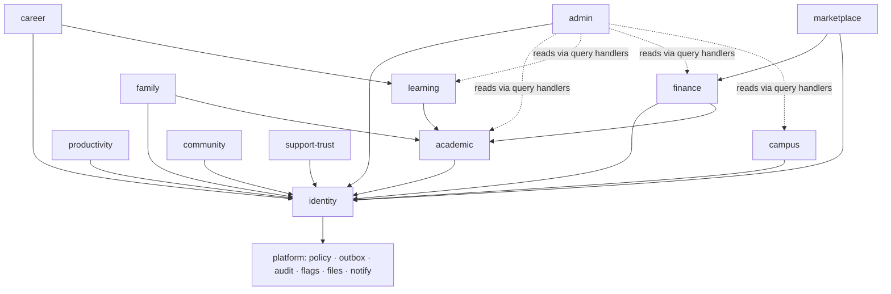

# 04 · Domain-service boundary plan and ownership model

> Part of the [CTO architecture pack](README.md). Status: **proposed**. Table
> and screen names are real (surveyed on `origin/main` 7287ddc); table counts
> are static greps of the migration history, not live-database counts.

## 1. Rules for drawing a boundary

1. A module owns **objects**, not screens. A screen composes several modules.
2. One owner per table. A table that two modules write is a boundary bug.
3. A module may **read** another's data only via its query handlers or an
   event-fed projection; never by joining its tables.
4. Authority is explicit per object: *who is the system of record when the
   connector is up, and when it is down* (the audit's four questions: who owns
   it, what if the connector dies, who may change it, how is that audited).
5. A boundary is only worth drawing where an **extraction trigger**
   ([03](03-TECHNOLOGY-DECISIONS.md) P-02) could plausibly fire.

## 2. Module map: objects, authority, today's footprint

| Module | Canonical objects | Native authority | Connected authority (precedence) | Today's footprint in repo |
| --- | --- | --- | --- | --- |
| **identity** | person, account, organization, institution/campus (`schools`), program, role, role grant, relationship, consent, device, session, tenant policy | Semester | IdP attributes (`institution_verified`) beat student-entered | `organizations`, `organization_members`, `institution_membership`, `institution_identity_provider`, `app_roles`/`role_capabilities`/`role_grants`, `consent_record`, SCIM tables, `break_glass_grant`, `tenant_*` policy tables; gateway `membership.ts`, `auth.ts`, `scim*.ts`; `delete-account` fn |
| **academic** | term, course, section, catalog, enrollment, schedule, degree requirement, academic record, hold | Semester when native; **SIS when connected** | SIS wins, Semester keeps provenance + conflicts | `registration_*` (windows, holds, requests, sections, overrides, audit); screens `Registration`, `Registrar`, `Degree`, `Courses`; gateway `registration.ts`; `lib/enrollment`, `lib/record` |
| **learning** | module, assignment, submission, rubric, assessment, attempt, grade, feedback, passback | Semester | LMS via LTI/AGS; grade release is a workflow | `gradebook_*`, `grade_passbacks`, `lti_*`; `lti` fn (881 lines); screens `Gradebook`, `Grades`, `Lesson`, `Drill`, `Exam`; `lib/gradebook`, `lib/assessment` |
| **productivity** | task, project, goal, reminder, event, time block, note, document, sheet, deck, study set, file | **Student** (local-first, private by default) | Google/Microsoft/ICS imports are *imports* | `state/*`, `lib/sheet.ts`, `lib/plot.ts`, screens `Today`, `Calendar`, `Sheet`, `Write`, `Deck`, `Study`; fns `calendar`, `fetchcal`, `canvas`; OWNED_TABLES synced by `lib/cloud.ts` |
| **campus** | event, location, service, meal, housing assignment, club, activity, athletics | Institution content; Semester publishes | campus feeds | `dining_*`, screens `Dining`, `Housing`, `Maps`, `Directory`, `Athletics`, `Activities`; gateway `housing.ts`, `athletics.ts`, `clubs.ts` |
| **community** | group, discussion, message, meeting, mentorship, report, moderation case | Semester | email/video identity | `community_*` (~40 tables), `src/community/`, screens `Community`, `Moderation`, `Classmates`, `Meet` |
| **family** | guardian relationship, permission, sharing scope, consent, age policy | Semester | SIS family contacts | `guardian_*`, `family_access_events`, `share_audit`; screen `Family`; gateway `family.ts` |
| **finance** | account, charge, invoice, payment plan, aid item, refund; **plus** Semester's own tenant billing | Institution billing events and processor confirmations are authoritative; Semester **mirrors**, never originates institutional money | ERP / processor / aid system | `student_account_*`, `billing_*` (accounts, subscriptions, invoices, quotes, dunning), `dining_ledger`; fns `billing-*`; screens `Bill`, `Costs`; gateway `money.ts` |
| **career** | profile, portfolio artifact, opportunity, application, mentor, verified achievement, alumni profile | Student owns; verification by issuer | employers, career systems | screens `Career`, `Opportunities`, `Applying`, `Pathway`, `Proof`, `Volunteer*`; gateway `career.ts`; `lib/advancement` |
| **marketplace** | provider, listing, offer, order, commission, dispute, payout | Semester | payment + fulfilment partners | not built beyond `gtm_*` and `Springboard`/`Launchpad` precursors; **gated off until consumer-protection/tax review** |
| **support-trust** | ticket, trust-room access, incident, status event, legal hold, deletion request, retention rule | Semester | CRM/email | `support_*`, `trust_room_access_log`, `support_access_grant`, `legal_holds`, `feature_kill_switch`; fns `trust-room`, `support-reply-notify`, `lead-intake`; screens `Support`, `TrustRoom`, `Help` |
| **admin** | configuration, policy, workflow, report, import job, approval | Semester | — | Configuration Studio (D-1011), `lib/console`, `lib/config`, screens `Console`, `University`, `Reports`, `Data` |

Platform modules (not domains; no user-facing objects of their own):
`policy` (`decide`), `outbox`/events, `audit` ledger (`audit_event`,
`private.ledger_chain`), `flags`/rings, `files`, `notify` (rule 4),
`search` (one ranker, ADR 0006), `consent`, `ai-gateway` client.

## 3. Dependency direction

Lower layers never import upward. `family` reading academic/finance data
happens through a **consent-filtered projection**, not a join (the repository's
`multi-tenant-isolation.md` already says guardian/partner access are
projections, not raw RLS).

## 4. Extraction plan (which seam goes first, and why)

| Order | Seam | Trigger that makes it real | Prep done in advance |
| --- | --- | --- | --- |
| 0 (day one) | `ai-gateway` | different scaling, secrets, compliance | provider interface, budget enforcement, event log |
| 0 | `integration-hub` workers | long-running jobs; 30 s Vercel cap; retry/DLQ | adapter contract, `integration-tick` becomes a worker |
| 0 | `sync-gateway` | stateful protocol, high connection count | protocol spec ([06](06-DELIVERY-AND-OPERATIONS.md) §7) |
| 1 | `finance` (processor-facing part) | PCI scope minimisation; processor webhooks | keep card data out entirely (hosted checkout, already the case with Stripe), isolate webhook ingestion |
| 2 | `community` | write-heavy fan-out, moderation queues | already ~40 tables and its own event set |
| 3 | `learning` gradebook | exam-week spikes; grade-integrity SLO | grade release as a workflow machine |
| 4 | anything else | only on a written trigger | — |

## 5. Ownership model

Every module has, in `MODULE.md`, **one accountable team** and these named
roles. Roles are *functions*; at today's headcount one person holds several,
and `OWNER-AND-ACCOUNTABILITY-MATRIX.md` is where the real names live.

| Role | Accountable for | Cannot be the same person as |
| --- | --- | --- |
| Module owner (tech lead) | design, SLO, backlog, extraction decision | — |
| Product owner | jobs-to-be-done, acceptance criteria, capability register row | — |
| Data steward | classification, retention, deletion, lineage | module owner **for exports/deletes** (four-eyes) |
| Security champion | threat model, authz tests, secrets | the author of the change under review |
| Accessibility owner | WCAG 2.2 AA evidence for the module's screens | — |
| On-call primary / secondary | runbook, alerts | each other |

A module is **not allowed to exist** in `services/core` without all of: an
`OWNERS` file, a `MODULE.md`, an SLO row, a runbook, a threat-model entry, a
retention rule for every table, and a capability-register row. That mirrors
the audit's 16-point completion standard and the repo's DO-NOT-BUILD rule 13
(no Core module without RLS tests, an immutable history and a kill switch).
CI checks the files exist; reviewers check they are true.

## 6. Data ownership and control matrix (reconciled with the audit)

| Category | Owner module | Student control | Institution control | Hard rule |
| --- | --- | --- | --- | --- |
| Profile | identity | edit non-verified fields; view provenance; request correction | required fields; verified attributes | IdP attributes cannot be silently overwritten |
| Academic record | academic | view/export/dispute | approve/amend under policy | immutable change history; dual control for amendments |
| Learning work | learning | create/submit/export | course + retention policy; grade release | grade change = workflow with reason and audit |
| Personal productivity | productivity | full control | **no default visibility**; explicit tenant policy only | admin cannot read by default; support only via consented, time-bound grant |
| AI context | ai-gateway + consent | inspect/delete; choose sources | models, zones, retention, tool permissions | retrieval filtered *before* model context |
| Financial | finance | view/pay/preferences | charges, plans, reconciliation | ledger append-only; mirror, don't originate |
| Guardian | family | grant/revoke by scope | legal constraints | no access without live consent or legal basis |
| Audit | platform audit | access per policy | investigation/export | append-only; write-only role |

Legal conclusions (FERPA applicability, minors, cross-border, retention
periods) are **flagged for qualified counsel**, never decided here; the
repository's `COUNSEL-BRIEF.md` and `LEGAL-REVIEW-QUEUE.md` are where they go.
