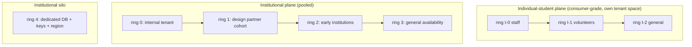

# 05 · Environment strategy: local, preview, integration, staging, production, canary, tenant rings

> Part of the [CTO architecture pack](README.md). Status: **proposed**.
> Builds on `docs/engineering-operations/ENVIRONMENT-AND-CONFIGURATION-MANAGEMENT.md`,
> `STAGING.md` and `docs/PILOT-AND-INDIVIDUAL-RELEASE-PROFILES.md`; where they
> disagree with this page, they win until a decision says otherwise.

## 1. Today

One Supabase project (`lzrqvlugnawcgywkhqlz`), the SPA on GitHub Pages
(`/semester/`), the institution gateway as one Vercel function, staging only as
a Supabase preview branch whose "matches production" claim `STAGING.md`
records as *unproven*, and a build-time flag set (`VITE_*`, ~25 flags) plus
per-tenant runtime policy. Release gates exist for the SPA (CI → Pages) and
for functions (CI → `functions.yml`); schema applies via `supabase db push`.

## 2. The ladder

| Env | Purpose | Data | Who can reach | Created by | Lifetime |
| --- | --- | --- | --- | --- | --- |
| **local** | inner loop | synthetic seed (`test-fixtures`), local Postgres 17 + local Supabase stack | the developer | `pnpm dev` / `supabase start` (what `account-sync` CI already does) | session |
| **preview** | review a PR | synthetic; DB branch per PR touching migrations | reviewers, via authenticated preview URL | PR open (Supabase Branching today; Terraform module later) | deleted on PR close |
| **integration** | contract and connector tests against *sandboxes* of real vendors (Canvas dev, LTI reference platform, Stripe test, IdP test tenant) | synthetic tenants only | CI, engineers | main merge | permanent, reset weekly |
| **staging** | production-parity rehearsal: same IaC, same flags, same topology, same migration path | **anonymised/synthetic only — never real student data** (FERPA) | engineers, design-partner admins for UAT | release candidate | permanent |
| **production** | real tenants | real | per role/ring | tagged release | permanent |
| **demo** | sales/pilot walkthrough | synthetic, visibly labelled (`VITE_DEPLOY_ENVIRONMENT`) | prospects | on demand | resettable |

Parity rule: **staging is built from the same Terraform modules with a
different `.tfvars`.** A difference that is not a variable is a bug, and a
nightly drift job compares plans.

## 3. Production topology: planes, regions, rings

The existing release profiles already separate *individual* from *pilot*
releases; this keeps them separate so a consumer-side incident cannot touch an
institution's data and vice versa.

| Ring | Tenants | Gate to enter (all required) | Rollback authority | Soak before next |
| --- | --- | --- | --- | --- |
| 0 | Semester's own tenant + synthetic tenants | CI green, staging smoke, migration rehearsal | any on-call | 24 h |
| 1 | 1 design-partner cohort (one program) | ring-0 SLOs met; named-tenant approval (`named-tenant-approval` governance exists); isolation test report; support runbook; counsel-approved terms | CTO + customer success | 2 weeks |
| 2 | early institutions (≤ ~5) | ring-1 error budget not exhausted; connector reconciliation clean; pen-test findings closed | CTO | 4 weeks |
| 3 | general | capacity test at 2× expected load; DR drill passed in last 90 days; status page + comms live | CTO + CEO | continuous |
| 4 | silo/enterprise | contract specifies it; IaC stamped from the same modules; separate restore drill | CTO | per contract |

**A ring is a property of a *tenant*, not a deployment.** Every tenant row
carries `ring` and `release_channel`; the control plane
(`tenant_rollout`, `tenant_feature_policy`) decides which *version* and which
*capabilities* that tenant sees. The existing rule stands: a flag plus an
entitlement is never sufficient to expose a high-risk capability — tenant
evidence and approval are required, and the control plane denies otherwise.

## 4. Canary (within a ring)

Two independent axes, never conflated:

1. **Code canary** — a new `core` revision receives 1 % → 5 % → 25 % → 100 % of
   *requests*, sticky by `(tenant, person)` so a user does not flip versions
   mid-session. Each step holds ≥ 15 min (≥ 1 h at 25 %) and is gated by
   automatic analysis:
   - error rate on canary ≤ baseline + 0.5 pp (absolute) and ≤ 2× baseline;
   - p95 latency ≤ baseline × 1.2 on the five critical journeys;
   - zero new `5xx` signatures, zero PDP-vs-RLS disagreements, zero outbox
     relay stalls;
   - no `audit_event` write failures (any is an immediate abort).
   Abort = automatic traffic shift back (seconds), no human needed.
2. **Capability canary** — a feature flag rolls out by *tenant ring* then by
   percentage of persons inside the tenant. Kill switch is one write
   (`feature_kill_switch`, null tenant = global), exercised monthly by the
   existing `drill:killswitch`.

Client versions: web is deployed atomically (content-hashed assets,
service-worker update prompt). Native apps use staged store rollouts (e.g.
1 % → 100 % over a week) and **server APIs stay backward compatible for ≥ 2
release trains / 90 days** because old binaries linger.

## 5. Configuration and promotion

- One immutable artifact per commit (container image, web bundle, migration
  set) promoted unchanged through every environment; **configuration is the
  only difference**, injected at deploy time. No rebuild per environment
  (today the SPA is built per target with `VITE_*`; the target keeps runtime
  config for everything not security-relevant at build time and keeps `VITE_*`
  public-only, as `SECRETS.md` requires).
- Promotion evidence is stored with the artifact: CI run, SBOM, provenance
  attestation, migration rehearsal log, ring gate checklist
  (`RELEASE-GATES.md` / `RELEASE-CERTIFICATION.md` are the existing homes).
- Production changes are made only by the pipeline; humans have read access
  and a break-glass role with dual control and automatic expiry.

## 6. Data in non-production

- Staging and integration use generated personas from
  `packages/test-fixtures` (second-account harness, multi-role tenant, edge
  cases: transfer student, minor with guardian, accommodation, legal hold).
- Production snapshots are **never** copied down. If a bug needs production
  shape, an irreversible, tenant-scoped anonymiser (k-anonymity floor, no free
  text) runs *inside* production and only its output leaves, with an audit
  event and a data-steward approval.

## 7. Region and residency

Region is a tenant attribute chosen at onboarding and fixed (P-12 is open).
All stores for a tenant (Postgres, object storage, vector index, AI provider
zone, logs with identifiers) must be in that region; the AI router refuses a
provider/zone not on the tenant's allow-list. Cross-border transfer
mechanisms are **counsel decisions** and are recorded in
`COUNSEL-BRIEF.md`, not inferred.

## 8. Test gates per promotion

| Promotion | Required, automatic |
| --- | --- |
| PR → preview | typecheck, lint, boundaries, unit, contract diff (`oasdiff`), migration lint, second-account suites for touched modules |
| main → integration | full suite (`test`, `test:shuffle`, TZ matrix), connector contract tests, a11y smoke (axe), SBOM + `npm audit` high |
| integration → staging | end-to-end journeys (`smoke:golden`, `smoke:sync`, `smoke:cold`), load profile at 1× target, migration forward+rollback rehearsal on a production-sized synthetic DB |
| staging → ring 0 | chaos subset (kill a worker, partition the DB replica, expire a connector credential) with SLO intact; restore drill ≤ 30 days old |
| ring n → ring n+1 | SLO + error-budget gate over the soak window, zero Sev-1/2 open, support queue not growing, ring checklist signed |
